- [01. introduction](#01)
- [02. linear regression](#02)
- [03. logistic regression](#03)
- [04. regularization](#04)
- [05. neural network](#05)
- [06. some advice](#06)
- [07. SVM](#07)
- [08. clustering](#08)
- [09. dimensionality reduction](#09)
- [10. anomaly detection](#10)
- [11. recommender systems](#11)
- [12. large scale machine learning](#12)
- [13. application photo OCR](#13)

This is a note to record some key points in course "machine learning" of Andrew. I think it is a good introductory course in machine learning, which not only talking about the basic theory of pupular machine learning model also introduce some hot application like recommender system and photo OCR.  

It is strongly recommend to follow the whole couse and finish the assignment and course project. 

<h1 id="01"> 01. introduction </h1>

## Welcome  

**Machine Learning**  

* Grew out of work in AI
* New capability of computers 

**Examples**

* Database Mining
    - Large datasets from growth of automation/web
    - E.g., Web clicimak data, medical records, biology, engineering
* Application can't program by hand
    - E.g., Autonomous helicoper, handwriting recognition, most of natural language processing (NLP), Computer Vision
* Self-customizing programs
    - E.g., Amazon, Netflix product recommendations 
* Understanding human learning (brain, real AI )

## What is machine learning  

**Machine Learning Definition**
> Arthur Samuel(1959). Machine Learning: Field of study that gives computers the ability to learn without being explicitly programmed.  
> Tom Mitchell(1998). Well-posed Learning Problem: A computer program is said to learn from **experience E** with respect to some **task T** and some **performance measure P**, if its **performance on T, as measured by P, improves with experience E**.  

**This course content**

* Machine Learning:
    - supervised learning: "right answers"(ground truth) given
        * regression: label is continuous value 
        * classification: label is categories 
    - unsupervised learning
        * Clustering  
        * Dimensionality Reduction  
        * Anomaly detection
        * application: Organize computing clusters, Social network analysis, Market segmentation, Astronomical data analysis
* Others:
    - Reinforcement learning, recommender systems
* Also talk about: 
    - Practical advice for applying learning algorithms

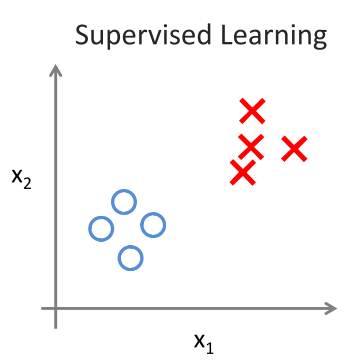
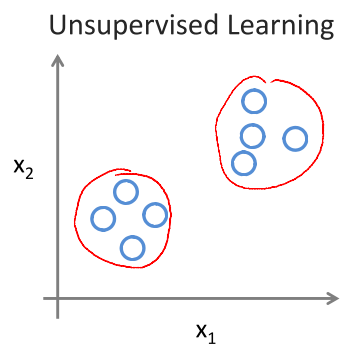

<h1 id="02"> 02. linear regression </h1>
 

## model representation

In general, learning is a process to fit a hypothesis from data, however there are more than one hypothesis, the winner will be choosed by some given inductive bias.   

Linear regression can be view as a process to use straight lines to fit the trajectory of data, and the line with minimum error will be prefer, also to minimize the distence from each data point to line.  

## cost function

Cost function is convex function.

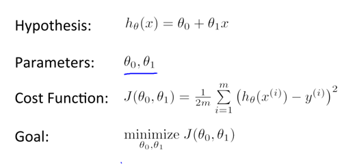
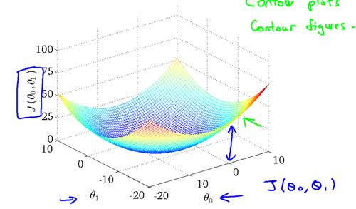

## gradient descent (GD)

Learning: adjust the parameter based on some rule to find global minimum in solution space, which space in linear regression just like the curve above.   

Gradient Descent is a method to update parameter, along the gradient is the increasing direction so along the reverse direction can reduce the objective function. 

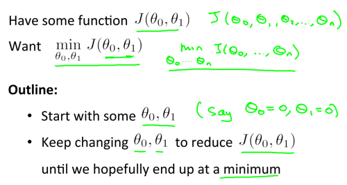
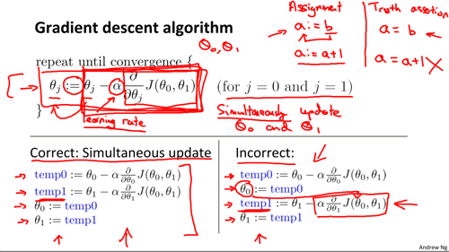

- note: different initial point may lead different extremum. 
- random choose the initial point and repeat more than ones. 

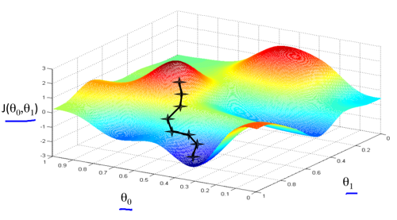
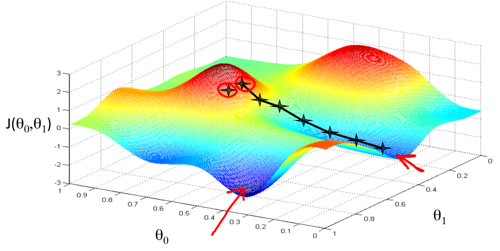

## one result

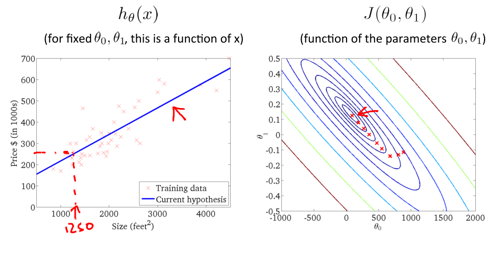

# Linear regression with multiple variable

### model definition

   
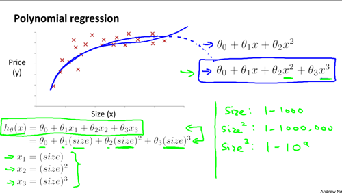
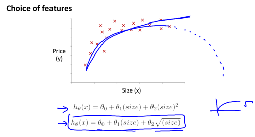

### GD Learning

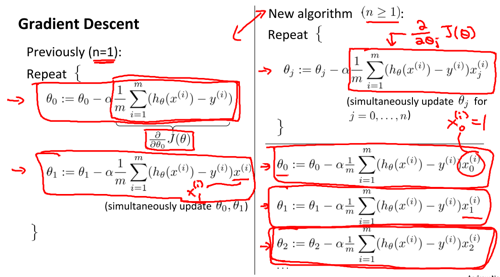
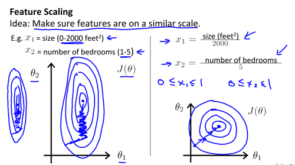
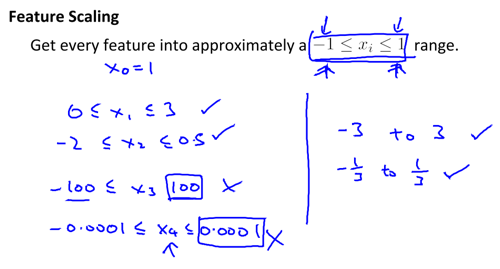
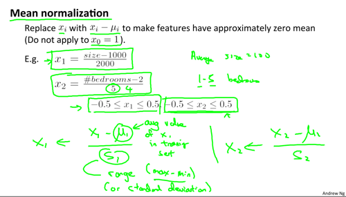

### Debugging and Learning Rate

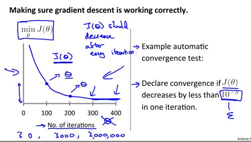
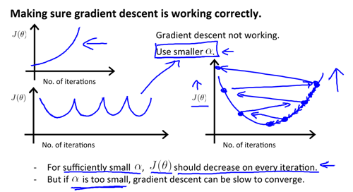
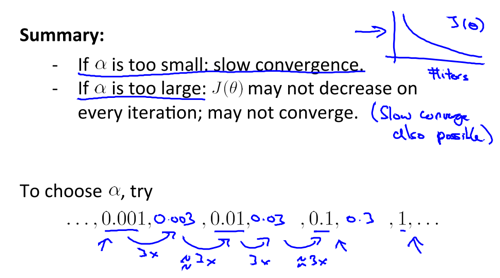

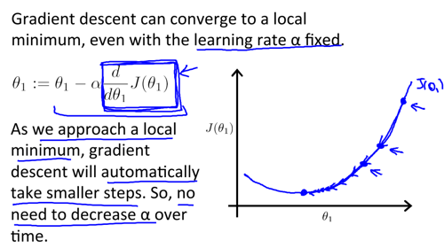

- The GD above is stochastic GD (SGD), each GD just use one training instance.
- Batch GD: each step of GD uses all training examples. 
- Mini Batch, each step of GD uses part of training examples. (split the whole training set into multiple block, each block can lead GD ones.)

### normal equation

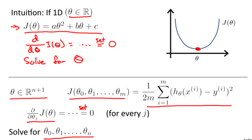
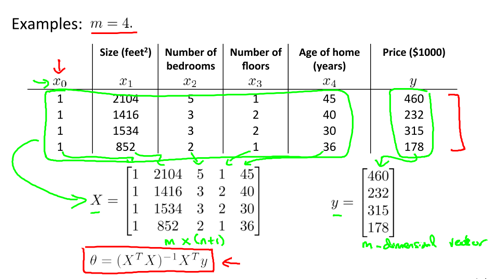
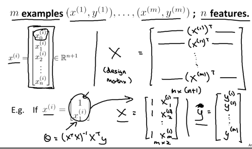
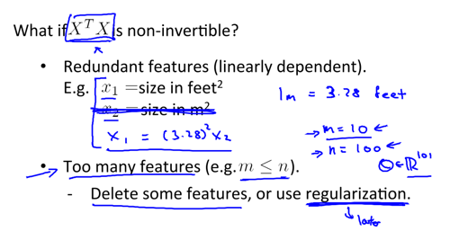

### GD vs Normal equation
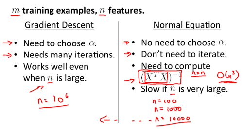

<h1 id="03"> 03.logistic regression </h1>

## Abstract

- some application
    - Email: Spam / Not Spam
    - Online Transactions : Fraudulent (Yes/No)
    - Tumor : Malignant / Benign

- classification:
    - hypothesis : h, threshold : alpha (decision boundary)
        - if h(x) >= alpha, predict 1
        - if h(x) < alpha, predict 0
        - Note: h(x) is a real value
    - logistic regression, map h(x) to range [0,1], then h(x) can be the probability of predicting 1.

- logistic regression
    - sigmoid function: h(x) = 1 / (1+exp(-w*x)), h(x) = [0,1]
    - h(x) = estimated probability that y=1 on input x
    - binary distribution(Bernoulli distributed): p = h(x)^y*(1-h(x))^(1-y)  
    - maximize maximum likelihood: maximize p <-> maximize ln(p)
    - maximize ln(p) = maximize yln(h(x)) + (1-(h(x)))ln(1-h(x))
    - maximize ln(p) = minimize -ln(p) = minimize -(yln(h(x)) + (1-(h(x)))ln(1-h(x)))
    - cost function, sum up on all m instance

- other topic:
    - optimization method: GD or advanced method: BFGS, L-BFGS, Conjugate gradient
    - multi-class classification: one-vs-all
    - logistic regression is a special case of generalized linear model 

## Hypothesis Representation

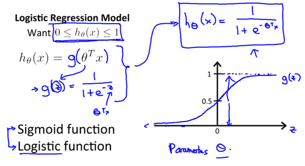
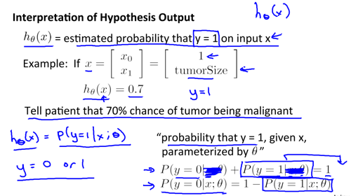

## Decision boundary
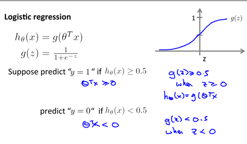  
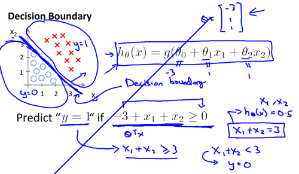
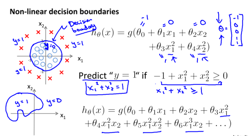

## Cost Function
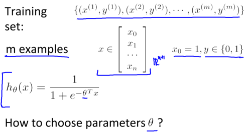  
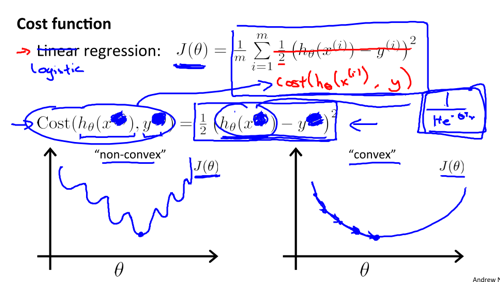  
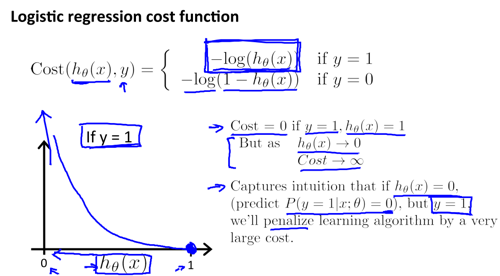
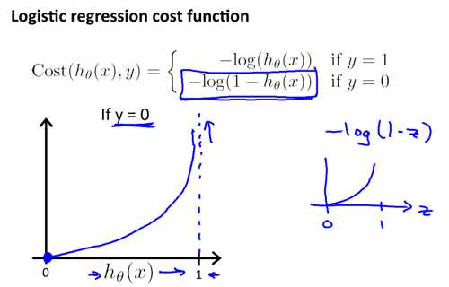
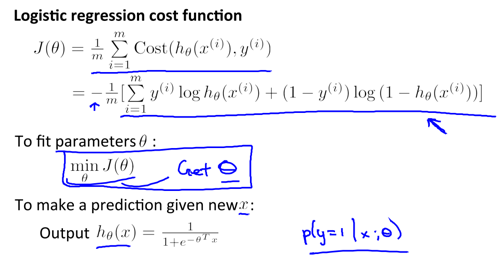

## Optimization 

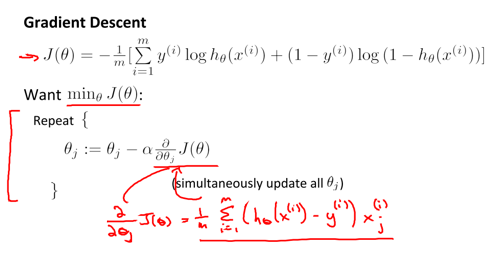
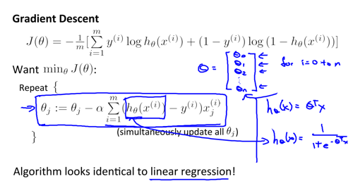
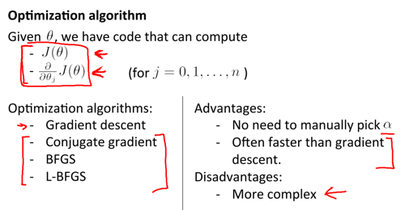  

## Multi-class 

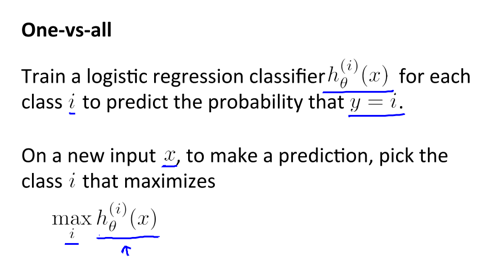  
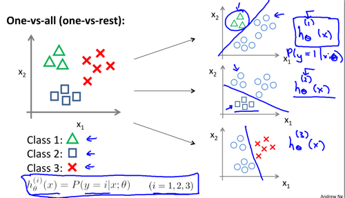

<h1 id="04"> 04. regularization </h1>

- regularization is a efficent way to address overfitting problem.
- overfitting: the learned hypothesis may fit the training set very well, but fail to generalize to new examples. 
- cost funtion can be split into two part
    - error part: measure the accuracy of model
    - regularization part : punish the complexity of model
        - L2 : ridge regression, prefer more feature with small weight. works well, when we have a lots of features, each of which contributes a bit to predicting y.
        - L1 : Lasso, sparcity, feature selection. 
- regularization parameter:
    - too large: underfitting
    - too small: cann't address the overfitting problem

## overfitting
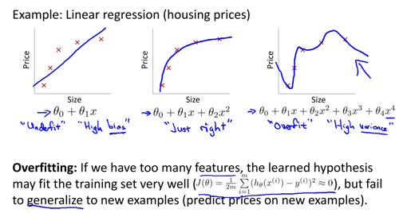
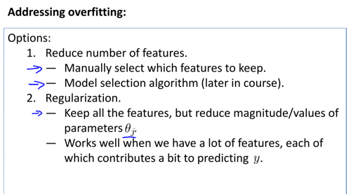

## regularization part

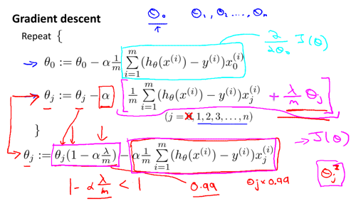
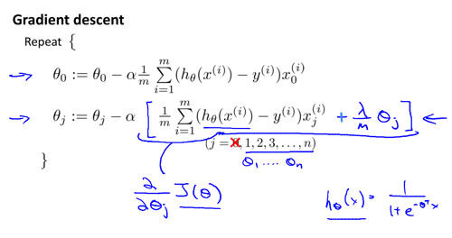
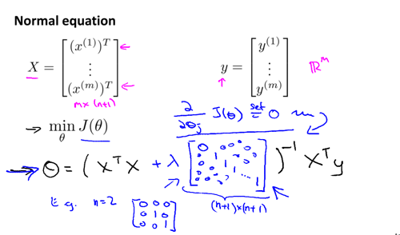
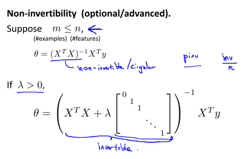

## regularization parameter

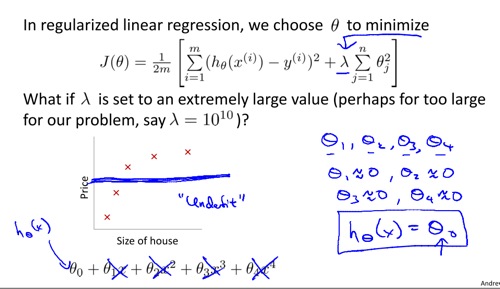
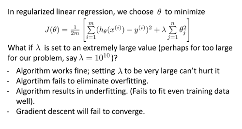
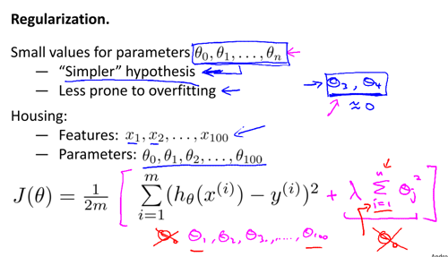

<h1 id="05"> 05. neural network </h1>

- brief introduction 
    - non-linear hypothesis
    - Origins: Algorithms that try to mimic the brain
    - Was very widely used in 80s and early 90s; popularity diminished in late 90s
    - Recent resurgence: State-of-the-art techique for many applications

- component:
    - neurons 
    - activation
    - bias / threshold, which define a neuron is activated or not. 
    - layer
        - input layer
        - hidden layer: active function always is the sigmoid functon 
        - out put layer : fully connecting, one-hot for multi-class

- basic operation:
    - inference: forward propogate 
    - learning: backpropogate (BP)(error)

- basic example:
    - AND, OR, XOR

- multi-classification:
    - one-vs-all, one-hot-vector

- training a neural network:
    - Randomly initialize weights
    - Implement forward propagation, get predict value for each input
    - Implement backpropagation to minimize error
    - gradient checking 
    - use gradient descent or advanced optimization method with backprobagation to try to minimize cost funciton 

## Basic 

### non-linear hypothesis**  

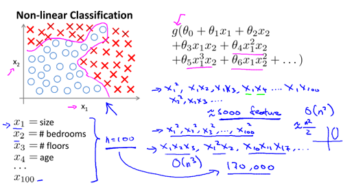
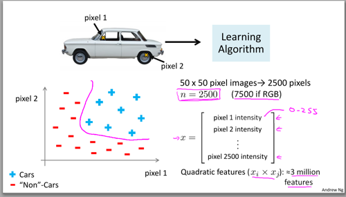

### mimic brain 

### model representation

### example

### multi-class classification

## Cost function

  

  

## putting together

  

<h1 id="06"> 06. some advise for applying machine learning</h1>

- underfitting vs overffiting
- bias vs variance
- split data to evaluating model
    - training data : train model
    - validation data : model selection
    - testing data : test generative ability
- some helpful figure
   - x : different model (diff structure or parameter) vs y : different kinds of error
   - learning curve: x : data set size vs y : different error
- machine learning diagnostic
   - diagnostic: A test that you can run to gain insight what is/isn't working with a learning algorithm, and gain guidance as to how best to improve its performace.
   - diagnostic can take time to implement, but doing so can be a very good use of your time.  

- some solution 
    - get more training examples (high variance will help)
    - try smaller sets of features (high variance)
    - try getting additional features (high bias)
    - try adding polynomial feature (high bias)
    - try decreasing regularization parameter (high bias)
    - try increasing regularization parameter (high variance)

## overfitting 

## bias vs variance

## Learning curve

  

## Regularization parameter selection

## neural network

# Machine learning system design

### example-spam classifier:

- collect lots of data
- feature preparation 
    - develop sophisticated features based on email routing information (from email header)
    - develop sophisticated features for message body 
    - develop sophisticated algorithm to detect misspellings. 
- choose classifer:
    - logistic regression, cnn ...

### recommended approach:
	
- start with a simple algorithm that you can implement quickly
- plot learning curves to decide if more data, more features, etc. are likely to help
- error analysis 
    - manually examine the examples (in cross validation set) that your algorithm made errors.
    - see if you spot any systematic trend in what type of examples it is making errors on.
    - some nemerical evaluation methods are important
        - accuracy 
        - error 
    - control variate method to inspect which can improve your result
    - Only solution is to try it and see if it words 
- unbalanced data evaluation
    - precision / recall (PR curve, how to balance precision and recall)
    - F-scoer, f1-score

### It's not who has the best algorithm that wins, It's who has the most data.  

  

<h1 id="07"> 07. SVM </h1>

# Support Vector Machine

- optimization objective:
    - large margin  
- linear separable:
    - Yes : linear svm
    - No : kernel function (Gaussian kernel, String kernel, chi-square kernel, histogram intersection kernel)
- parameter
    - C : is the reciprocal of the regularization parameter, (1/lamda)
    - kernel parameter : 
- overfitting:
    - noise: slack variable
    - cross-validation to choose model parameter
- multi-class classfication
    - on-vs-all
- logistic regression vs SVM

## Optimization objective and Large Margin Intuition

## The mathematics behind large margin classification 

	

## Kernel-I

## Kernel-II

## Use SVM

<h1 id="08"> 08. clustering </h1>

- unsupervised learning
- cost funtion is non-convex, the result sensitive to the initializing point and K
- choosing parameter
    - random initialization and choose the model with minimum objective value
    - K:
        - K vs objective value  
        - based on the performance of downstream purpose
- EM ideology
    - E: estimate new centroid (hidden variable, random initialization in the beginning)
    - M: maximization, <=> minimize Objective function 

<h1 id="09"> 09. dimensionality reduction </h1>

- PCA:Definition
    - reduce from n-dimension to k-dimension: find k vectors onto which to project the data, so as to minimize the project error.  
- Motivation
    -  compression 
        - reduce memory / disk needed to store data
        - speed up learning algorithm  
    -  visualization
    -  Bad use of PCA:  
        -  address overffitting:
        - may work, but!!! Note, it is recommend to address overfitting with regularization. 
- Algorithm:
     - PCA: 
         - [U,S,V] = svd(Sigma), U_[n*n]
         - U\_reduce = U(1,2..,k), 1<=k<=n, n feature, z = U\_reduce' * x , z\_[k*1]
     - Reconstruction: x = U_reduce * z
- advice
     - choose K, appropriate variance should be retained
     - for supervised learning: PCA not only use on training data but also on validatoin and test data
     - how about performance with PCA or not. PCA is sometimes used where it shouldn't be 
     - scale features to have comparable range of values
     - Note: PCA != linear regression

## definition

     
## choosing k

## advice 

<h1 id="10"> 10. anomaly detection </h1>

- density estimation
- guassian distribution
    - one variable
    - multi-variable
- parameter estimation
    - mean
    - standard
- prediction
    - calculate density for example x, p(x)
    - p(x) large for normal examples
    - p(x) small for anomalous examples  
- evaluation
    - charateristic: 
        - very small number of postive examples
        - larege number of negative
        - many different 'types' of anomalies
        - future anomalies may look nothing like any anomalous examples we've seen so far
    - true positive, false positive, true negative, false negative
    - precision / recall
    - f-score 
- choosing feature
    - non-guassian feature, (log transformation)
    - error analysis 
- application:
    - fraud detection
    - manufacturing monitor
    
## problem motivation

## algorithm

## multivariate guassian distribution for anormaly detection

## evaluation

## vs supervised learning

## choosing feature 

## singular gaussian distribution

## multivariate guassian distribution

<h1 id="11"> 11. recommender systems </h1>

- data structure (two dimention array)
    - row : user
    - column : items (eg. movies)
    - r[i,j] : user_j rating for items_i

- contented based recomendation
    - features are some characters on item 
    - row[i], item score vector (knew)
    - colunm[j], user parameter on each feature (learn from rating data)
    - rating = row[i] * colunm[j], user j rating item i (predict unrating element)

- collaborative filtering
    -  row[i], item score vector (learn)(x)
    -  colunm[j], user parameter on each feature (learn)(theta)
    -  x->theta->x->theta...

- similarity based on CF
    - user similarity, calculate distence between colum(i) and colum(j)
    - item similarity, calculate distence between x(i) and x(j) 

- implementation
    - mean normalization (there are big differences on absolute score among different user)

## problem formulation

## content based recomendation

## collaborative filtering

## vectorization

## implementation detial

<h1 id="12"> 12. large scale machine learning </h1>

- "It's not who has the best algorithm that win. It's who has the most data"
- gradient descent
    - batch GD : use all examples in each iteration
        - time expensive
    - stochastic GD (SGD) : use 1 example in each iteration
        - time efficent 
        - convergence, learning rate can be slowly decrease over time
    - mini-batch GD : use b example (a small subset) in each iteration
        - balance choice 
    - checking for convergence
        - error vs number of iteration
        - Note: for SGD, error should be a mean error during a time section
- online learning
    - shipping service website
    - product search
        - click throgh rate 
    - choosing special offers to show user
    - customized selection of news articles
    - product recommendation
- large scale machine learning
    - mini-bach
    - map: divide training data and learn each part on parallel computer
    - reduce: combine all error for model update

## the role of data

## stochastic gradient descent (SGD)

## mini-batch gradient descent

## online learning

## map-reduce

<h1 id="13"> 13. application photo OCR </h1>

- set up a pipline for your project
    - for instance OCR: text detection -> character segmentation -> charater classification 
- segmentation : sliding window
    - win size
    - classfication problem for each segmentation
- get more data
    - artifical
    - sythesis
    - Note:
        - make sure you have a low bias classification
        - "how much work would it be to get 10x as much data as we currently have?"
           - artificial data synthesis
           - collect / label it yourself
           - "crowd source"
- ceiling analysis   

## pipline

## sliding window

## get more data

## ceiling analysis

