# 【读书笔记】《python数据分析与挖掘实战》-张良均

最近看一些机器学习相关书籍，主要是为了拓宽视野。在阅读这本书前最吸引我的地方是实战篇，我通读全书后给我印象最深的还是实战篇。基础篇我也看了，但发现有不少理论还是讲得不够透彻，个人还是比较倾向于 《Machine Learning》--Tom M.Mitchell，Andrew 的 machine learning 课程，或周华志的《机器学习》，Jiawei Han 的 《data mining》。相对于本书的基础篇，这些侧重于理论基础的课程和书籍对基础模型的理解和阐释要更系统化。另外，值得注意的是本书基础篇有多处错误，比如高斯分布的公式，阅读时应当留意。    

机器学习的工程实践过程大致可分为如下几个步骤：问题抽象、确定目标、采集数据、数据预处理（探索、清洗和变换）、模型选择与构建、模型评价和模型应用。  

- 其中问题的抽象和目标确定很关键，只有充分的理解“我们想要什么”才能更好的去思考“如何做”。
- 数据采集的手段多种多样，常见的有传感器、互联网数据库、爬虫等，采集的手段往往和业务背景密切联系。
- 数据预处理，这个环节往往要耗费大量时间并且需要灵活的思考，为了保证数据的质量这一步骤尤为关键。我们需要调研一些领域知识，基于领域知识和统计特征对数据进行前期的探索，在进一步清洗的基础上进行数据变换，即特征提取。**特征工程**往往是模型成败的关键，这里需要多加思考、联合领域知识并反复尝试评估。
- 模型选择与构建，机器学习和数据挖掘发展至今已经有很多成熟的模型可供使用。很多时候我们需要基于业务的场景以及任务目标对比不同的模型进行选择。我们需要深入理解模型的原理、应用场景和优缺点。
- 模型的评价，机器学习的最终目的是降低**泛化误差**，然而我们只能通过有限的数据（训练数据）对其进行近似计算。如何根据不同的任务，选择合适的指标对模型进行评估很关键。比如回归问题的 RMSE。分类问题的 accuracy, precision, recall, f1-scall 等。充分利用图表，比如 ROC等。
- 模型的应用，对资源、模型的实时性等方面进行综合考虑。我们需要定期的更新我们的模型以适应环境的变化。

本书涉及的主要内容包括**时间序列分析**，**分类**，**回归预测**，**关联关系挖掘**，**推荐系统**。以下是我读过的一些书籍整理，可以作为进一步的扩展。

- 时间序列分析可以进一步参考《时间序列分析及应用》——Jonathan D.Cryer，《Time Series Analysis and Its Applications with R examples》-- Robert H. Shumway。相对于 Python，其实 R 在时间序列分析上的支持更为完善。
- 统计机器学习（分类，回归预测）：sklearn 官方的 tutorial 我觉得很好，理论的话，《Machine Learning》--Tom M.Mitchell，Andrew 的 machine learning 课程，或周华志的《机器学习》。
- 数据挖掘：最为经典的Jiawei Han 的 《data mining》，其中涉及了数据挖掘的基本流程和方法、数据处理、数据仓库、分类、预测、异常检测、关联关系挖掘等内容。“Data Mining”--Charu C.Aggarwal，其特点是加入了时序数据处理的内容，可作为进阶内容。
- 推荐系统：《推荐系统实践》——项亮，很好的入门书籍。

我没有动手实操，阅读旨在拓宽自己的视野，也是出于对各个行业如何应用机器学习的好奇。如果时间有余的读者不妨过一遍书本的例子，应该会有更深的认识。此外通过 kaggle 等比赛平台去进行实践也是不错的。

总的来说，对于 data driven 的工程实践还是应该做足调研，几乎不可能有一个全新的方向和全新的难题。因此学会在巨人的肩膀上去拓展很重要，尤其是在数据科学这一交叉领域，注意团队合作。平时注重积累，处理问题发散思考很重要，很多特征的设计都很巧妙且有意思。

# 概要总结

作者：张良均、王路、谭立云、苏剑林  
注意：这本书有多处地方有误，尤其是公式推导部分。  

- 基础篇
   1. 数据挖掘基础
   2. Python 数据分析简介
   3. 数据探索
   4. 数据预处理
   5. 数据建模 
- 实战篇
   6. **电力窃漏电用户自动识别：**基于 5 年所有窃电用户的有关数据（用户基本信息，各种用电功率等）对窃电用户进行识别。基于目标对数据进行清洗，缺失值填充。基于领域知识构建了 3 个指标：电量趋势下降指标-用电量趋势，线损指标-线损增长率，告警类指标-与窃漏电相关的终端告警数。基于 3 个指标利用 Keras 构建 LM 神经网络模型，准确率为 94%；Scikit-Learn CART 决策树的准确率为 94%。使用 ROC 曲线对模型进行评估。
   7. **航空公司客户价值分析：**借助航空公司客户数据对客户进行分类，在此基础上对不同类客户进行对比分析发现有价值的模式。基于分析结果提供个性化服务，制定相应的营销策略。基于领域知识了解到 LRFMC模型，由此可计算 5 个关键指标作为特征，分别为客户关系长度 L, 消费时间间隔 R, 消费频率 F, 飞行里程 M 和折扣系数的平均 C。采用 k-means 聚类划分用户群，采用图表的形式分析不同用户群的特点并制定营销策略。
   8. **中医证型关联规则挖掘：**借助三阴乳腺癌患者的病理信息，挖掘患者的症状与中医证型之间的关联关系。对截断治疗提供依据，挖掘潜在性证素。由于医疗数据的缺乏，通过问卷调查的形式获取数据。问卷调查仅针对患病者并且具有一定中以诊断学基础，能清除的描述病情。根据领域知识得到 6 种证型得分作为后期模型分析的基础。采用Apriori 算法进行关联关系挖掘，注意选择合适的最小支持度、最小置信度。
   9. **基于水色图像的水质评价：**有经验的从事渔业生产的从业者可通过观察水色变化调控水质，以维持养殖水体生态系统中浮游植物、微生物、浮游动物等合理的动态平衡。我们期望通过机器学习的方法将这一过程自动化。通过拍摄照片获取不同水质的图片。这里我们还需要通过专家对数据打 label，这个过程很是费时费力，并且质量奖影响整体模型的效果。使用直接提取的方式对图片进行切割，在此基础上计算 一阶颜色矩，二阶颜色矩，三阶颜色矩 3 个特征。将特征向量输入到 svm 分类器中，这里有个需要注意的细节，征的范围都在 0～1 之间，如果直接输入 SVM，彼此之间区分度会比较小，**因此不妨将所有特征统一乘以一个适当的常数 k**，经过反复测试最佳的 k=30。  
实际上对于图片的处理，现在大多都直接采用 DNN，尤其是 CNN 在图像处理中表现出非常好的效果。
   10. **家用电器用户行为分析与事件识别：**对热水器使用中的用水事件进行识别。分析过程涉及到领域知识和基于数据观察的手工特征，并没有涉及太多的模型，几乎都是基于阈值进行数据的处理。最后使用 BP 神经网络进行分类识别，准确率 85.5%。
   11. **应用系统负载分析与磁盘容量预测：**这是时间序列预测的一个典型案例，主要涉及到 ARIMA 模型应用的细节。
   12. **电子商务网站用户行为分析及服务推荐：**这是推荐系统的一个应用实例。爬虫获取数据，数据的探索分类，这一过程占了不少工作量。基于物品和基于用户的协同过滤推荐之间的权衡。为用户和物品之间建立关系，使得用户更容易发现潜在有价值的物品，同时使得长尾物品更容易被发掘出来。基本步骤为（1）计算物品之间的相似度；（2）根据物品的相似度和用户的历史行为给用户生成推荐列表。对于推荐系统的评价应该考虑 3 个方面：用户、物品提供者和提供推荐系统的网站。
   13. **财政收入影响因素分析及预测模型：**通过 Adative-Lasso 模型进行特征选择。灰色预测与神经网路组合模型进行预测。
   14. **基于基站定位数据的商圈分析：**计算 4 个指标，工作日上班时间人均停留时间、凌晨人均停留时间、周末人均停留时间、日均人流量。基于以上 4 个指标进行层次聚类，根据谱系聚类图可以聚成 3 类。通过图表观察每个簇的特征。“轨迹挖掘”是一个新兴的研究主题，尤其是面向拼车推荐应用是轨迹挖掘。
   15. **电商产品评论数据情感分析：** 主要是主题模型的应用。“八爪鱼”爬虫工具爬取评论数据，并进行文本去重、机械压缩去词和短句删除等数据预处理操作。（1）构建情感倾向性模型对评论进行分类，即分为正面、负面和中性 3 类评论。这里有两个关键点，一个是文本的表示，训练栈式自编码网络；另一方面是类别标注，人工标注费时。本案例使用 ROST 系统完成情感倾向性分析的任务。（2）基于语义网络的评论分析，抽取正面、负面两组，以进行语意网络的构建与分析。由于中性评论过于复杂本案例没有进一步分析。（3）基于 LDA 模型的主题分析，针对正面和负面的文本分别使用 LDA 发现潜在的主题。基于前 3 个分析结果给出改进建议。

# 基础篇

### 1. 数据挖掘基础

- 连锁餐饮企业：客户关系管理系统，前厅管理系统，后厨管理系统，财务管理系统，物资管理系统
- **数据挖掘**：从数据中“淘金”，从大量数据（包括文本）中挖掘出隐含的、未知的、对决策有潜在价值的关系、模式和趋势，并用这些知识和规则建立用于决策支持的模型，提供预测性决策支持的方法、工具和过程。
- 基本任务：分类与预测、聚类分析、关联规则、时序模式、偏差检测、智能推荐方法。（帮助企业提取数据中隐含的商业价值，提高商业的竞争力）
- 数据挖掘建模过程：
    - 定义目标： 
    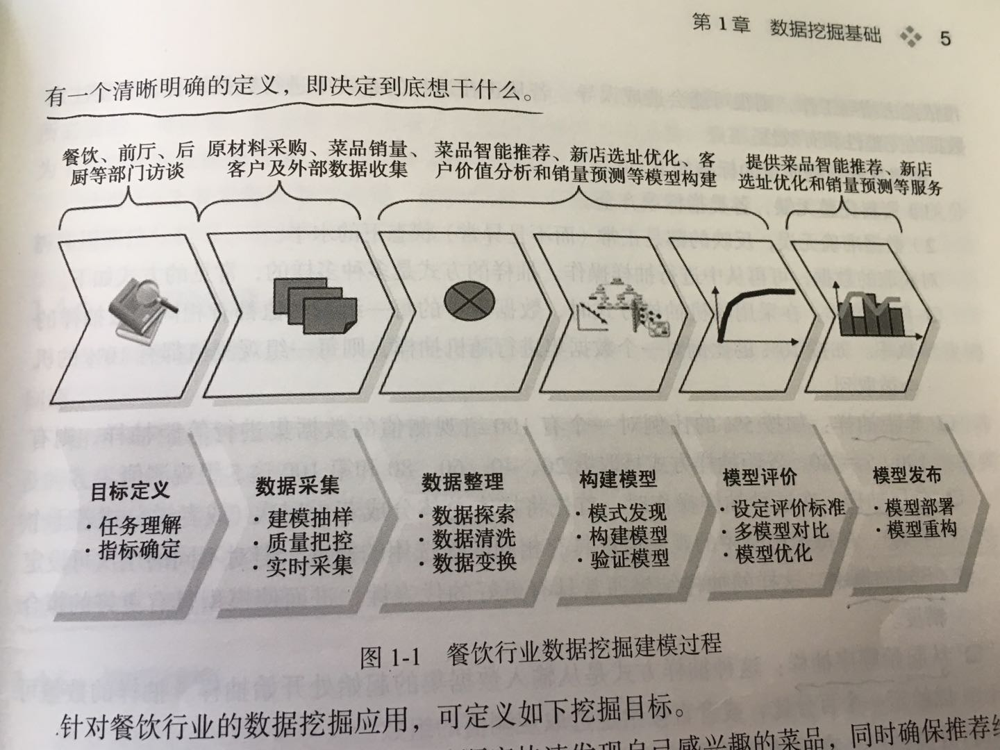
    - 数据抽样：
        - 标准：相关性、可靠性、有效性
        - 目的：减少数据处理量，节省系统资源，使得寻找的规律更能凸显出来
        - 抽样方法：随机抽样、等距抽样、分层抽样、从起始顺序抽样、分类抽样。
    - 数据探索：
        - 挖掘模型的质量不会超过抽取样本的质量
        - 内容包括：异常值分析、缺失值分析、相关分析和周期性分析。
    - 数据预处理：数据筛选、数据变量转换、缺失值处理、坏数据处理、数据标准化、主成分分析、属性选择、数据规约等。
    - 挖掘建模：核心环节！问题的定义，模型的选择。
    - 模型评价。   
- 常用的数据挖掘工具：SAS Enterprise Miner, IBM SPSS Modeler, SQL Server, Python, WEKA, KNIME, RapidMiner, TipDM. (_工具太多，了解就好，要形成自己核心技术栈_)

### 2. python 数据分析简介

- 简单易学、“胶水语言”
- 搭建 python 平台
    - python 版本, v2.x 到 v3.x 的改动很大
    - linux vs windows： Linux 效率更高，安装也更容易
    - Anaconda 很合适进行数据分析。
- python 使用入门
    - 中文字符串前需要加 u (表示使用 UTF-8 编码)
    - 基本命令：基本运算、判断与循环、函数（def，lambda (行内函数)）
    - 数据结构：List, Tuple, Dictionary, Set
        - python 都是引用类型，赋值语句 a=b，a改变b也会改变。要产生真的复制应该是 a = b[:]
        - 函数式编程：lambda(), map(), reduce(), filter()。
    - python 数据分析工具：Numpy, Scipy, Matplotlib, Pandas, StatsModels, Scikit-learn, Keras, Gensim（自然语言处理）。（_tensorflow， nltk_）   

### 3. 数据探索

数据探索：通过检验数据集的质量、绘制图表、计算某些特征量等手段，**对样本数据集的结构和规律进行分析的过程**。

- 数据质量分析：缺失值、异常值、不一致（数据集成时会存在）、重复数据及含有特殊符号的数据。
    - 缺失值分析：记录的缺失和记录中某个字段的缺失
        - 缺失值产生的原因：无法获取、遗漏、属性值不存在（单身的人不存在配偶）
        - 缺失值的影响：大量有用信息的丢失、不确定性更显著、可能导致不可靠的输出
        - 缺失值的分析：简单的统计分析缺失情况
    - 异常值分析：检查数据是否含有错误的录入和不合理的数据。重视异常值的出现，分析其产生的原因，往往是发现问题和改进的契机：
        - 简单的统计量分析：比如最大值、最小值、检查变量是否超出了合理的范围
        - 3 delta 原则（如果数据服从正态分布 P(|x-mu| > 3*delta) <= 0.003）
        - 箱型图分析: 中位数、均值、上四分位、下四分位、上界、下届、离群点
    - 一致性分析：不一致是指数据的矛盾性、不相容性。主要发生在数据集成的过程。
- 数据特征分析
    - 分布分析：
        - 定量数据的分布分析：1.极差-->2.组距与组数-->3.分点-->4.频率分布表-->5.频率分布直方图；（主要原则：各组之间必须互斥、包含所有数据、组的宽度最好相等）
        - 定性数据的分布分析：常常根据变量的分类类型来分组。（饼图、直方图）
    - 对比分析：选择合适的对比标准是十分关键的步骤。
        - 绝对数比较
        - 相对数比较：结构相对数（eg. 产品合格率）、比例相对数（eg. 人口性别比例、投资与消费比例）、比较相对数（eg. 不同地区商品价格对比）、强度相对数（eg. 人口密度“人/平方公理”）、计划完成程度相对数、动态相对数（eg. 速度）
    - 统计量分析
        - 集中趋势：均值（对极端值敏感，对于此问题可以使用中位数、截断均值）、中位数、众数。
        - 离中趋势：极差、标准差、变异系数（主要比较两个或多个具有不同单位或不同波动幅度的数据集的离中趋势）、四分位数间距
    - 周期性分析
    - 贡献度分析：帕累托分析法（Pareto Analysis，又称柏拉图分析），20/80定律。
    - 相关性分析：散点图、散点图矩阵、计算相关性系数（Pearson, Spearman 秩相关系数）
- python
   - Pandas: sum(), mean(), var(), std(), corr(), cov(), skew(), skurt(), describe(); 拓展：cum\*, rolling\_*
   - matplotlib: plot, pie, hist, boxplot, plot(logy=True), plot(yerr=error)   

### 4. 数据预处理

数据预处理一方面是提高数据质量，另一方面是要让数据更好地适应特定的挖掘技术或工具。（_这部分的内容很多参考《数据挖掘》韩家炜的书_）

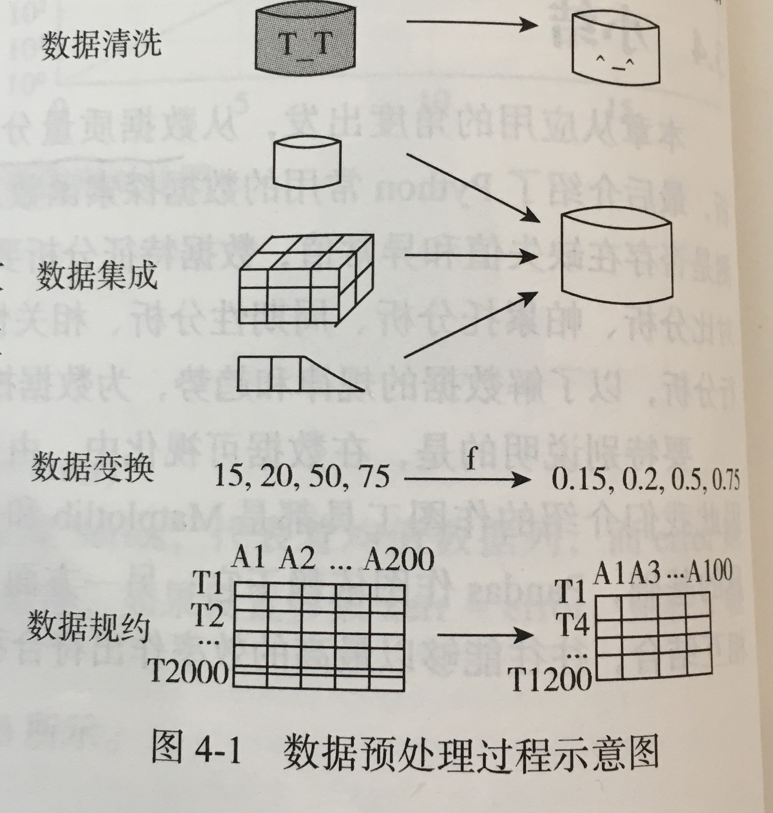

- 数据清洗
    - 缺失值处理：删除记录、数据插补、不处理。其中插值的方法有：
        - 均值/中位数/众数插值
        - 使用固定值
        - 最近临插补
        - 回归方法
        - 插值法：利用已知点建立合适的插值函数f(x)，未知值由对应点 x\_i 求出的函数值 f(x\_i) 近似代替。
            - 拉格朗日插值法：结构紧凑，理论中分析方便。但当节点增加或减少时插值多项式会变化，克服这个困难使用牛顿插值。
            - 牛顿插值 
    - 异常值处理：删除含有异常值的记录、视为缺失值处理、平均值修正、不处理
- 数据集成：
    - 实体识别：任务是统一不同源数据的矛盾之处，常见形式：同名异义、异名同义、单位不统一
    - 冗余属性识别：同一属性多次出现、同一属性命名不一致导致重复（有些冗余属性可以使用相关性进行分析。）
- 数据变换：
    - 简单函数变换：
        - eg. 平方、开方、对数、差分
        - 作用：将非正太分布数据转成正太分布数据；对时序数据，log和diff可以将非平稳时序转换为平稳时序。
    - 规范化：消除指标之间量纲和取值范围差异的影响。
        - 最小-最大规范化，也称离差标准化，是对原始数据的线性变换。保留了原数据中存在的关系，是最简单的规范化方法。**缺点：若数据中存在某个很法的值，会导致规范化后的数接近 0（对离群点敏感）**
        - 零-均值规范化，也称为标准差标准化（standardize）。是当前使用得最多的规范化方法。
        - 小数定标规范化。通过移动属性值的小数位数，将属性值映射到[-1,1]之间。
    - 连续属性离散化（pandas.cut）
        - 等宽法。区间的个数由数据本身的特点决定，或者由用户指定。**缺点：对离群点敏感**
        - 等频法。易于操作，但需要人为规定划分区间的个数。
        - 基于聚类分析的方法。  
    - 属性构造：很多时候需要基于原有的属性构造新的属性并加入到数据集中。
    - 小波变换。小波变换具有多分辨率的特点，在时域和频域都具有表征信号局部特征的能力，通过伸缩和平移等运算过程对信号进行多尺度聚焦分析，提供了一种非平稳信号的时频分析手段，可以由粗及细地逐步观察信号，从中提取有用信息。**小波变换可以对声波信号进行特征提取，提取出可以代表声波信号的向量数据，及完成从声波信号到向量数据的变换。工具：Scipy, PyWavelets**
        - 基于小波变换的特征提取方法：基于小波变换的多尺度空间能量分布特征提取方法、基于小波变换的多尺度空间的模极大值特征提取方法、基于小波包变换的特征提取方法、基于适应性小波神经网络的特征提取方法。
        - 小波基函数。是一种具有局部支集的函数。常用的小波基有 Haar 小波基, db 系列小波基。
        - 小波变换。多小波基函数进行伸缩和平移变换。
        - 基于小波变换的多尺度空间能量分布特征提取方法。
- 数据规约
    - 意义：降低无效、错误数据对数据模型的影响，提高模型的准确性；少量且具代表性的数据将大幅度缩减数据挖掘所需的时间；降低存储数据的成本。
    - 属性规约：合并属性、逐步向前选择、逐步向后删除、决策树规约、主成分分析（用于连续属性降维的方法，sklearn）。
    - 数值规约：指通过选择替代的、较小的数据来减少数据量。可分为：参数方法和无参数方法。参数方法是用一个模型来评估数据，只需要存储参数而不需要存储数据，比如：回归、对数线性方程。无参数方法需要存放实际数据，比如：直方图、聚类、抽样（放回/不放回抽样、聚类抽样、分层抽样）。
- 主要工具：Scipy-interpolate, Pandas/Numpy-unique, Pandas-isnull, Pandas-notnull, Pandas-PCA, Pandas-random.

### 5. 挖掘建模

挖掘模型：分类和预测、聚类、关联规则、时序模式、偏差检测（异常检测）

- 分类与预测：
    - 场景：菜品销量预测，顾客流失预测，哪些客户更有可能成为 VIP 客户 ...
    - 算法：
        - 回归分析：线性回归、非线性回归、Logistic 回归，岭回归，主成分回归，偏最小二乘回归
        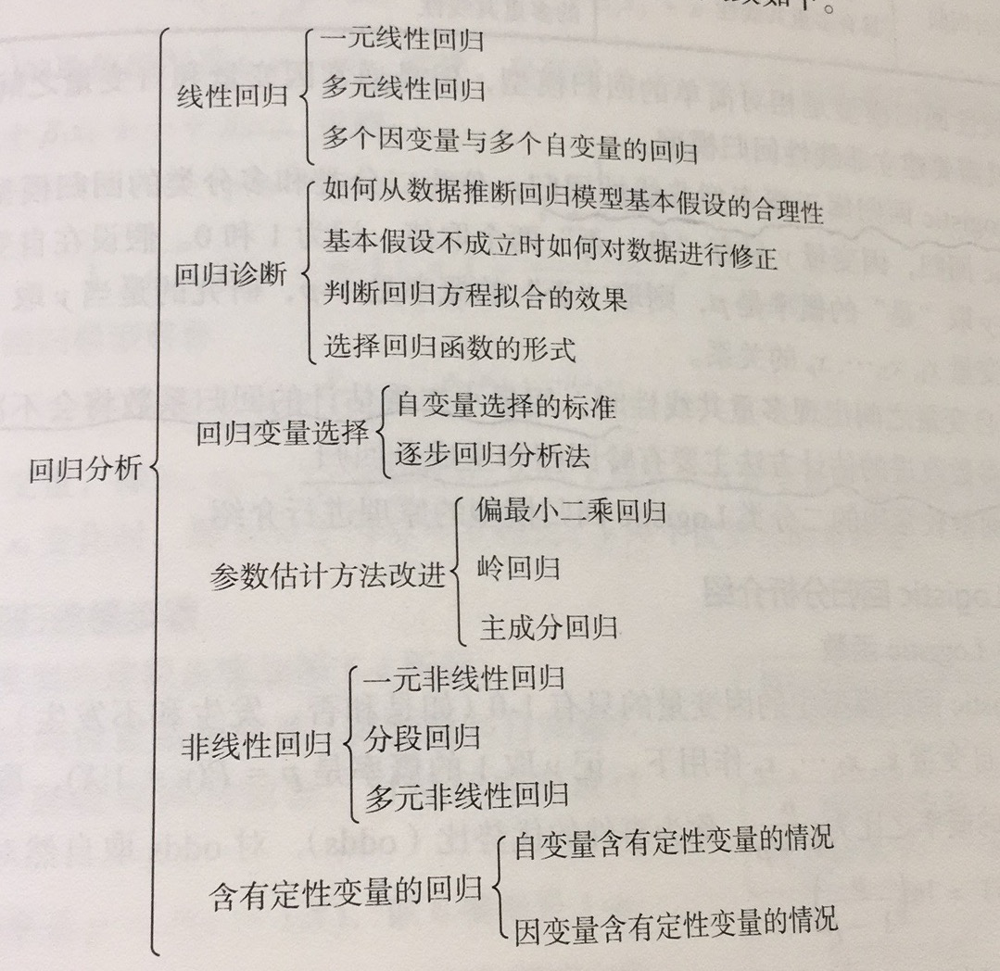
        - 决策树：ID3 （信息增益, J.Ross Quinlan 提出）, C4.5（信息增益率）, CART（回归树）。关键：如何选择划分变量，剪枝，可作为特征选择的支持。理论基础：信息论，信息熵。
        - 人工神经网络：
            - 激活函数：阈值函数（阶跃函数），分段线性函数，非线性转移函数（sigmoid，有很好的数学性质），Relu （解决梯度消失）
            - 算法：BP, LM, RBF, FNN（模糊神经网络）, GMDH, ANFIS 
        - 贝叶斯网络：
        - 支持向量机
    - 评价指标：
        - 绝对误差与相对误差（Relative Error）
        - 平均绝对误差（MeanAbsoluteError）
        - 均方误差（MeanSquaredError），用于还原平方失真程度。一大优点：误差 E 的平方，加强了数值大的误差在指标中的作用，从而提高了这个指标的灵敏性。 
        - 均方根误差（Root Mean Squared Error，RMSE）
        - 平均绝对百分误差(Mean Absolute Percentage Error, MAPE)
        - Kappa 统计。比较两个或多个观测者对同一事物，或观测者对同一事物的两次或多次观测结果是否一致。
        - 识别准确度(accuracy), precision，recall, ROC。
    - 工具：sklearn 
- 聚类：
    - 场景：找到有价值的用户群，用户的消费行为，对菜品进行分析
    - 原理：簇内距离最小化，簇间距离最大化
    - 算法：
        - 划分（分裂）方法： K-Means(K-平均), K-Medoids(k-中心点)，CLARANS(基于选择的算法)，
        - 层次分析方法：BIRCH(平衡迭代规约和聚类)，CURE算法（代表点聚类），CHAMELEON算法（动态模型），
        - 基于密度的方法：DBSCAN, DENCLUE(密度分布函数)，OPTICS（对象排序识别）
        - 基于网格的方法：STING(统计信息网络)，CLIOUE（聚类高维空间），WAVE-CLUSTER（小波变换）
        - 基于模型的方法：统计学方法、神经网络方法
    - 常用：K-means, K-Medioids，系统聚类。关键：距离度量，目标函数
    - 评价：purity，RI，F 值评价
    - 工具：sklearn, 聚类结果可视化工具----TSNE
- 关联规则：
    - 又称购物篮分析。
    - 算法：Apriori（Support, Confidence，剪枝基础：频繁项集的所有非空子集也必须是频繁项集）, FP-Tree, Eclat, 灰色关联法
- 时序模式：
    - 场景：餐饮销售量的预测
    - 模型：ARIMA(p,d,q)；
        - 1. 平稳性检测：
            - 时序图、自相关图（操作简单，缺点：带有主观性）
            - 构造检验统计量，最常用的是单根检验  
        - 2. 纯随机性检验：常用的统计量有 Q 统计量、LB 统计量 
        - 3. 平稳序列分析（非平稳可以通过 diff，log 转换成平稳序列）
            - 平稳条件，均值和方差保持不变。 
        - 4. 模型选择
            - 1. 人为识别，ACF, PACF
            - 2. 相对最优模型识别：AIC, BIC
        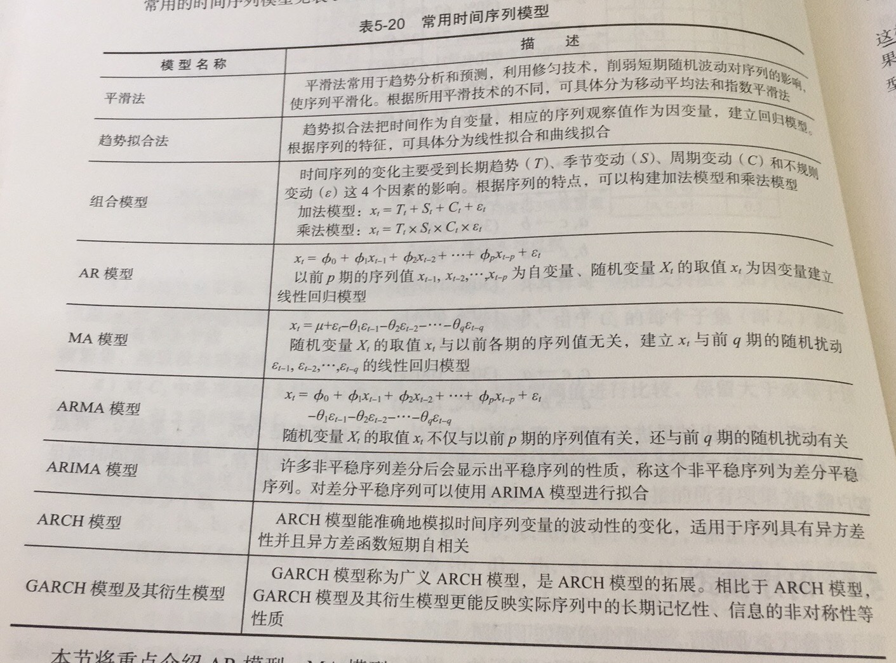
    - 工具：python-StatsModels，R 分析时序数据更成熟
- 离群点检测（也称为偏差检测）
   - 场景：异常消费，异常订单。
   - 离群点的原因：数据来源于不同的类、自然变异、数据测量和收集误差
   - 离群点类型：
       - 从数据范围：全局离群点 vs 局部离群点
       - 从数据类型：数值离群点 vs 分类型离群点
       - 从属性的个数：一维离群点 vs 多维离群点
   - 检测方法：
       - 基于统计：前提是知道数据所服从的分布；对高维数据，检验效果可能很差。
       - 基于邻近度：简单，低维可作散点图分析；大数据集不适用；对参数选择敏感；具有全局阈值，不能处理具有不同密度的区域。
       - 基于密度：给出了对象是离群点的定量度量，并且即使数据具有不同的区域也能够很好处理；大数据集不适用；参数选择困难。
       - 基于聚类：可能是高度有效的；聚类算法产生的簇的质量对该算法产生的离群点的质量影响很大。                                                                              

---

# 实战篇

### 6. 电力窃漏电用户自动识别

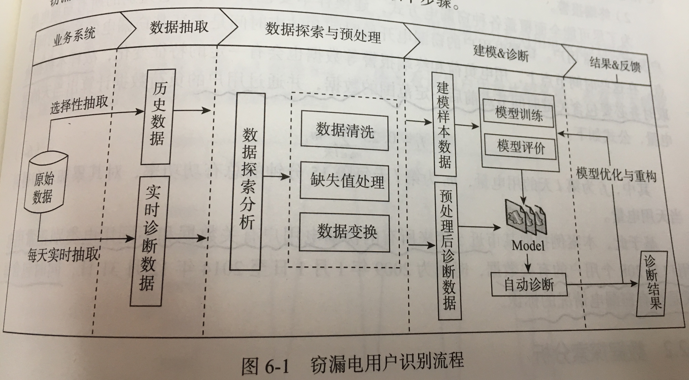

- 背景：通过采集电量异常、负荷异常、终端报警、主站报警、线损异常等信息，建立数据分析模型，来实时监测窃漏电情况和发现计量装置的故障。
- 目标：1. 归纳出窃漏电用户的关键特征，构建窃漏电用户的识别模型；2. 利用实时监测数据，调用监测模型进行实时诊断。
- 方法与过程：
    1. 数据抽取：来自营销系统和自动化系统的数据。近 5 年来所有的窃漏电用户有关数据和不同用电类别正常用电共 208 个用户的有关数据，同时包含是否有窃漏电情况的标识。（用户基本信息，各种用电功率等，采集数据时注意包含关键节点前后的数据）
    2. 数据探索分析：通过各种图表进行分布分析，周期性分析。 发现重要特征：窃漏电用户的电量有持续下降的趋势。
    3. 数据预处理：
        - 数据清洗：非居民用电不存在窃漏电的情况，过滤掉该部分数据；节假日相比工作日的日用电明显偏低，过滤节假日用电数据，尽可能达到较好的数据效果。
        - 缺失值处理：综合考虑采用拉格朗日插值法对缺失值进行补全。
        - 数据变换：实际也就是特征提取，计算 3 个指标，即：电量趋势下降指标-用电量趋势，线损指标-线损增长率，告警类指标-与窃漏电相关的终端告警数。 
    4. 构建专家样本：也就是准备训练数据集
    5. 构建模型：
        - 构建窃漏电模型：
            - 数据划分：20%做测试数据，80%做训练数据
            - Keras 的 LM 神经网络 - 94% accuracy
            - Scikit-Learn CART 决策树 - 93% accuracy
        - 模型评价：ROC
        - 进行窃漏电诊断 

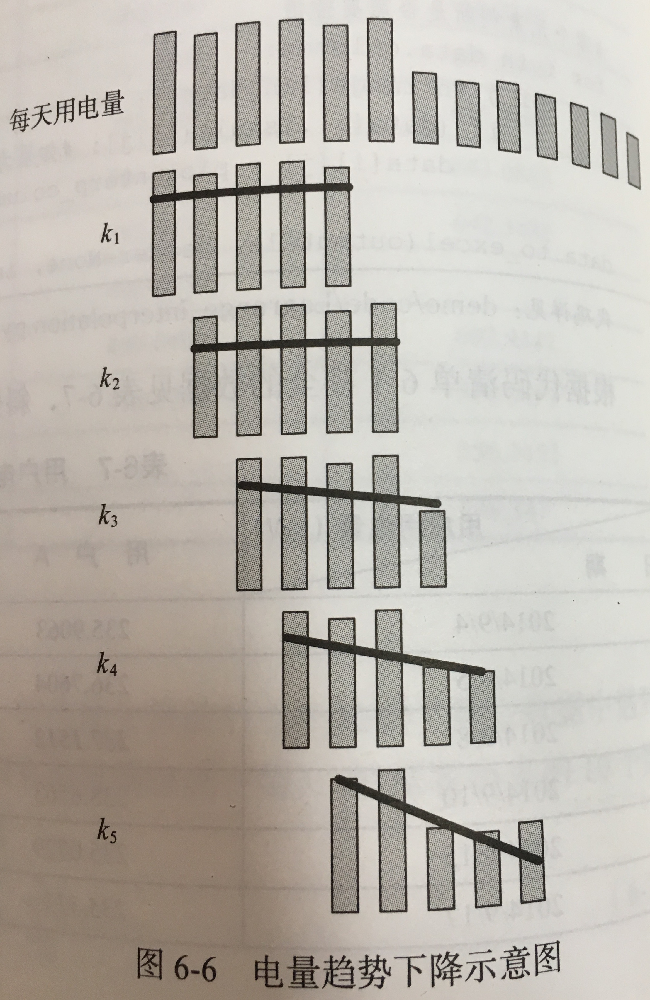

### 7. 航空公司客户价值分析

- 背景：企业营销焦点从产品中心转变为客户中心。准确的客户分类结果是企业优化营销资源分配的重点依据。
- 目标：
    - 借助航空公司客户数据，对客户进行分类；
    - 对不同的客户类别进行特征分析，比较不同类客户的客户价值；
    - 对不同价值的客户类别提供个性化服务，制定相应的营销策略。
- 数据：客户基本信息，客户基本信息，乘机信息，积分信息。
- 方法与过程：
    - 基于领域知识构建模型指标
        - RFM模型：最近消费时间间隔（Recency），消费频率(Frequency)和消费金额（Monetary）
        - LRFMC模型：客户关系长度 L, 消费时间间隔 R, 消费频率 F, 飞行里程 M 和折扣系数的平均 C。（本文选择这个模型）
    - 数据抽取：以固定时间窗口抽取 2 年的数据
    - 数据探索分析：统计空的记录，一些简单的统计值：最大值、最小值
    - 数据预处理：
        - 数据量较大，空值直接丢弃。丢弃票价为空的记录；丢弃票价为 0 、平均折扣率不为 0 、 总飞行里数大于 0 的记录。 
    - 属性规约：原始属性太多，只保留 LRFMC 模型需要的属性。
    - 数据变换：计算 LRFMC 指标
    - 模型构建：
        1. k-means 聚类，划分用户群。
        2. 结合业务对每个用户群进行特征分析，分析其客户价值，并对每个客户进行排名。
            - 雷达图
            - 重要保持客户，重要发展客户，重要挽留客户，一般与低价值客户。
    - 模型应用：
        - 会员升级与保级
        - 首次兑换
        - 交叉销售  

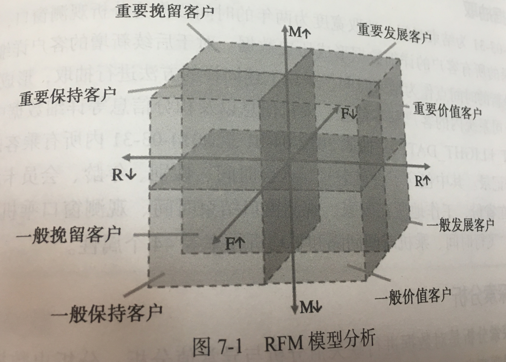

### 8. 中医证型关联规则挖掘

- 目标：
    - 借助三阴乳腺癌患者的病理信息，挖掘患者的症状与中医证型之间的关联关系；
    - 对截断治疗提供依据，挖掘潜在性证素。
- 分析与过程：
    - 数据获取：问卷调查
        - 问卷信息采集均要求有中医诊断学基础，能准确识别病人的舌苔脉象，能正确填写症状；
        - 问卷调查对象必须是三阴乳腺癌患者。
    - 数据预处理：
        - 数据清洗：去除无效调查问卷
        - 属性规约：只保留 6 种证型得分、TNM 分期的属性。（TNM 分期是乳腺癌分期的基本原则，I 期较轻，IV 期较严重）
        - 数据变换：属性构造（证型系数 = 该证型得分 / 该证型总分）和数据离散化（为 Apriori 做准备） 
    - 模型构建：
        - 中医证型关联规则模型：Apriori 算法，重要参数：最小支持度、最小置信度
        - 模型分析
        - 模型应用：模型结果表明 TNM 分期为 IV 期的三阴乳腺癌患者主要为肝肾阴虚证、热毒蕴结证、肝气郁结证和冲任失调证。 

### 9. 基于水色图像的水质评价

- 背景：有经验的从事渔业生产的从业者可通过观察水色变化调控水质，以维持养殖水体生态系统中浮游植物、微生物、浮游动物等合理的动态平衡。
- 数据来源：水产专家按水色判断水质分类的数据及用数码相机按照标准进行水色采集的数据。（！！！采集数据是一个很耗时费力的过程）
- 分析与过程：
    - abstract
        - 图像特征提取是图像识别或分类的关键步骤；
        - 图像特征包括：颜色特征、纹理特征、形状特征和空间关系特征
        - 本案例中选择采用颜色矩来提取水样图像的特征 
    - 数据预处理
        1. 图像切割：采样的图像包括容器，容器与水的颜色差距很大，把水的图片切割出来（直接提取水样图像中央 101 x 101 像素的图像）；
        2. 特征提取：一阶颜色矩，二阶颜色矩，三阶颜色矩；（3 个通道分别计算 RGB）
    - 模型构建：
        - 模型输入：
            - 80% train set，20% test set
            - SVM
            - 特征的范围都在 0～1 之间，如果直接输入 SVM，彼此之间区分度会比较小，**因此不妨将所有特征统一乘以一个适当的常数 k**，经过反复测试最佳的 k=30
        - 结果分析：96.91% 准确率
    - 水质评价。
    - 拓展思考：我国环境质量评价工作从 20 世纪 70 年代发展至今，指标体系有较大进展。但所采用的分析手段通常采用一些比较传统的评价方法，往往是从单个污染因子的角度进行评价。寻求更全面、客观、准确反映环境质量的新的理论方法具有重要的现实意义。比如空气指标：SO2, NO, NO2, NOX, PM10, PM2.5。     

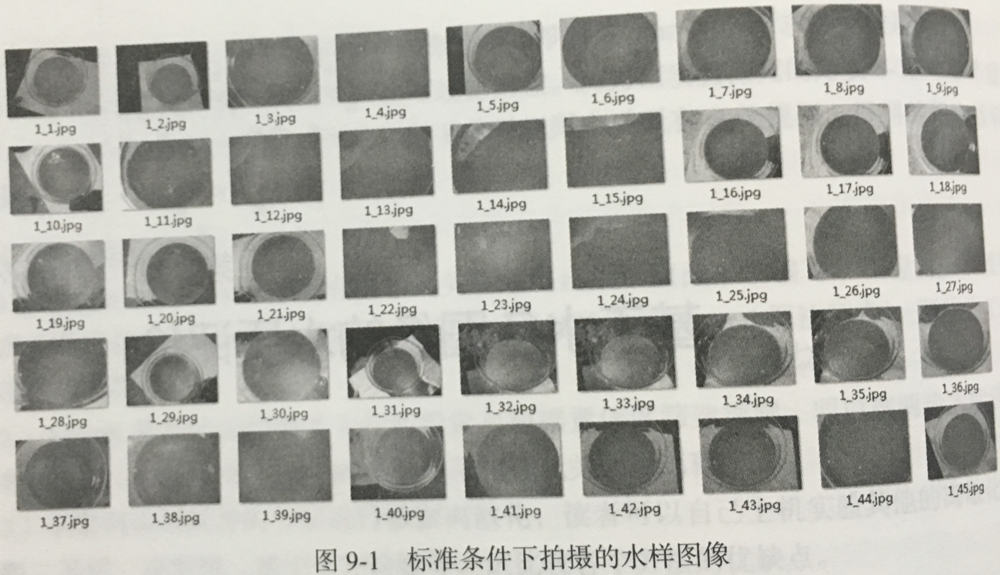
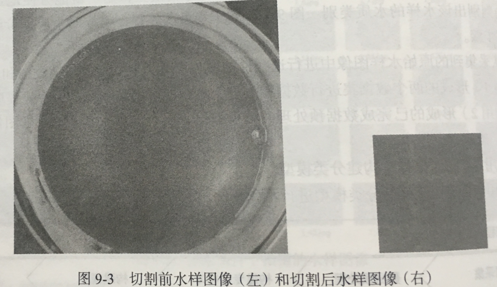

### 10. 家用电器用户行为分析与事件识别

- 背景：家电企业若能深入了解不同用户群的使用习惯，开发新功能，就能开拓新市场；以热水器为例，其中用水事件识别是关键的环节。
- 目标：
    1. 根据热水器采集到的数据，划分一次完整用水事件；
    2. 在划分好的一次完整用水事件中，识别出洗浴事件。
- 分析方法与过程：
    - 数据抽取：200 家热水器，2014 年 1 月 1 日至 2014 年 12 月 31 日的用水记录。
    - 数据探索分析：通过“用水停顿时间间隔频数分布表”探索用户真实用水停顿时间间隔的分布情况。
      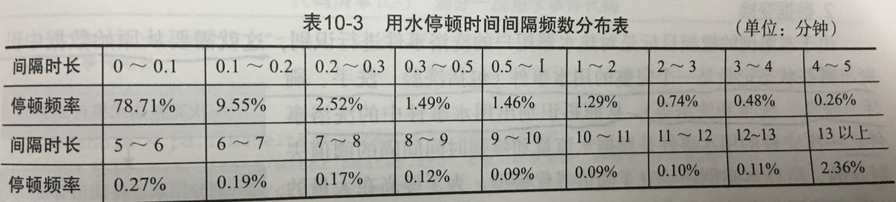
    - 数据预处理：
        1. 数据规约：属性规约：去掉无关属性，比如热水器编号；数值规约：热水器状态为”关“且流水量为 0 时，数据为无效数据去掉。
        2. 数据变换：一次完整用水事件划分 --> 划分用水事件阈值寻优 --> 属性构造 --> 筛选“候选洗浴事件” --> 得到建模数据样本集。
            - 一次完整用水事件划分：用水量为 0 的记录持续时间 t 超过一定的阈值 R 说明为一个划分点。
            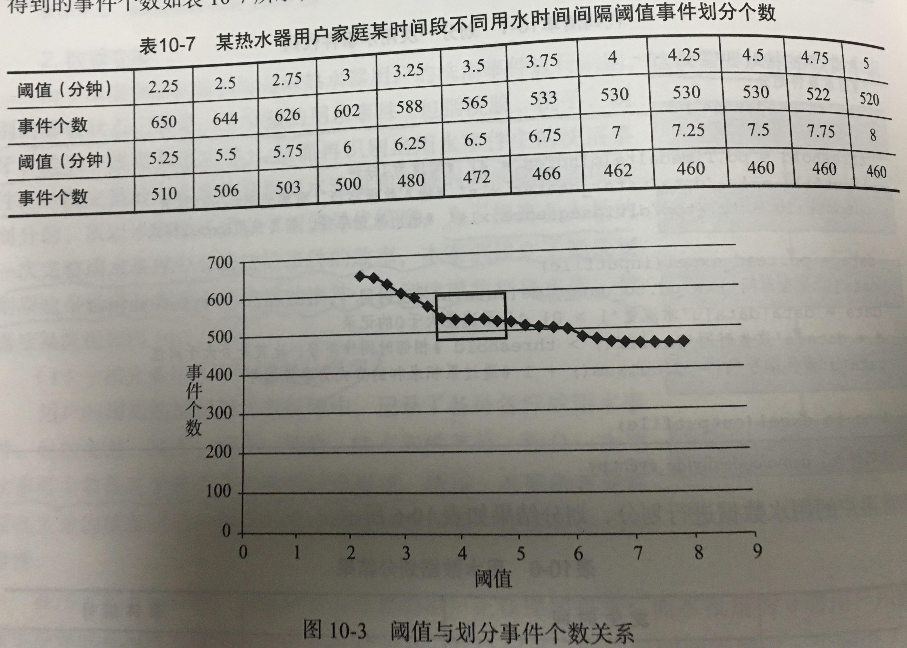
            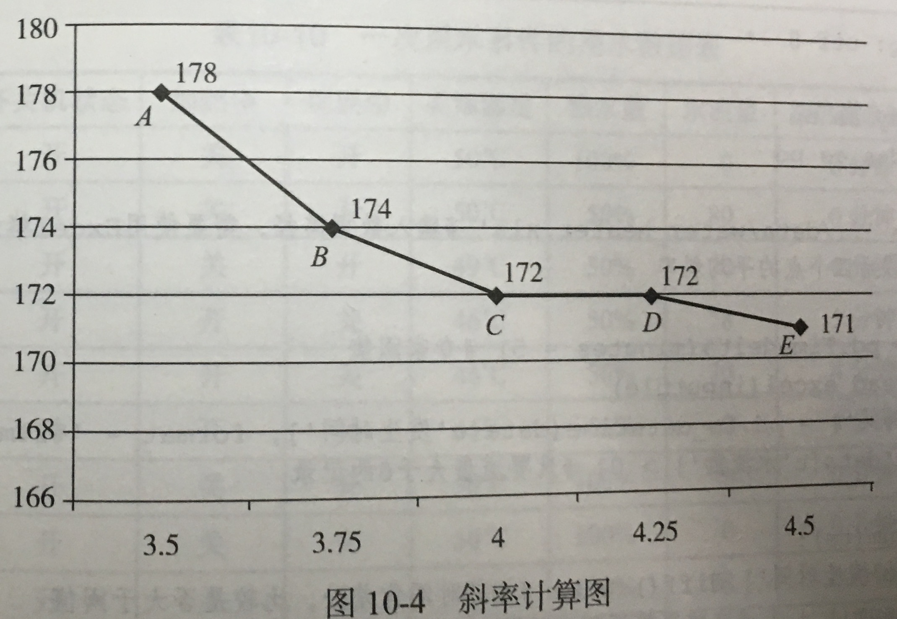
            - 划分用水事件阈值寻优：尝试不同的阈值 R，并观察事件数的变化，选较为稳定的 R
            - 属性构造：时长指标、频率指标、用水量化指标、用水波动指标
            - 筛选“候选洗浴事件”：用 3 个比较宽松的条件筛选掉那些非常短暂的用水条件。（1）一次用水事件中总用水量（纯热水）小于 y 升；（2）用水时长小于 100 秒； （3）总用水时长小雨 120 秒。
        3. 数据清洗：处理缺失值，根据观察的 trick
    - 模型构建：BP 神经网络，对网络参数寻优，确定第二层隐藏层节点数为 17、10
    - 模型检验：准确率 85.5%
    - 拓展思考：针对两次（或多次）洗浴事件被合并为一次洗浴事件的情况，需要进行优化，对连续洗浴事件进行识别，提高模型识别精度。（多设计了几个指标，基于联合指标的阈值确定划分点）

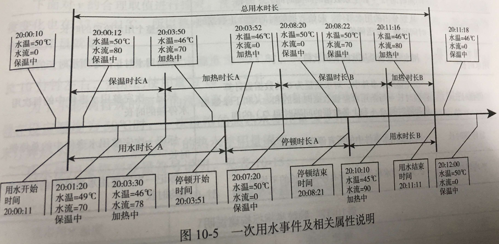

### 11. 应用系统负载分析与磁盘容量预测

- 目标：
    - 针对历史磁盘数据，采用时间序列分析方法，**预测应用系统服务器磁盘已使用空间大小**。
    - 根据用户需求**设置不同的预警等级**，将预测值与容量值进行比较，对其结果进行**预警判断**，为系统管理员提供定制化的预警提示。 
    
    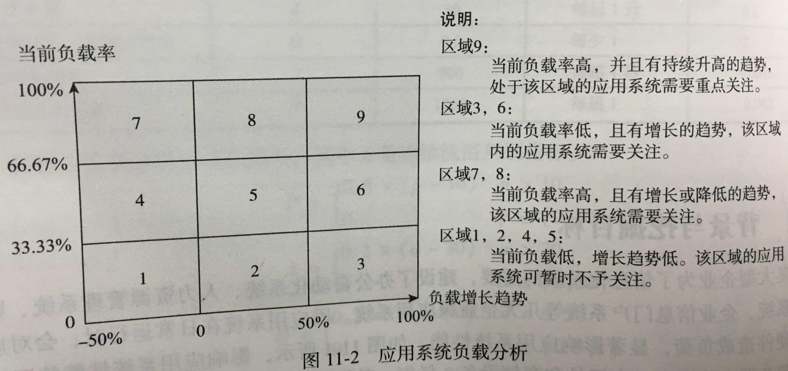
- 分析方法与过程：
    - 数据抽取：抽取2014-10-01 至 2014-11-16 财务管理系统中的性能数据。
    - 数据探索分析：时间序列的平稳性检测
    - 数据预处理
        - 数据清洗：重复数据的剔除
        - 属性构造：key 的转换（多个字段合并成为唯一标识）
    - 模型构建
        - 容量预测模型：ARIMA
            - 平稳性检验：ADF
            - 白噪音检验
            - 模型识别: BIC
            - 模型检验
            - 模型预测：获取未来 5 天的预测值
            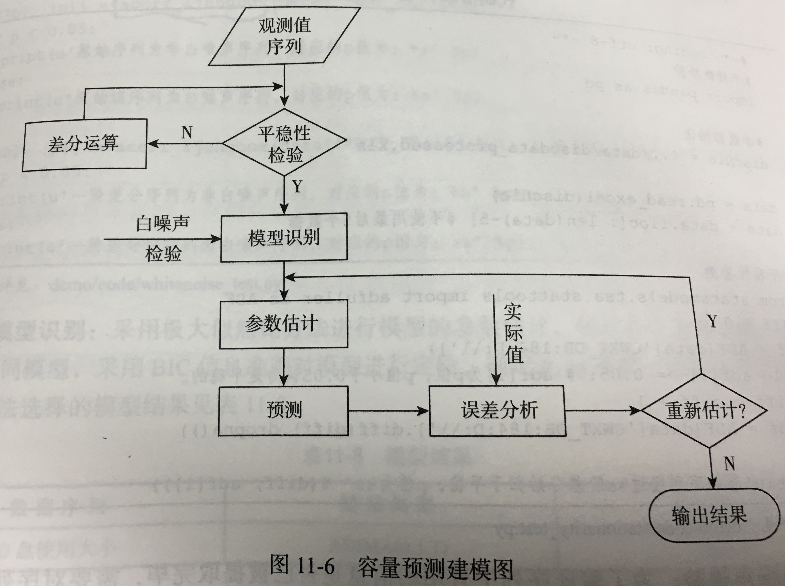
        - 模型评价：平均绝对误差，均方根误差和平均绝对百分误差
        - 模型应用：将预测值与总容量进行比较，及获取预测值占总量的百分比，获得磁盘使用率。当预测的磁盘使用率超出预定阈值则报警。其中预警等级的设定需要结合实际应用。在实际应用中，模型需要重新调整，考虑到每天的变化较小，因此可以结合实际业务确定调整的频率。
        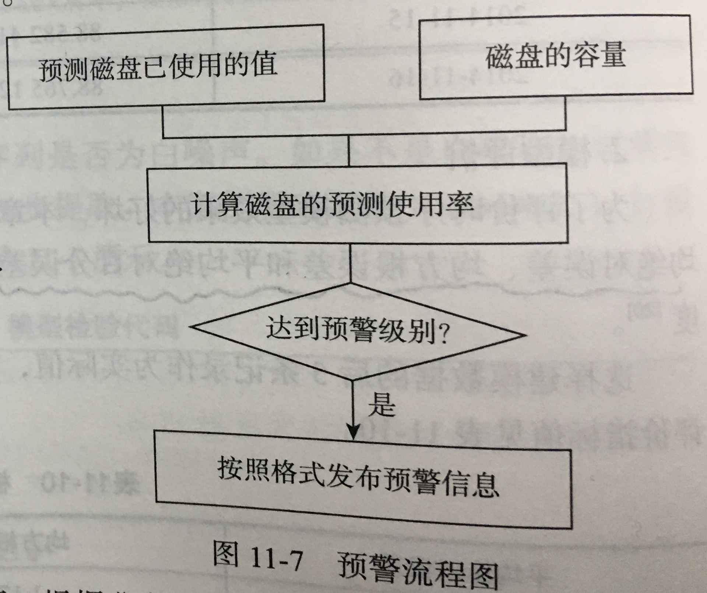
    - 拓展思考：根据每天的各类型的告警数，通过相关性判断哪些类型告警与应用系统真正故障有关。通过相关类型的告警，预测明后两天的告警数。方法：（1）通过时序算法预测未来相关类型的告警数；（2）采用分类预测算法对预测值进行判断，判断未来系统是否发生故障。  

### 12. 电子商务网站用户行为分析及服务推荐

- 目标：对用户进行推荐，即以一定的方式将用户与物品（本案例指网页）之间建立联系。
    - **按地域**研究用户访问时间、访问内容和访问次数等分析主题，深入了解用户对访问网站的行为和目的及关系的内容。
    - 借助大量的用户访问记录，发现用户的访问行为习惯，对不同需求的用户进行相关的服务页面的推荐。
    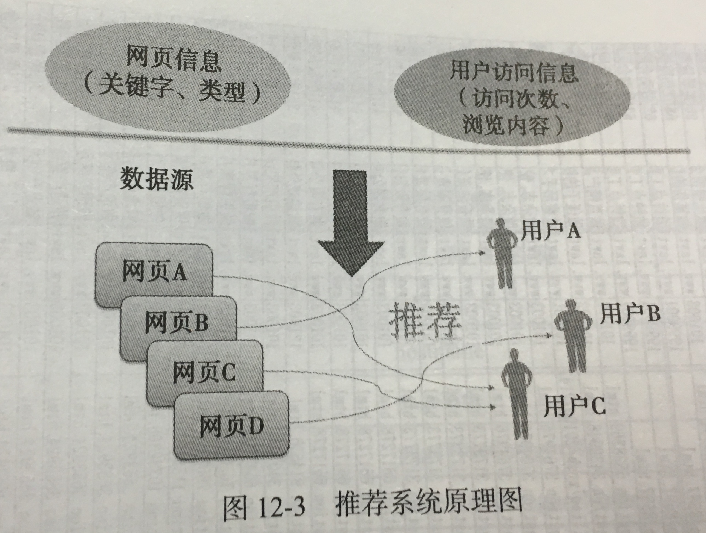
    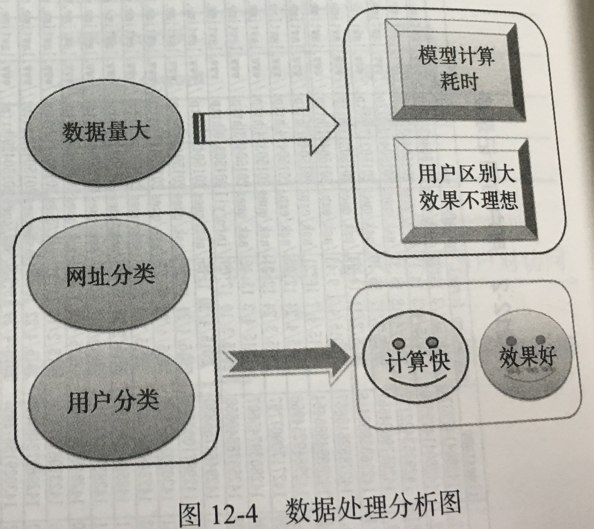
- 分析方法和过程：
    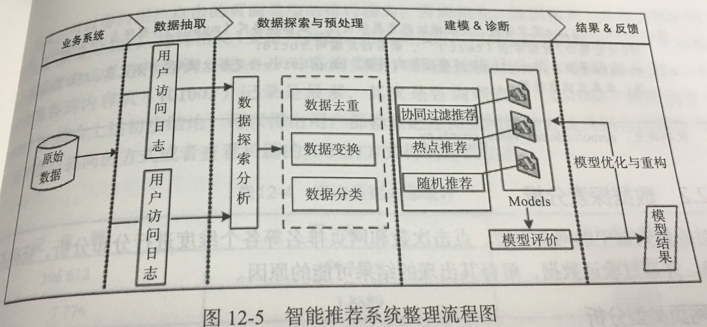
    - 数据抽取：我们将使用经典的协同过滤算法实现推荐，其特点是通过历史数据找到相似的用户或网页。因此在数据抽取过程中，尽量选择大量的数据，这样可以降低推荐结果的随机性。本案例使用广州地区近 3 个月的用户访问数据进行分析，总共有记录 837 450 条记录。 处理过程：建立数据库-->导入数据-->搭建 python 的数据库操作环境 --> 对数据进行分析 --> 建立模型。
    - 数据探索分析
        - 网页类型分析：
           - 处理要义是“分块进行”，必要时可以使用多线程和分布式；trick：正则表达式。
           - 发现一些与分析目标无关的规则：（1）咨询发布成功页面；（2）中间类型网页（带有 midques_关键字）；（3）网址中带有“？”类型，无法还原其本身类型的快搜页面与发布咨询网页；（4）重复数据（同一时间同一用户，访问相同网页）。（5）其他类别的数据（主网址不包含关键字）；（6）无点击 .html 页面行为的用户记录；（7）律师的行为记录（通过快车-律师助手判断） 。记录这些规则，有利于进行数据清洗操作。
       - 点击次数分析：浏览一次的用户占所有用户总量的 58% 左右，大部分用户浏览的次数在 2 ～ 7 次，用户浏览的平均次数为 3 次。大约 80% 的用户 （不超过 3 次）只提供大约 30% 的浏览量 （几乎满足二八定律）。
       - 网页排名：平局大概 60%～80% 的人会选择看下一页，基本每一页都会丢失 20% ～ 40% 的点击率。
   - 数据预处理:
       - 数据清洗：根据网页类型分析的结果删除无关网页
       - 数据变换：翻页情况，不同的网址属于同一类型的网页，直接删除会损失大量数据；探索阶段发现部分网页所属类别是错误的，需对其数据进行网址分类，基于业务分析，可以通过**网址构成**进行分类。统计每一类中的记录，可以看到浏览量基本满足二八定律。
       - 属性规约：只保留用户和网页
       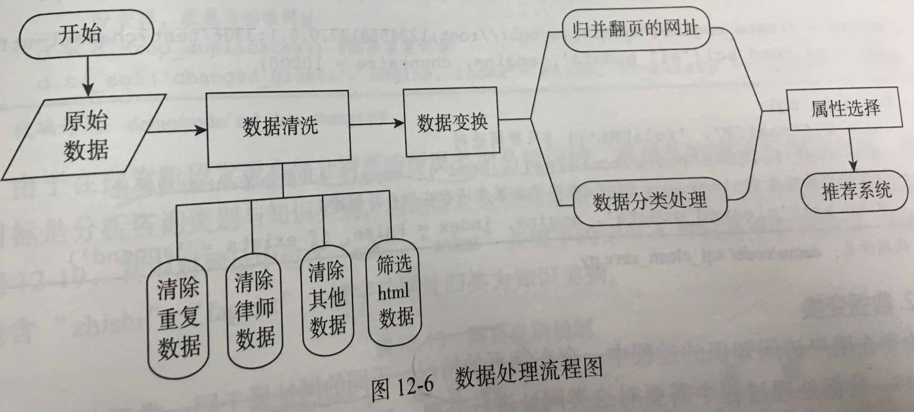
   - 模型构建：
       - 基于物品的协同过滤 vs 基于用户的协同过滤。当前场景中网页数明显少于用户数，因此选择基于物品的协同过滤。
       - 实际中使用的通常是对多种对件方法的推荐结果进行组合推荐，以优化效果。
       - 基于物品的协同过滤：
           - 步骤：（1）计算物品之间的相似度；（2）根据物品的相似度和用户的历史行为给用户生成推荐列表。    
           - 相似性度量：余角余弦、杰卡德相似系数（category）、相关系数
           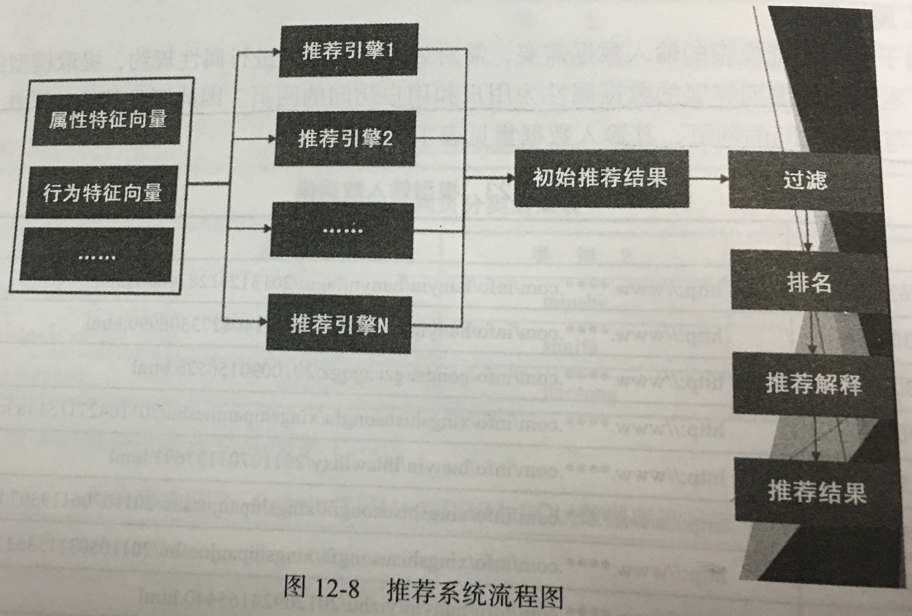
           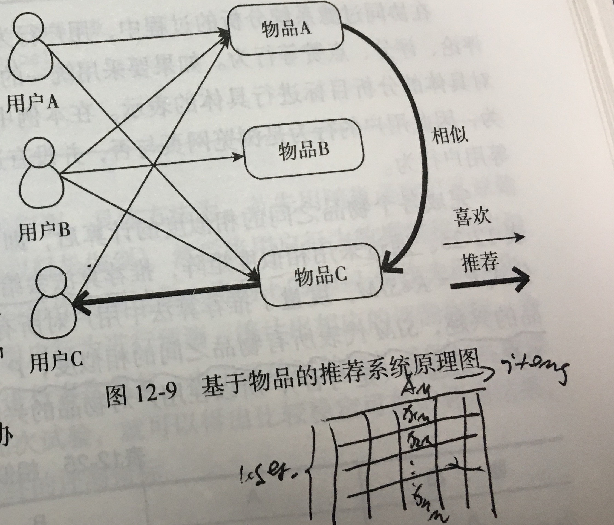
           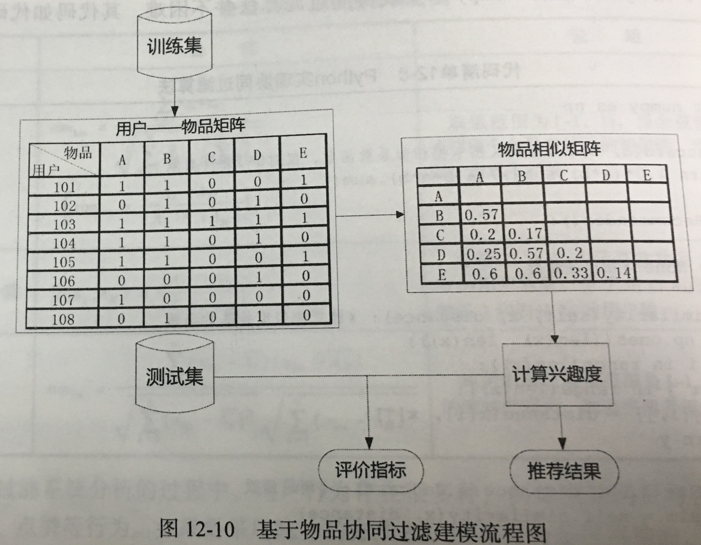
       - 模型评价：
           - 从几个方面：用户、物品提供者、提供推荐系统网站
           - 好的推荐系统：满足用户需求，推荐感兴趣的物品；推荐物品中不能全是热门物品，也需要反馈意见帮助完善推荐系统；不仅能预测用户的行为，而且能帮助用户发现可能感兴趣，但却不容易发现的物品；推荐系统还应该帮商家将长尾中的好商品发掘出来。
           - 评价指标主要来源于3中实验方法：离线测试、用户调查和在线实验。
           - 注意：离线指标和实际商业指标存在差距。 高预测准确率 ！= 高用户满意度。
           - 指标：预测准确度：RMSE, MAE; 分类准确度：Precesion, recall, F1-score
           - P-R 曲线观察效果，finetune
       - 结果分析：
           - 推荐结果存在 null 的情况，因为出现访问此网址的只有单独一个用户，因此在协同过滤算法中计算它与其他物品的相似度为 0。（冷启动问题）
   - 拓展思考：冷启动问题；通过文本挖掘可以优化推荐。

### 13. 财政收入影响因素分析及预测模型

- 目标：
    1. 梳理影响地方财政收入的关键特征，分析、识别影响地方财政收入的关键特征的选择模型；
    2. 结合目标 1 的因素分析，对某市 2015 年的财政总收入及各个类别收入进行预测。
- 分析方法与过程：
    - 数据探索分析：分析关键属性的统计值，社会从业人数、在岗职工工资总额、社会消费品零售总额、城镇居民人均可支配收入、城镇居民人均消费性支出、年末总人口、全社会固定资产投资额、地区生产总值、第一产业值、税收、居民消费价格指数、第三产业与第二产业产值比、居民消费水平。
    - 模型构建
        - 模型选择：
            - Lasso vs Adative-Lasso，Adaptive-Lasso 惩罚因子加入权重，进行特征选择。
            - 灰色预测与神经网路组合模型：
                -  在 Adaptive-Lasso 变量选择的基础上，鉴于灰色预测对小数据量数据预测的优良性能，对单个选定的影响因素建立灰色预测模型，得到它们在 2014 年及 2015 年的预测值。
                -  神经网络具有较强的适应性和容错能力，对历史数据建立训练模型，把灰色预测的数据带入训练好的模型中，就可以得到充分考虑历史信息的预测结果。
        - 模型评价：
            - 灰色预测：后验差比值
            - 回归预测的评价指标
    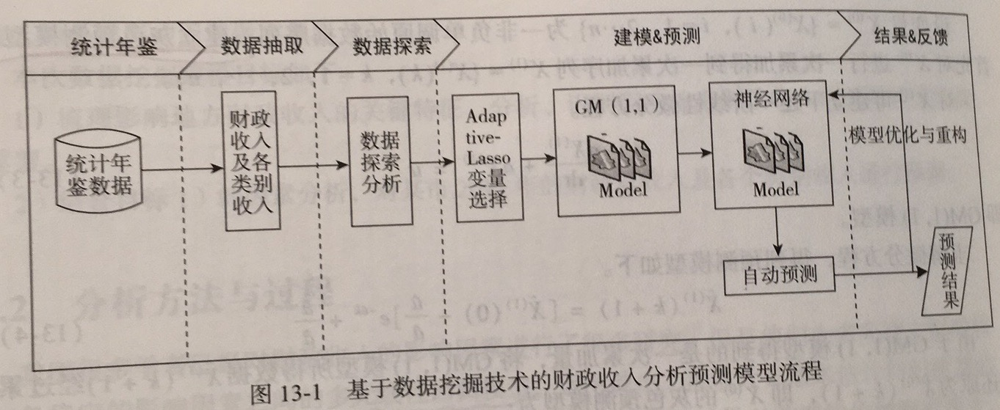
    - 拓展思考：
        - 电力负荷预测是电力系统运行调度、生产规划、电力市场竞价决策的重要组成部分。
        - 目前，国内外的预测应用软件大多基于特定的少数几种模型，而选择模型单一造成的后果是：预测结果往往只对某中发展规律有效。目前基于用电侧的电力负荷预测效果不甚理想。   

### 14. 基于基站定位数据的商圈分析

- 目标：
    - 对用户的历史定位数据，采用数据挖掘技术，对基站进行分群。
    - 对不同的商圈分群进行特征分析，比较不同商圈类别的价值，选择合适的区域进行运营商的促销活动。
    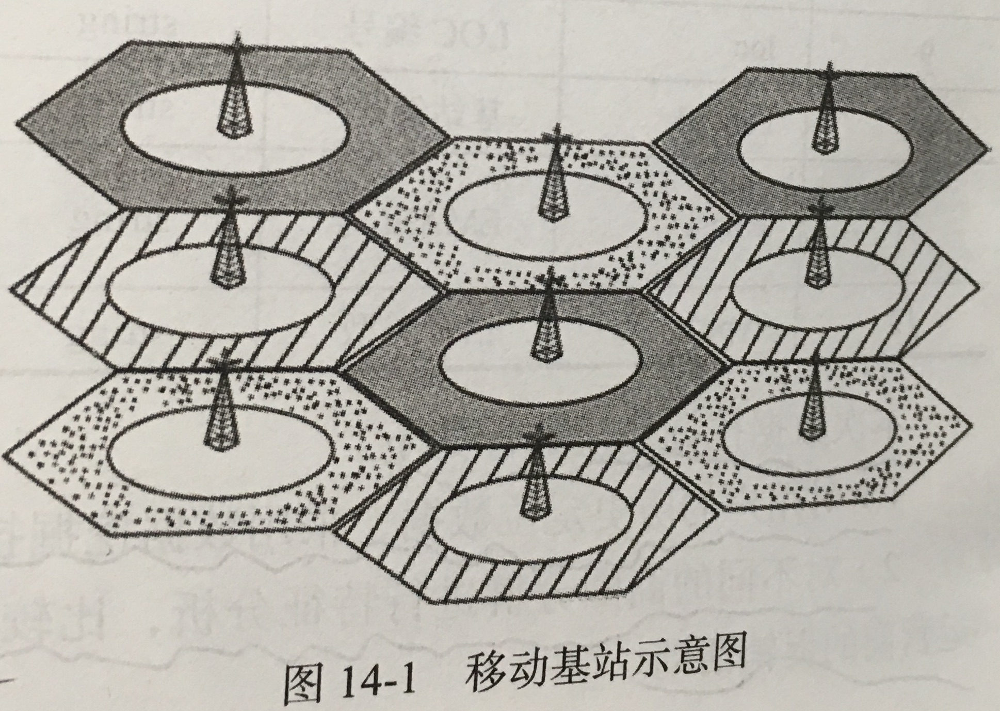
- 分析方法和过程：
    - 数据抽取：从移动运营商提供的特定接口上解析、处理、并滤除用户属性后得到位置数据。时间为 2014-1-1 至 2014-6-30
    - 数据探索分析：EMAI号为 “5555” 的用户在 2014-1-1 的位置数据
    
    - 数据预处理：
         - 数据规约：网络类型、LOC 编号和信令类型对分析无用删除；用户停留时间无需精确到毫秒级，将毫秒属性删除；
         - 数据变换：计算 4 个指标，工作日上班时间人均停留时间、凌晨人均停留时间、周末人均停留时间、日均人流量。
     - 模型构建：
         - 构建商圈聚类模型：层次聚类，根据谱系聚类图可以聚成 3 类。
         - 模型分析：针对聚类结果按不同类别画出 4 个特征的折线图。 
         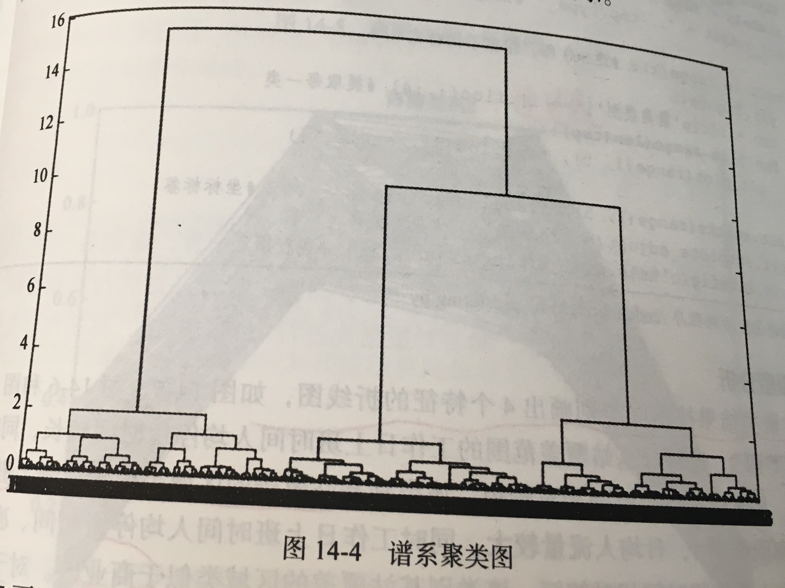   
         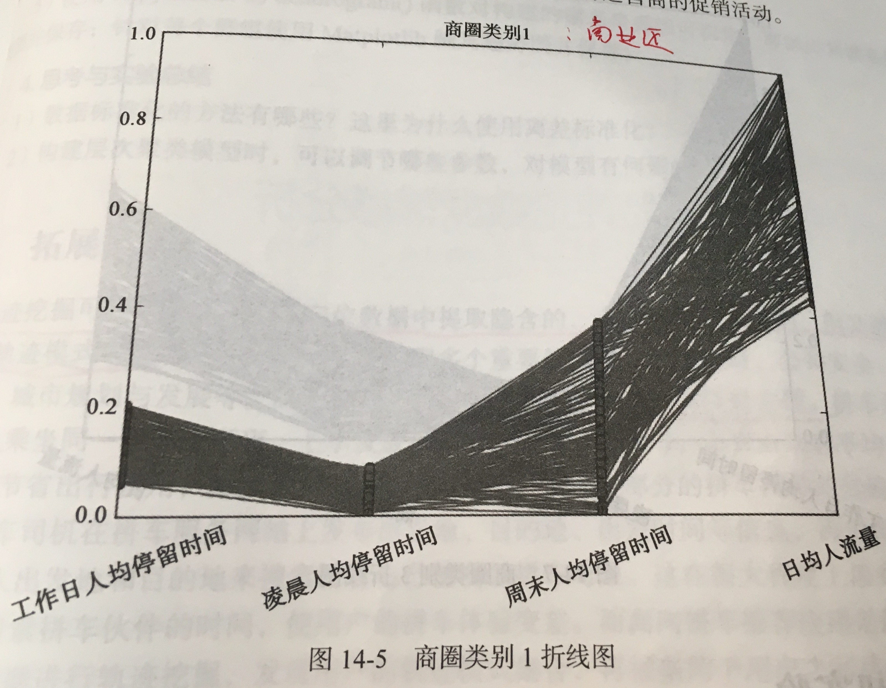
         
         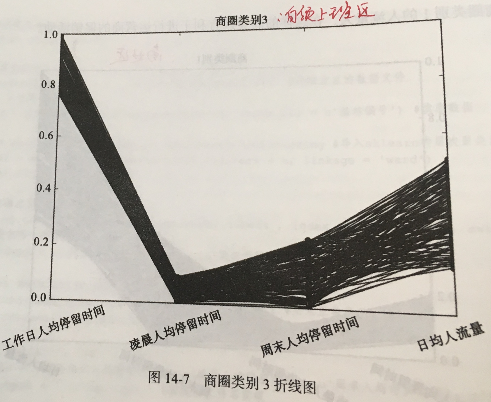
     - 拓展思考：
         - 轨迹挖掘定义：从移动定位数据中提取隐含的、人们预先不知道的、但又潜在有用的移动轨迹模式的过程。
         - 面向拼车推荐应用是轨迹挖掘的新兴研究主题。 

### 15. 电商产品评论数据情感分析 

- 目标：对京东平台上的热水器评论进行文本挖掘分析
     1. 分析某一品牌热水器的用户情感倾向；
     2. 从评论文本中挖掘出该品牌热水器的优点与不足；
     3. 提炼不同品牌热水器的卖点。
- 分析方法与过程：
    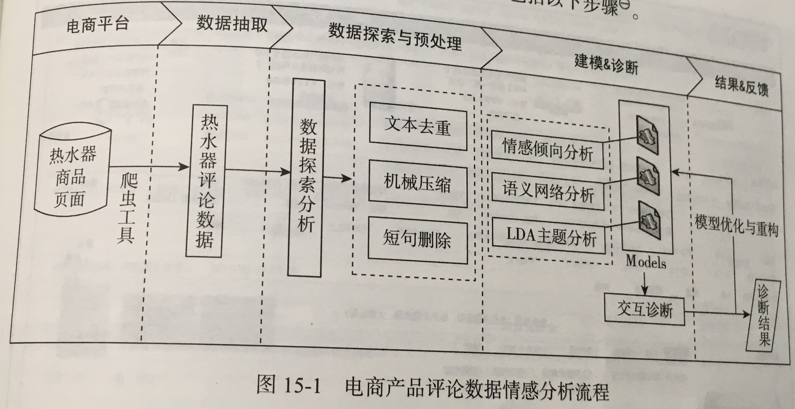 
    - 评论数据采集：对比多种网络爬虫工具后，选择“八爪鱼”。易用，主要通过模仿用户的网页操作进行数据采集，只需指定数据采集逻辑和可视化选择采集的数据，即可完成采集规则的制定。抓取页面中的：产品名称，价格和评论信息。
    - 评论预处理：
        1. 文本去重：
            - 原因：1. 用户长时间不评论会有默认评论，这是无用信息；2. 同一个人可能会重复评论，没有价值；3. 从语言特点来看，不同人之间的有价值评论不回存在重复。
            - 常见文本去重
                - 给予相似性阈值截断，效果依赖于相似性度量，容易删除有用的语句；
                - 方法选择：基于以上分析，选择简单的方法，直接删除全完全重复的语句。 
        2. 机械压缩去词：
            - 原理：去掉一些连续重复累赘的表示，例如：“哈哈哈哈哈哈哈哈哈” --> “哈”
            - 机械压缩去词的语料结构
            - 机械压缩去词过程和规则的阐述
            - 操作流程：对开头和结尾的重复进行删除
        3. 短句删除：
            - 太短的语句没有信息量，比如“很好”，“不错”
            - 保留评论字数的下限没有精确的标准，具体问题具体分析，一般 4～8 个国际字符都为比较合理的下限。
    - 文本评论分词：python 的 "jieba" 分词包。分词结果的准确性对后续文本挖掘算法有着不可忽视的影响。
    - 模型构建
        1. 情感倾向性模型：
            - 训练生成词向量：将符号数学化
                - one-hot representation：不能反映语义之间的关系
                - distributed representation：两个词义上相近的词，转换后的向量也相近
                - 选择：word2vec 采用神经网络模型 NNLM 和 N-gram 语言模型进行 representation 的学习，每个词都可以表示成一个向量。
                - 注意：学习的效果依赖于语料库。
            - 评论集子集的人工标注与映射
                - 人工打label，positive 评论 1， negative 评论 0
                - 可以采用 python 的 NLP 包 snownlp 的 sentiment 功能进行简单的机器标注，减少人的工作量
            - 训练栈式自编码网络
                - auto-encoder：特征学习，从一个特征空间到另一个特征空间。
                - 栈式自编码神经网络是一个由多层稀疏自编码器组成的网络。它的思想是利用逐层贪婪训练的方法，把原来多层的神经网络分成一个个小的自编码器，每次只训练一个自编码器，然后将前一层的输出作为下一层的输入。在最后一层连接一个分类器，svm 或 softmax。这里为了得到更好的权重，可以在连接分类器以后，基于 bp 网络的思想对整个框架进行微调。
        2. 基于语义网络的评论分析：
            - 语意网络的概念、结构与构建本质：由 R.F.Simon 提出的用于理解自然语言并获取认知的概念，是一种语言的概念及关系的表达。
            - 基于语义网络进行评论分析的优势。
            - 基于语义网络进行评论分析的前期步骤与解释
                1. 数据预处理、分词以及停用词过滤
                2. 进行情感倾向性分析 ，并将评论数据分割成正面（好评）、负面（差评）、中性（中评）。情感分析可以在原来的情感分析工作基础上作出修改，使用 ROST 系统，武汉大学开发的一款免费反剽窃系统。
                3. 抽取正面、负面两组，以进行语意网络的构建与分析。（不对中性评论进行分析是因为其复杂）  
            - 基于语义网络进行评论分析的实现过程。描述 ROST 系统的操作步骤。
            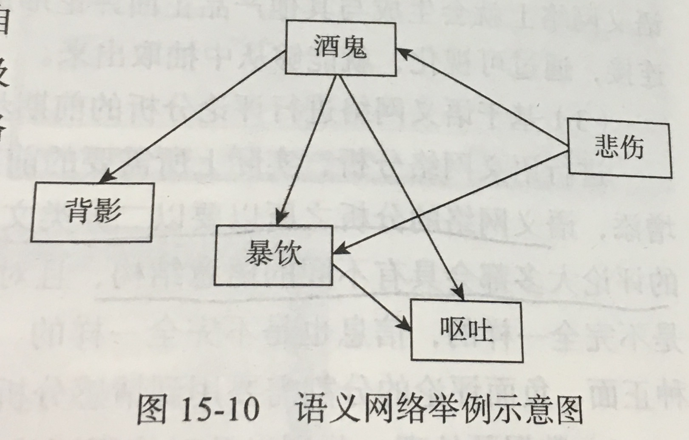
        3. 基于 LDA 模型的主题分析：从统计学的角度，对主题的特征词出现频率进行量化表示。
            - 主题挖掘模型：
                - 主题模型是**在一系列文档中发现抽象主题的一种统计模型。** 
                - 相似性计算：TF、TF-IDF 没有考虑文字背后的关联；判断相似性应该进行语义挖掘，而语义挖掘最有效的工具就是主题模型。
                - LDA（Latent Dirichlet Allocation）是一种无监督的生成式概率模型。
                    -  每一篇文档的每一个词都是通过“一定的概率选择了某个主题，并从这个主题中以一定的概率选择了某个词语”
                    -  LDA 模型假定每篇论文由各个主题按一定比例随机混合而成，混合比例服从多项式分布
                    -  LDA 主题模型在文本聚类、主题挖掘和相似性计算等方面都有广泛应用。
                    -  优势：引入 Dirichlet 先验，模型泛化能力强，不容易出现过拟合；可以解决多种指代问题；一种无监督的模式，不需要人工打label。
            - LDA 主题模型估计
                - MCMC（Markov Chain Monte Carlo）算法的一个特例 Gibbs 抽样。 
            - LDA 模型的实现：
                - 在语义网络的情感分类结果基础上（COSTCM6 机器标注），对不同情感倾向下的潜在主题分别进行挖掘分析（python 的 Gensim 中有 LDA 的实现），从而得到不同情感倾向下用户对热水器不同方面的反映。
                - 根据不同的主题发现热水器的优势和主要的抱怨，并基于此给出改进的建议。
    - 拓展思考：应用层次分析法（Analytical Hierachy Process, AHP） + 模糊综合评判（Fuzzy Comprehensive Evaluation, FCE）。AHP 能够准确地对决策定性，但其决策过程需要经过大量数据对比来最终通过概率确定权重；而 FCE 中虽然有很好的定量评价，但无法很好地对决策定性。尝试通过对二者的结合来实现对电商平台上热水器的购买决策分析。
    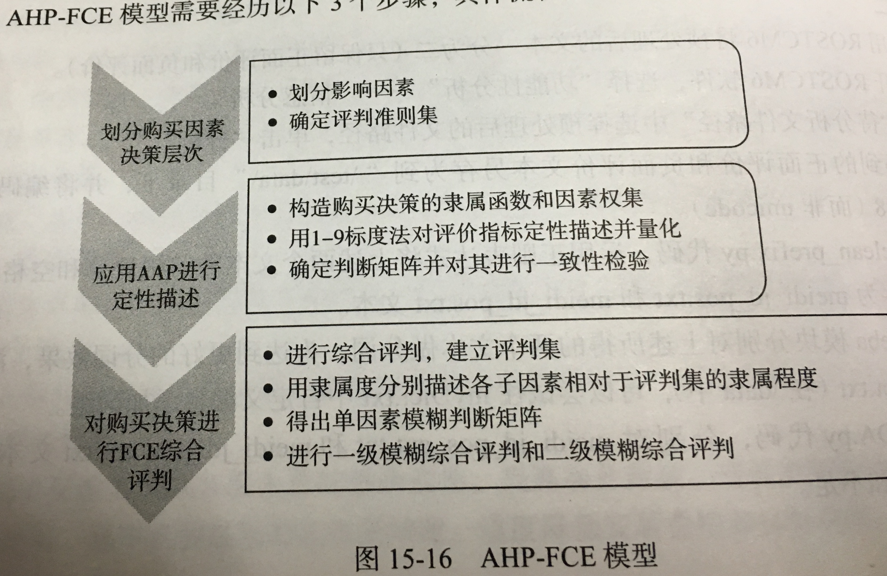