The latest update: 2018-04-15

# 概率论与数理统计-第四版-浙江大学-盛骤

- [x] [1. 概率统计的基本概念](#001)
    - [x] 随机试验
    - [x] 样本空间、随机事件
    - [x] 频率与概率
    - [x] 等可能概型（古典概型）
    - [x] 条件概率
    - [x] 独立性
    - [x] 小结
- [x] [2. 随机变量及其分布](#002)
    - [x] 随机变量
    - [x] 离散型随机变量及其分布律
    - [x] 随机变量的分布函数
    - [x] 连续型随机变量及其概率密度
    - [x] 随机变量的函数分布
    - [x] 小结
- [x] [3. 多维随机变量及其分布](#003)
    - [x] 二维随机变量
    - [x] 边缘分布
    - [x] 条件分布
    - [x] 相互独立的随机变量
    - [x] 两个随机变量的函数分布
- [x] [4. 随机变量的数字特征](#004)
    - [x] 数学期望
    - [x] 方差
    - [x] 协方差及相关系数
    - [x] 矩、协方差矩阵
- [x] [5. 大数定律及中心极限定理](#005)
    - [x] 大数定律
    - [x] 中心极限定理
- [x] [6. 样本及抽样分布](#006)
    - [x] 随机样本
    - [x] 直方图和箱线图
    - [x] 抽样分布
- [x] [7. 参数估计](#007)
    - [x] 点估计
    - [x] 基于截尾样本的最大似然估计
    - [x] 估计量的评选标准
    - [x] 区间估计
    - [x] 正态总体均值与方差的区间估计
    - [x] （0-1）分布参数的区间估计
    - [x] 单侧置信区间
- [x] [8. 假设检验](#008)
    - [x] 假设检验
    - [x] 置信区间与假设检验之间的关系
    - [x] 样本容量的选取
    - [x] 分布拟合检验
    - [x] 秩和检验
    - [x] 假设检验问题的 p 值法
- [x] [9. 方差分析及回归分析](#009)
    - [x] 单因素试验的方差分析
    - [x] 双因素试验的方差分析 
    - [x] 一元线性回归
    - [x] 多元线性回归
- [x] [10. bootstrap 方法](#010)
    - [x] 非参数 bootstrap 方法
    - [x] 参数 bootstrap 方法
- [x] [11. 在数理统计中应用 Excel 软件](#011)
    - [x] 箱线图
    - [x] 假设检验
    - [x] 方差分析
    - [x] 一元线性回归
    - [x] bootstrap 方法、宏、VBA
- [x] [12. 随机过程及其统计描述](#012)
    - [x] 随机过程的概念
    - [x] 随机过程的统计描述
    - [x] 泊松过程及维纳过程
- [x] [13. 马尔可夫链](#013)
    - [x] 马尔可夫过程及其概率分布
    - [x] 多步转移概率的确定
    - [x] 遍历性
- [x] [14. 平稳随机过程](#014)
    - [x] 平稳随机过程的概念
    - [x] 各态历经性
    - [x] 相关函数的性质
    - [x] 平稳随机过程的功率谱密度

<h2 id="001"> 1. 概率统计的基本概念 </h2>

**专业术语：**

- 确定性现象、统计规律、随机现象
- 样本空间、样本点、随机事件（事件）、事件发生、基本事件、必然事件、不可能事件
- 事件的关系：相等、和事件、积事件、差事件、互不相容事件/互斥的，逆事件/对立事件
- 事件的运算：交换律、结合律、分配律、德摩根律
- 频数、频率、频率的基本性质、概率、概率的基本条件
- 等可能概型（古典概率）、概率的计算公式
- 放回抽样、不放回抽样、超几何分布、“概率很小的事件在一次试验中几乎不可能发生（实际推断原理）”
- 条件概率、乘法定理、划分、全概率公式、贝叶斯公式
- 2 个重要例子：
    - 零部件的损坏的例子：先验概率和后验概率的关系
    - 临床癌症的普查：P(A|C) 和 P(C|A) 混淆的严重后果
- 独立性

**笔记**

自然界和社会上发生的现象是多种多样的，其中有**确定性现象**（eg. 太阳东升西落）和**随机现象**（eg. 抛硬币、掷骰子）。其中随机现象是指在个别**试验**（可以理解为进行一次测试）中其结果呈不确定性，在大量重复试验中其结果又具有统计规律性的现象。  

满足一下 3 个特点的试验称为**随机试验**：（1）可以在相同条件下重复进行；（2）每次试验的可能结果不止一个，并且事先明确试验的所有可能结果；（3）进行一次试验之前不确定哪个结果会出现。

随机试验 **E** 可能发生的所有结果组成的集合称为**样本空间**，记为 **S**。样本空间中的每个元素，即试验 E 每个可能结果称为**样本点**。样本空间 S 的子集称为试验 E 的**随机事件**，简称**事件**。特别的，一个样本点组成的单点集，称为**基本事件**。在每次试验中，当且仅当这一子集中的一个样本点出现时，称这一**事件发生**。两个特殊情况，S 称为**必然事件**，`$\varnothing $` 称为**不可能事件**。

事件是一个集合，因此事件关系和运算同集合论中集合之间的关系和运算一样，只是在术语上有些少差别。  
- 事件的关系
    - 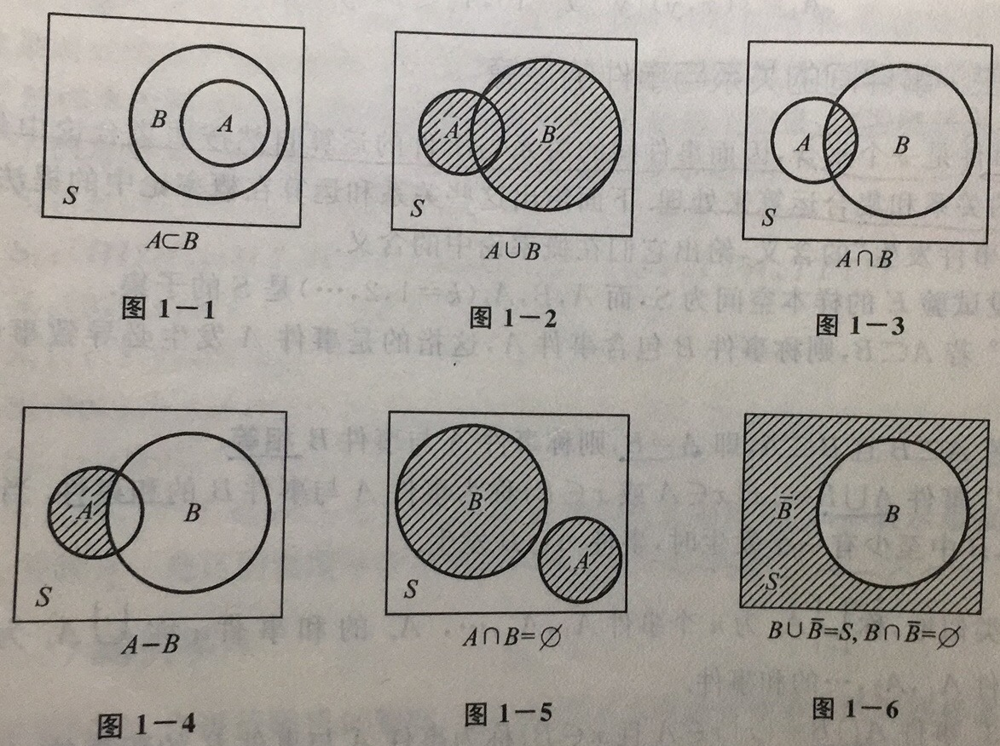
    - 互不相容事件/互斥的: `$ A \cap B = \varnothing  $`，A 和 B 互斥
    - 逆事件/对立事件：`$ A \cup B = S and A \cap B = \varnothing  $`
- 事件的运算：
    - 交换律：`$ A \cap B = B \cap A; A \cup B = B \cup A  $`
    - 结合律：`$ A \cap (B \cap C) = (A \cap B) \cap C; (A \cup B) \cup C = A \cup (B \cup C) $`
    - 分配律：`$ A \cap (B \cup C) = (A \cap B) \cup (A \cap B); A \cup (B \cap C) = (A \cup B) \cap (A \cup C) $`
    - 德摩根律：`$ \overline{A \cap B} = \overline{A} \cup \overline{B}; \overline{A \cup B} = \overline{A} \cap \overline{B} $`
- 频率与概率：
    - **频率**是衡量事件发生频繁程度的指标。在相同条件下进行 n 次试验，A 事件发生了 k次，那么 k 称为事件 A 发生的 **频数**，比值 k/n 称为事件 A 发生的 **频率**，并记为 `$ f_{n} $`。频率满足 3 个条件：**非负性、规范性、可列可加性**。
    - 当重复试验足够大时，频率趋于稳定，这种“频率的稳定性”即通常说的“统计规律”，由此引出表征事件发生可能性大小的指标——**概率**。（历史上有若干人重复做抛硬币的试验，其中皮尔逊做了 24000 重复试验，发现频率稳定在 0.5 左右，由此得硬币出现正/反面的概率相同为 0.5）。
    - 概率得定义：设 E 是随机试验，S 是它的样本空间。对于 E 的每一事件 A 赋予一个实数，记为 P(A)，称为事件 A 的**概率**。概率满足下列 3 个条件：**非负性、规范性、可列可加性**。
    - 由概率的定义得到一些概率的重要性质：
        - `$ P(\varnothing) = 0  $`
        - `$ P(S) = 1 $`
        - `$ P(A_{1} \cup A_{2} \cup ... \cup A_{n}) = P(A_{1}) + ... + P(A_{n}) , A_{1}, ..., A_{n} $` 两两互不相容
        - `$ if: A \subseteq B, P(B-A) = P(B) - P(A), P(B) \geqslant  P(A) $`
        - `$ P(\overline{A}) = 1 - P(A) $`
        - `$ any: A, B; P(A \cup B) = P(A) + P(B) - P(AB) $`
- 等可能概型（古典概型）
    - 特点：样本空间元素有限、每个基本事件发生的可能性相同
    - 计算：`$ P(A) = \frac{the\_number\_of\_base\_event\_in\_A}{the\_number\_of\_base\_event\_in\_S } $`
    - 练习中的概念：放回抽样、不放回抽样、超几何分布、“概率很小的事件在一次试验中几乎不可能发生——**实际推断原理**”
- 条件概率：
    - `$ P(B|A) $` 称为 A 发生的条件下 B 发生的概率。`$ P(B | A) = \frac{P(AB)}{P(A)}, P(A)>0 $`。条件概率也是概率，当 A 固定时候 `$ P(\cdot|A)$` 符合概率 3 个条件，即非负性、规范性、可列可加性。
    - 乘法定理/乘法公式: `$ P(AB) = P(A)*P(B|A), P(A) > 0 $`，可推广到 n 个事件中，方便实际中用于计算联合概率分布。
    - 划分：设 S 为试验 E 的样本空间，`$ B_{1}, B_{2}, ..., B_{n} $` 为 E 的一组事件，若(1) `$ B_{i}B_{j} = \varnothing, i \neq j, i,j = 1,2, .., n$`, (2) `$ B_{1} \cup B_{2} \cup ... \cup B_{n} = S $`，则称 `$ B_{1}, B_{2}, ..., B_{n} $` 为 S 的一个**划分**，在一次试验中有且仅有一个会发生。
    - 全概率公式：`$ P(A) = \sum_{i=1}^{n}P(A|B_{i})P(B_{i}), P(B_{i}) > 0 $`
    - 贝叶斯公式: `$ P(B_{i} | A) = \frac{ P(A|B_{i})P(B_{i}) }{\sum_{j=1}^{n}P(A|B_{j})P(B_{j})},  P(B_{i})>0, P(A)>0, i=1,...,n, $`
    - 练习：
        - 贝叶斯公式中 `$ P(B_{i}) $` 称为**先验概率**，可由历史数据分析得到。而 `$ P(B_{i} | A)$` 称为 **后验概率**，可由新的信息修正得到。
        - 通过计算癌症的例子说明 P(A|C) 和 P(C|A) 混淆会导致很严重的后果。A 表示检查呈阳性，C 表示患癌症。P(A|C)=0.95，已经确诊为癌症的人检查呈阳性的概率为 0.95。P(C|A)=0.087，普查中某人检查结果呈阳性下被确诊患癌症的概率仅有 0.087，即 1000 检查呈阳性确诊患癌症大约只有 87 人。
- 独立性
    - 若 `$ P(AB) = P(A)P(B) $`，则称事件 A 和 B **相互独立**，简称**独立**。定义可以推广到 n 个事件和对立事件中。
    - 若 A 和 B 相互独立，且 P(A) > 0，则 P(B|A) = P(B)，分之亦然。
    - 在实际应用中，对于事件的独立性常常根据事件的实际意义去判断。比如甲、乙两人感冒，若两人距离很远可任务两者相互独立，若两人是室友，则不独立。
    
<h2 id="002"> 2. 随机变量及其分布 </h2>

**专业术语**

随机变量、分布函数、离散型随机变量及其分布律、连续型随机变量及其概率密度、伯努利试验、（0-1）分布、n 重伯努利试验、二项分布、泊松分布、指数分布、均匀分布、正太分布、随机变量函数的分布

**笔记**

- 随机变量
    - 前面讨论随机事件的样本空间有数值型的也有非数值型的。为了方便运用数学工具进行研究，本章将引入**随机变量**的概念，将样本点都映射到数值型，进而将样本空间映射到实数域内。  
    - _定义_：设随机试验的样本空间为 S={e}. X=X(e) 是定义在样本空间 S 上的实值单值函数。称 X=X(e) 为**随机变量**。  
    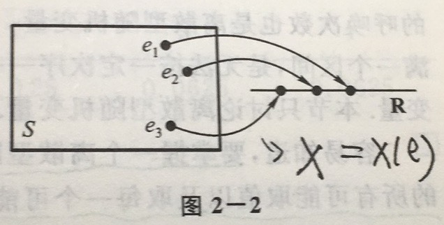  
    一般，若 L 是一个实数集合，将 X 在 L 上取值写成 `$ X\in L $`。它表示事件 `$ B = \{e | X(e) \in L\} $`，即 B 是由 S 中使得 `$ X(e) \in L $` 成立的所有样本点 e 组成的事件，此时有 `$ P\{X \in L\} = P(B) = P\{ e| X(e) \in L\} $`  
    - _约定_：我们一般用大写字母如 `$ X, Y, Z, W, ... $` 表示随机变量，而小写字母 `$ x, y, z, w, ... $` 表示实数。
- 离散型随机变量及其分布律
    - 对于离散型随机变量，我们只要知道其所有取值的概率就可以掌握其统计规律。
    - **分布律：** `$ P(X = x_{k}) = p_{k}, k=1,2,... $`，可以列成表格的形式。
    - 3 种重要的离散型随机变量；
        - （0-1）分布：
            - 分布律：`$ P(X=k) = p^{k} *(1 - p)^{1-k}, k=0,1 (0 < p < 1) $`
            - 随机变量只有两个取值，实际中以下场景均对应（0-1）分布，性别、产品质量是否合格、抛硬币等。
        - 伯努利试验、二项分布
            - **伯努利（Bernoulli）试验：** 试验 E 只有两种可能结果，即 `$ A $` 及`$\overline{A}$`，则称 E 为伯努利试验。若 E 独立重复地进行 n 此，则称这一串事件的独立试验为 n **重伯努利试验**。设 `$ P(A) = p $`，则 `$ P(\overline{A}) = q = 1-p $`。
            - n 重伯努利试验是一种很常用的数学模型，有广泛的应用，是研究最多的模型之一。
            - 以 X 表示 n 重伯努利试验中事件 A 发生的次数，X 是一个随机变量。则 X 的分布律为:`$ P\{X = k\} = \binom{n}{k}p^{k}q^{n-k}, k=0,1,2,...,n $`，其中 `$ \binom{n}{k}p^{k}(1-p)^{n-k} $` 刚好是二项式 `$ (p + q)^{n} $` 展开式出现 `$ p^{k} $` 的那一项。因此我们又称 X 服从参数为 n, p 的 **二项分布**，记为 `$ X \sim b(n, p) $`。
            - 一个练习：将一次射击看成一次试验，设击中的次数为 X，则 `$ X \sim b(400, 0.02) $`。由此可得 `$ P\{X \geq 2\} = 1 - P\{X=0\} - P\{X=1\} = 0.9972$`。得到两个有趣结论：
                - 不要忽略小概率事件：虽然单次试验发生的概率很小，但若每次试验是相互独立的，那么重复多次以后，事件发生似乎是必然。
                - 实际推断原理。如果射手在 400 次射击中，击中的次数不到 2 次，因为 `$ P(X \leqslant 2) = 1 - 0.9972 = 0.003$` 很小，小概率事件在一次试验中发生了，我们有理由怀疑射击手的中靶概率不到 0.02。
        - 泊松分布
            - 分布律：`$ P\{X = k\} = \frac{\lambda ^{k} e^{-\lambda}}{k!}, k=0,1,2... , \lambda > 0$`，记为 `$ X \sim \pi(\lambda) $`
            - 泊松定理：设 `$ \lambda > 0$` 是一个常数，n 是任意正整数，设 `$ np_{n} = \lambda $`，则对于任一固定的非负整数 k，有：`$ lim_{n\rightarrow \infty}\binom{n}{k}p_{n}^{k}(1-p_{n})^{(n-k)} = \frac{\lambda ^{k} e^{-\lambda}}{k!} $`。
            - 注意到泊松定理的条件为 `$ np_{n} = \lambda $`， `$ \lambda $` 为常数，那么当 n 很大时候 `$ p_{n} $` 必定很小。因此表明当 n 很大， p 很小时，有以下近似公式：`$ \binom{n}{k}p^{k}(1-p)^{n-k} = \frac{\lambda ^{k} e^{-\lambda}}{k!}, \lambda = np $`，**这一公式常常用来作为二项分布的近似计算**。一般当 `$ n \geq 20, p \leqslant 0.05 $` 时近似效果颇佳。
            - 实际中的泊松分布：一本书一页中的印刷错误数、某地区在一天内邮递遗失的信件数、某一医院一天内急诊病人数、某一地区一个时间间隔内发生交通事故的次数、在一个时间间隔内某种放射性物质发出的、经过计数器的 alpha 粒子数等。
- 随机变量的分布函数
    - 非离散型的随机变量不能取值无法穷举。再者我们遇到的非连续型随机变量在任一确切值上的取值为 0。由此我们不能向研究离散型随机变量一样列出其分布律。因此我们转而研究非离散型随机变量落在一个区间内的概率，`$ P(x_{1} \leqslant x < x_{2}) = P(x \leqslant x_{2}) - P(x \leqslant x_{1})$`，由此我们只要知道 `$  P(x \leqslant x_{2}) $` 和 `$ P(x \leqslant x_{1}) $` 就可以求得非离散型随机变量落入任意区间内的概率。为了研究方便，我们引入**分布函数**的概念。
    - _定义_：设 X 为一个随机变量，x 是任意实数，函数 `$ F(x) = P(X \leqslant x), - \infty < x < \infty $` 称为 X 的**分布函数**。
    - 由此可得 `$ P(x_{1} \leqslant x < x_{2}) = P(x \leqslant x_{2}) - P(x \leqslant x_{1}) = F(x_{2}) - F(x_{1})$`，那么分布函数完整地描述了随机变量的统计规律。
    - 分布函数具有以下性质（反之具备以下 3 个性质的函数F(x) 必是某个随机变量的分布函数）：
        1. F(x) 是一个不减函数。
        2. `$ 0 \leqslant F(x) \leqslant 1 $` 且 `$ F(-\infty) = lim_{-\infty}F(x) = 0, F(\infty) = lim_{\infty}F(x)=1 $`。
        3. `$ F(x + 0) = F(x) $`，即 F(x) 是右连续的。
    - 离散型随机变量的分布函数：`$ F(x) = P(X \leqslant x) = \sum_{x_{k} \leq x}P\{X = x_{k}\} = \sum_{x_{k} \leq x}p_{k} $`
- 连续型随机变量及其概率密度
    - 如果对于随机变量 X 的分布函数 F(x)，存在非负可积函数 f(x)，使对于任意实数 x 有 `$ F(x) = \int_{-\infty}^{x}f(t)dt $`，则称 X 为 **连续型随机变量**, f(x) 称为 X 的**概率密度函数**，简称**概率密度**。
    - 概率密度具有以下性质（反之，若 f(x) 满足性质 a. b.，引入 `$ G(x) = \int_{-\infty}^{x}f(t)dt $`，它是某一随机变量 X 的分布函数，f(x) 是 X 的概率密度。)
        1. `$ f(x) \geqslant 0 $`.
        2. `$ \int_{-\infty}^{\infty}f(t)dt = 1 $`
        3. 对于任意实数 `$x_{1}, x_{2}, (x_{1} \leq x_{2}), P(x_{1} \leq )$`  
        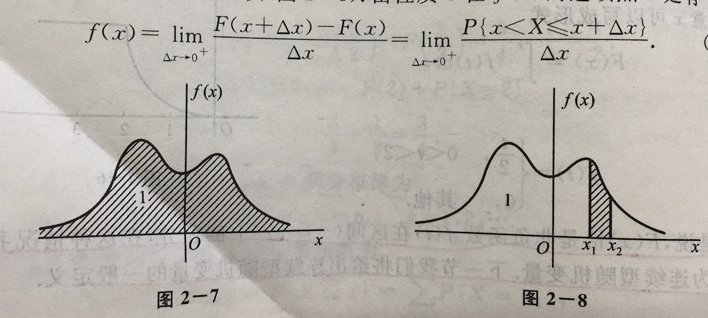
    - 概率密度的定义与物理学中的线密度的定义类似，这就是为什么称`$f(x)$`为概率密度的缘故。
    - 特别的，对于连续型随机变量在特定点上的概率为0。但值得注意的是，若A是不可能事件，则必然有P(A=0)；但若P(A)=0并不一定意味着A是不可能事件。
    - _以后的概率统计研究中，对于任意随机变量的「概率分布」指的是它的分布函数；确切一点，对于离散型型随机变量是分布律，对于连续型变量是概率密度。_
    - 3 种重要的连续型随机变量：
        - 均匀分布
            - `$ f(x) = \left\{\begin{matrix}
                    \frac{1}{b-a} & a < x < b \\ 
                    0 & others 
                    \end{matrix}\right. $`
            - 记为：`$ X \sim U(a, b) $`
        - 指数分布
            - `$ f(x) = \left\{\begin{matrix}
                \frac{1}{\theta}e^{-x/\theta},  &  x>0 \\ 
                0,  & others
                \end{matrix}\right. $`  
                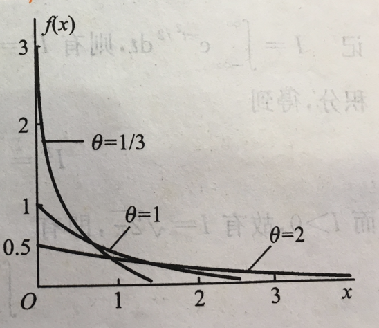
            - **无记忆性**：`$ P\{X>s+t | X>s\} = P\{t\}  $`
        - 正太分布
            - `$ f(x) = \frac{1}{\sqrt{2\pi}\sigma}e^{-\frac{(x-\mu)^2}{2\sigma^{2}}} $`
            - 记为：`$ X \sim N(\mu, \sigma^{2}) $`，其中`$\mu=0, \sigma=1$`时称为标准正太分布
                - 曲线关于`$x=\mu$`对称，并在此处取最大值。
            - 引理：若`$X \sim N(\mu, \sigma^{2})$`，则`$\frac{X-\mu}{\sigma} \sim N(0, 1)$`
            - `$ 3\delta$`法则：  
                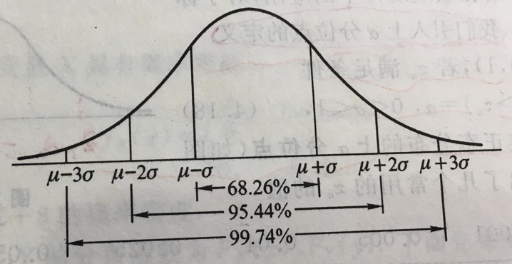
            - `$ \alpha $` 分位点：设`$ X \sim N(0, 1) $`，若 `$ z_{\alpha} $` 满足条件：`$ P(X > z_{\alpha}) = \alpha , 0 < \alpha < 1$` 则称  `$ z_{\alpha} $` 为标准正太分布的**上`$\alpha$`分位点**  
                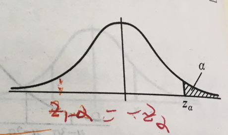
- 随机变量的函数分布
    - 本节主要讨论如何从已知随机变量X的概率分布去求得它的函数`$Y=g(X)$`（`$g(X)$`为连续函数）的概率分布。
    - 定理：设随机变量X具有概率密度函数`$f(x), -\infty < x < \infty$`，又设函数`$g(x)$`处处可导且恒有`$g'(x) > 0$`（或恒有`$ g'(x) < 0 $`），则`$ Y=g(X) $`是连续型随机变量，其概率密度为`$ f(x) = \left\{\begin{matrix}
f_{X}[h(y)]|h'(y))| , & \alpha < y < \beta \\ 
0,  & others
\end{matrix}\right. $`，其中`$ \alpha = min(g(-\infty), g(\infty)), \beta = max(g(-\infty), g(\infty))$`，`$ h(y) $` 是 `$ g(x) $` 的反函数。
    

------
<h2 id="003"> 3. 多维随机变量及其分布 </h2>

**关键字：** 二维随机变量(X, Y)，(X, Y)的分布函数，离散型随机变量(X, Y)的分布律，连续型随机变量(X, Y)的概率密度，离散型随机变量(X, Y)的边缘分布律，连续型随机变量(X, Y)的边缘概率密度，条件分布函数，条件分布律，条件概率密度，两个随机变量X,Y的独立性，Z=X+Y,Z=Y/X,Z=XY的概率密度，M=max{X,Y},N=min{X,Y}的概率密度。

- 二维随机变量
    - 定义：一般，设E是一次随机试验，它的样本空间是S={e}，设X=X{e}和Y=Y(e)是定义在S上的随机变量，由它们构成的一个向量(X,Y)，叫做**二维随机向量**或**二维随机变量**。如图3-1.
        - 例子：一个地区儿童(S)的身高(X)和体重(Y)。
        - 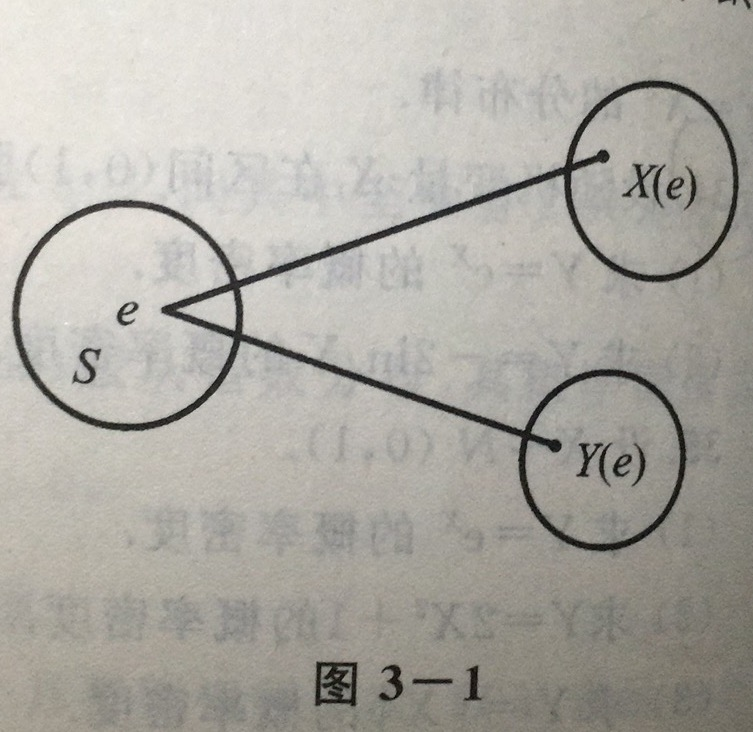 </img>
    - 定义：对于任意实数 x, y，二元函数`$F(x, y) = P(X\leqslant x) \cap P(Y \leqslant y) = P\{X \leqslant x, Y \leqslant y\}$` 称为二维随机变量(X, Y)的**分布函数**，或称为随机变量 X 和随机变量 Y 的**联合分布函数**。
        - `$P\{x_{1} < X \leqslant x_{2}, y_{1} < Y \leqslant y_{2}\} = F(x_{2}, y_{2}) - F(x_{2}, y_{1}) - F(x_{1}, y_{2}) + F(x_{1}, y_{1})$`
        - 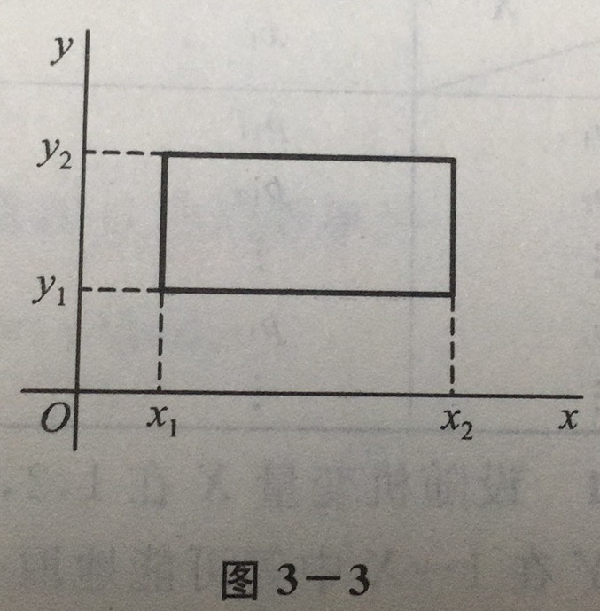 </img>
    - 与一维随机变量类似（定义很容易扩展到n维变量）：
        - **离散随机变量**<->**联合概率分布律**：`$P\{X=x_{i}, Y=y_{j}\} = p_{ij}, p_{ij}>0, \sum_{i=1}^{\infty}\sum_{j=1}^{\infty}p_{ij}=1$`
        - **连续型随机变量**<->**联合概率密度**：`$f(x,y) \geqslant 0, \int_{-\infty}^{\infty}\int_{-\infty}^{\infty}f(x,y)dxdy = F(\infty, \infty) = 1$`
- 边缘分布（联合分布通常以表格的形式，而边缘分布在表格边缘，这是名字的由来）（注意，由联合概率分布可得到边缘概率分布，反之一般不能确定，除非独立性条件得到满足）
    - **离散型随机变量**<->**边缘分布律**：`$P(X=x_{i}) = \sum_{j=1}^{\infty}p_{ij}=p_{i.}, P(Y=y_{i}) = \sum_{i=1}^{\infty}p_{ij}=p_{.j}$`
    - **连续型随机变量**<->**边缘概率密度**：`$f_{X}(x) = \int_{-\infty}^{\infty}f(x,y)dy, f_{Y}(y) = \int_{-\infty}^{\infty}f(x,y)dx$`
- 条件分布
    - **离散型随机变量**<->**条件分布律**：`$ P\{X=x_{i} | Y=y_{j}\} = \frac{P\{X=x_{i}, Y=y_{j}\}}{P=\{Y=y_{j}\}} = \frac{p_{ij}}{p.j} $`
    - **连续型随机变量**<->**条件概率密度**：`$ f_{X|Y}(x|y) = \frac{f(x,y)}{f_{Y}(y)} $`
- 相互独立的随机变量
    - 随机变量独立性定义（n个变量的类似）：`$ P\{X \leqslant x, Y \leqslant y\} = P\{X\leqslant x\}P\{Y \leqslant  y\}, F(x, y) = F_{X}(x)F_{Y}(y)$`
    - 二维正太分布的独立性充要条件是参数`$\rho=0$`
    - 一个值得注意的例子：一个负责人到达办公室的时间均匀分布在8～12时，他的秘书到达办公室的时间均匀分布在7～9时，设他们两人到达的时间相互独立，求他们到达办公室的时间差不超过 5 分钟（1/12 小时）的概率。
- 两个随机变量的函数的分布
    - Z = X+Y
        - 有一个**卷积公式**的概念
        - 服从正态分布的相互独立的n个随机变量，通过变换后仍服从正态分布，并且均值和方程分别是n个随机变量均值之和以及方差之和。
    - Z = Y/X, Z=XY
    - M = max{X,Y}及N=min{X,Y}
 
----

<h2 id="004"> 4. 随机变量的数字特征 </h2>

在某些实际和理论问题中，人们感兴趣于某些能描述随机变量某一特征的常数，**能刻画随机变量某一方面的特征的常数统称为数字特征**。

**关键字：** 数学期望，随机变量函数的数学期望，数学期望的性质，方差，标准差，方差的性质，标准化的随机变量，协方差，相关系数，相关系数的性质，X,Y不相关，切比雪夫不等式，几种重要分布的数学期望和方差，矩，协方差矩阵。

- 数学期望
    - 定义：**数学期望**E(X)，简称**期望**，又称**均值**，完全由随机变量X的概率分布决定，若X服从某一分布，也称E(X)是这一分布的数学期望。（我的联想：所以在做假设检验去验证样本是否同一分布时，通常通过检验某些统计量是否相同，因为很多统计量，比如期望，完全由随机变量决定）
    - 离散型：`$ E(X) = \sum_{k=1}^{\infty} x_{k}p_{k}$`
    - 连续型：`$ E(X) = \int_{-\infty}^{\infty}xf(x)$`
    - 定理：设 Y 是随机变量 X 的函数：Y=g(X)，g 是连续函数。
        - (1) 如果X是离散型随机变量，它的分布律`$P\{X=x_{k}\}=p_{k}$`，若`$ \sum_{k=1}^{\infty}g(x_{k})p_{k} $`绝对收敛，则有`$ E(Y) = E[g(X)] = \sum_{k=1}^{\infty}g(x_{k})p_{k} $`
        - (2) 如果X是连续型随机变量，它的概率密度为`$f(x)$`，若`$\int_{-\infty}^{\infty}g(x)f(x)dx$`绝对收敛，则有：`$ E(Y) = E[g(X)] = \int_{-\infty}^{\infty} g(x)f(x) dx $`。
        - **定理的重要意义在于当我们求E(Y)时，不必算出Y的分布律或概率密度。**
    - 期望的几个重要性质：C 是常数，X,Y是随机变量
        1. `$ E(C) = C $`
        2. `$ E(CX) = CE(X) $`
        3. `$ E(X + Y) = E(X) + E(Y)$`
        4. `$ E(XY) = E(X)E(Y) $`
    - 有意思的例子：
        - e.g.3：给出汽车到站时间和分布，计算人的等车时间。
        - e.g.5：检验 N 个人的血，有两种策略（1）每个人都检验，需要N次；（2）按k个人为一组，k个人的血液混合后检验，若为阳性则只需检验1次，若为阴性则需要检验k+1次。确定最优的k。—— 设X表示组内每个人化验的次数。
        - e.g.12：民航客车有20位旅客，10个车站可以下车，如到达一个车站没有旅客下车就不停车，以X表示停车的次数，求E(X)。——本题通过设计标记随机变量 Xi 表示第 i 真是否有人下车，这一标记随机变量的分布很容易求，由此再求出X。**本题将X分解成数个随机变量之和，然后利用随机变量和的数学期望等于随机变量数学期望之和来求数学期望的，这种处理方法具有一定的普遍意义**。
- 方差
    - 定义：设 X 是一个随机变量，若 `$ E\{[X-E(x)]^{2}\}$`存在，则称其为X的**方差**，记为`$D(X)$`或`$Var(X)$`，即`$ D(X) = Var(X) = E\{[X - E(X)]^{2}\} $`。引入`$ \sigma (X) = \sqrt{D(X)} $`，称为**标准差**或**均方差**。（初次定义为`$ E\{|X-E(X)|\} $`，因为有绝对值，不方便，因此使用平方项）
    - `$ Var(X)$ ` 刻画X取值分散程度的量（与均值之间的距离）。
    - 方差实际上就是随机变量X的函数`$ g(X) = (X - E(X))^{2} $`的数学期望，于是有
        - 离散型：`$ D(X) = \sum_{k=1}^{\infty} [x_{k} - E(X)]^{2}p_{k} $`
        - 连续型：`$ D(X) = \int_{-\infty}^{\infty}[x-E(X)]^{2}f(x)dx $`
    - 方差的另一种计算方式：`$ D(X) = E(x^{2}) - [E(X)]^{2} $`
    - **标准化变量**：`$ X^{*} = \frac{X-\mu}{\sigma} $`，均值为0，方差为1
    - 方差的性质：设 C 是常数，X,Y是随机变量
        1. `$ D(C) = 0 $`
        2. `$ D(CX) = C^{2}D(X), D(C + X) = D(X)$`
        3. `$ D(X, Y) = D(X) + D(Y) - 2E\{(X-E(X))(Y-E(Y))\} $`，若X,Y相互独立，则有`$ D(X,Y) = D(X) + D(Y) $`
        4. `$ D(X) = 0 $` 的充要条件是X以概率1取常数`$ E(X) $`
    - **切比雪夫(Chebyshev)不等式**：
        - 定理：设随机变量X具有数学期望`$ E(X) = \mu$`，方差`$ D(X) = \sigma^{2} $`，则对于任意正数`$ \varepsilon  $`，不等式`$ P\{|X - \mu| \geqslant \varepsilon \} \leqslant \frac{\sigma^{2}}{\varepsilon^{2}}$`成立，也可以写成`$ P\{|X-\mu| < \varepsilon\} \geqslant 1 - \frac{\sigma^{2}}{\varepsilon^{2}} $`。
        - 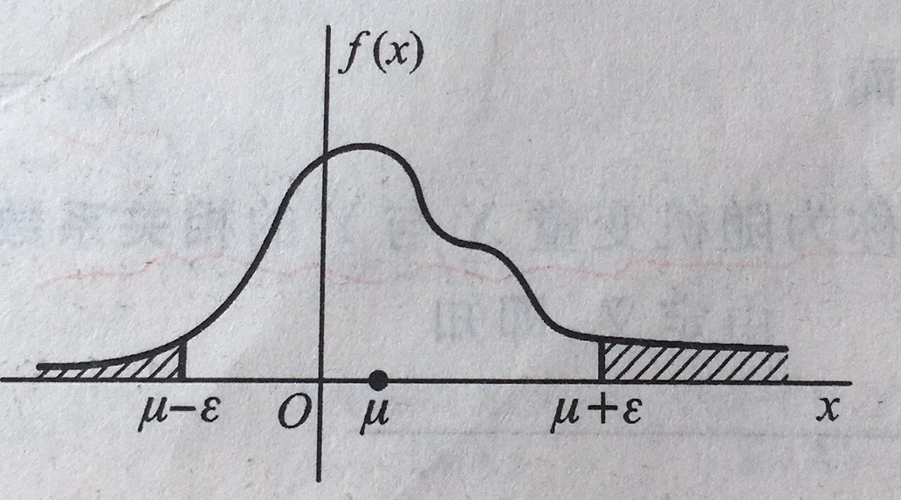
        - Chebyshev 不等式给出了在随机变量的分布未知，而知道E(X)和D(X)的情况下估计概率`$ P\{|X-E(X)| < \varepsilon\} $`的界限。
        - 比如：当`$ \varepsilon = 3\sqrt{D(x)} $`，`$ P\{|X-E(X)|<3\sqrt{D(X)}\} \geqslant 0.8889 $`
- 协方差及相关系数
    - 定义：量`$ E\{[X - E(X)][Y-E(Y)] \} $`称为随机变量X 和 Y的**协方差**，记为`$ Cov(X, Y) $`， 即 `$ Cov(X, Y) = E\{[X-E(X)][Y-E(Y)]\} $`，而`$ \rho_{XY} = \frac{Cov(X, Y)}{\sqrt{D(X)}\sqrt{D(Y)}} $` 称为随机变量X和Y的**相关系数**。
    - 由定义，即知`$ Cov(X,Y) = Cov(Y,X), Cov(X,X) = D(X) $`
    - 斜方差的性质：
        1. `$ Cov(aX, bY) = abCov(X,Y) $`
        2. `$ Cov(X_{1} + X_{2}, Y) = Cov(X_{1},Y) + Cov(X_{2}, Y) $`
    - 定理：
        1. `$ |\rho_{XY}| \leqslant 1 $`
        2. `$ |\rho_{XY}| = 1 $`的充要条件是，存在常数a，b使`$ P\{Y=a+bX\} = 1 $`
        - 通常来说，当 `$|\rho_{XY}| = 0 $`时，称X和Y **不相关**，值得注意这里仅仅指**线性不相关**，还有可能存在非线性相关。
        - 特殊的，二维正太随机变量(X,Y)的概率密度重参数`$ \rho $`就是X和Y的相关系数，因而二维正太随机变量的分布完全由X,Y各自的数学期望、方差以及它的相关系数所确定，当相关系数为零是即表明两个随机变量不相关。
- 矩、协方差矩阵
    - 定义：设X和Y是随机变量，有以下定义
        - **k 阶原点矩**，简称**k阶矩**，`$ E(X^{k}) $`
        - **k 阶中心距**，`$ E\{[X-E(X)]^{k}\}$`
        - **k+l 阶混合矩**，`$ E(X^{k}Y^{l}) $`
        - **k+l 混合中心矩**，`$ E\{ [X-E(X)]^{k}[Y-E(Y)]^{l} \} $`
     - 显然，X的数学期望是一阶原点矩，方差是二阶中心矩，斜方差是二阶混合中心矩。
     - 对于n维随机变量，通常使用**斜方差矩阵**进行描述。一般，n维随机变量的分布是不知道的，或者是太复杂，以致在数学上不易处理，因此在实际应用中**协方差矩阵**显得重要。
     
----

<h2 id="005"> 5. 大数定律及中心极限定理 </h2>

**关键字：** 依概率收敛，伯努利大数定理，辛钦大数定理，独立同分布的中心极限定理，李雅普诺夫中心极限定理，棣莫弗一拉普拉斯中心极限定理。极限定理是概率论的基本理论，在理论研究和应用中起着重要的作业，其中最重要的是**大数定律**和**中心极限定理**。大数定律是叙述随机变量序列的前一些项的算术平均在某种程度下收敛到这些项的均值的算术平均值；中心极限定理则是确定在什么条件下，大量随机变量之和的分布逼近于正太分布。

- 大数定律 
    - **弱大数定理**（辛钦大数定理）：设随机变量`$ X_{1}, X_{2}, ..., X_{n} $`，**相互独立**，服从**同一分布**且有数学期望`$ E(X_{k}) = \mu $`，则序列`$ \overline{X} = \frac{1}{n}\sum_{k=1}^{n}X_{k} $` 依概率收敛于`$ \mu $`，即`$ \overline{X} \rightarrow^{P} \mu $`
    - **伯努利大数定理**：重复n次**独立重复实验**，只要n足够大，频率依概率收敛于概率。
- 中心极限定理
    - **在客观实际中有许多随机变量，它们是由大量的相互独立的随机因素的综合影响所形成的，而其中每一个别因素在总的影响中所起的作用都是微小的。这种随机变量往往近似地服从正态分布。这种现象就是中心极限定理的客观背景。**——（这让我想到基于随机波动信号的早期特征提取）
    - **定理一**（独立同分布的中心极限定理）设随机变量`$ X_{1}, X_{2}, ..., X_{n} $`，**相互独立**，**服从同一分布**，且有数学期望`$E(X_{k}) = \mu $`和方差`$ D(X_{k}) = \sigma^{2} > 0$`，则随机变量之和的标准化变量为`$ Y_{n} = \frac{\sum_{k=1}^{n}X_{k} - E(\sum_{k=1}^{n}X_{k})}{\sqrt{D(\sum_{k=1}^{n}X_{k})}} = \frac{\sum_{k=1}^{n}X_{k}-n\mu}{\sqrt{n}\sigma}$`，当n充分大时，有`$ Y_{n} \sim N(0, 1) $`，也可以表述为，`$ \frac{\sum_{k=1}^{n}X_{k}-n\mu}{\sqrt{n}\sigma} = \frac{\frac{1}{n}\sum_{k=1}^{n}X_{k}-\mu}{\sigma/\sqrt{n}} = \frac{\overline{X}-\mu}{\sigma/\sqrt{n}}$`，则`$\overline{x} \sim N(\mu, \sigma/\sqrt{n})$`
    - **定理二**（李雅普诺夫(Lyapunnov)定理）：设随机变量`$ X_{1}, ..., X_{n} $`**相互独立**，具有数学期望`$ E(X_{k}) = \mu_{k} $`和方差`$ D(X_{k}) = \sigma_{k}^{2} > 0 $`，记`$ B_{n}^{2} = \sum_{k=1}^{n} = \sigma_{k}^{2} $`，当n很大时，随机变量`$ Z_{n} = \frac{\sum_{k=1}^{n}X_{k} - \sum_{k=1}^{n}\mu_{k}}{B_{n}^{2}} \sim N(0, 1)$`，即`$ \sum_{k=1}^{n}X_{k} \sim N(\sum_{k=1}^{n}\mu_{k}, B_{n}^{2}) $`
    - **定理三**（棣莫弗——拉普拉斯（De Moivre-Laplace）定理）设随机变量`$ \eta_{n} (n=1,2,...) $`服从参数为`$n, p(0<p<1)$`的二项分布，则数学期望为`$ E(\eta_{n}) = np $`，方差为`$ D(\eta_{n}) = np(1-p) $`，当n充分大时有`$ \frac{\eta_{n} - np}{\sqrt{np(1-p)}} \sim N(0,1)$`，即正态分布是二项分布的极限分布，可用作近似计算。
- 总结
    - 人们长期认识当实验重复足够大时，频率趋于稳定，而频率的稳定性是概率定义的客观基础。**伯努利大数定理**用严密的数学形式论证了频率的稳定性。
    - 中心极限定理表明，在相当一般的条件下，当独立随机变量的个数不断增加时，其和的分布趋向于正态分布。中心极限定理的内容包含极限，再加上其在统计中的重要性，由此得到名字，这是波利亚(Polya)在1920年取的名字。

----  

<h2 id="006"> 6. 样本及抽样分布 </h2>

1～5，概率论的基本内容，在假设分布已知的前提下去研究随机变量的性质、特点和规律性，例如随机变量的分布函数、常见的分布以及数字特征。

6～9，数理统计。在分布未知或不完全知道的情况下，它以概率为理论基础，通过对所研究的随机变量进行重复独立的观察，得到许多观察值，对这些数据进行分析，从而对研究的随机变量的分布作出种种推断。——（我理解：透过现象（数据）看本质）  
数理统计的内容：（1）收集、整理数据资料；（2）统计推断：对所得的数据资料进行分析、研究，进而对所研究的对象的性质、特点作出推断。  
**本书只介绍统计推断的内容**

数理统计的内容：（1）收集、整理数据资料；（2）统计推断：对所得的数据资料进行分析、研究，进而对所研究的对象的性质、特点作出推断。

- 随机样本
    - 在数理统计中往往研究有关对象的某一项**数量指标**。对这一数量指标进行试验或观察，将试验的全部可能的观察值称为**总体**，每个观察值称为**个体**。总体中的每一个个体是某一随机变量X的值，因此一个总体对应一个随机变量X。不区分总体和相应的随机变量X，统称为**总体X**，随机变量X服从什么分布，就称总体服从什么分布。实际中遇到的都是**有限总体**，是离散变量，但当总体包含的个体数量很大时，在理论上可以认为它是一个**无限总体**，无限总体的分布形式较为简明，便于在数学上进行处理，使用方便。
    - 定义：设 X 是具有分布函数 F 的随机变量，若`$ X_{1}, ..., X_{n} $` 是具有**同一分布函数**F的、**相互独立**的随机变量，则称`$ X_{1}, ..., X_{n} $`为从分布函数F（或总体F、或总体X）得到的**容量为n的简单随机样本**，简称**样本**，它们的观察值`$ x_{1}, ..., x_{n} $`称为**样本值**，又称为X的n个**独立的观察值**。由此有分布函数`$ F^{*}(x_{1}, ..., x_{n}) = \prod_{i=1}^{n}F(x_{i}) $`，概率密度函数`$ f^{*}(x_{1}, ..., x_{n}) = \prod_{i=1}^{n}f(x_{i}) $`。
- 直方图和箱线图
    - 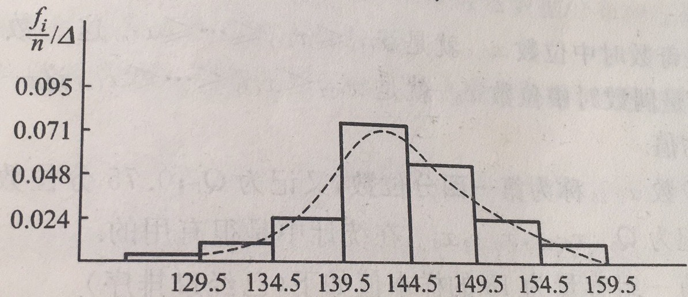</img>
    - 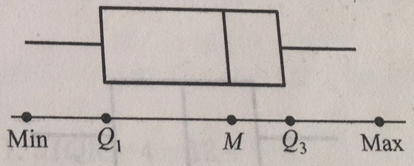</img>
    - 数据集中，疑似异常值的产生源于（1）数据的预测、记录或输入计算机时的错误；（2）数据来自不同的总体；（3）数据是正确的，但它只体现小概率事件。（采用对异常robust的方法，比如使用中位数不使用均值）
- 抽样分布
    - **样本是进行统计推断的依据**。在应用时，往往不是直接使用样本本身，而是**针对不同的问题构造样本的适当函数**，利用这些样本的函数进行统计推断。
    - 定义：设`$ X_{1},...,X_{n} $`是来自总体X的一个样本，`$ g(X_{1}, X_{2}, ..., X_{n}) $`是`$ X_{1},...,X_{n} $`的函数，若 g 中不含未知参数，则称`$ g(X_{1}, X_{2}, ..., X_{n}) $` 是一**统计量**，统计量也是一个随机变量。设`$ x_{1}, x_{2}, ..., x_{n} $` 是相应样本`$ X_{1},...,X_{n} $` 的样本值，则称`$ g(x_{1}, x_{2}, ..., x_{n}) $` 是 `$ g(X_{1}, ..., X_{n}) $`的观察值。
    - 常用的统计量（把样本观察值带入即可算确切的值）：
        - **样本均值：**`$ \overline{X} = \frac{1}{n}\sum_{i=1}^{n}X_{i} $`
        - **样本方差：** `$ S^{2} = \frac{1}{n-1} \sum_{1}^{n} (X_{i} - \overline{X})^{2} = \frac{1}{n-1}(\sum_{1}^{n}X_{i}^{2}-n\overline{X}^{2})$`
        - **样本标准差：** `$ S = \sqrt{S^{2}} $`
        - **样本 k 阶（原点）矩：** `$ A_{k} = \frac{1}{n} \sum_{i=1}^{n} X_{i}^{k}, k=1,2,... $`
        - **样本 k 阶中心矩：** `$ B_{k} = \frac{1}{n} \sum_{i=1}^{n}(X_{i} - \overline{X}),k=2,3,... $`
    - 经验分布函数：
        - 设`$ X_{1}, ..., X_{n} $` 是总体F的一个样本，用S(x)，`$ -\infty < x < \infty $` 表示`$ X_{1}, ..., X_{n} $`中不大于`$x$` 的随机变量的个数，定义为`$ F_{n}(x) = \frac{1}{n}S(x), -\infty < x < \infty $`。
        - 一般，设`$x_{1}, ..., x_{n}$` 是总体 `$ F $` 的一个容量为`$ n $`的样本值，先将`$ x_{1}, ..., x_{n} $` 按自小到大的次序排序，并重新编号。设为`$ x_{(1)} \leqslant x_{(2)} \leqslant ... \leqslant x_{(n)} $`。则经验分布函数`$ F_{n}(x) $`
        `$ \begin{cases}
0 & \text{ if } x \leqslant x_{(1)} \\ 
\frac{k}{n} & \text{ if } x_{(k)} \leqslant x < x_{(k+1)}, k=1,2,...,n-1 \\ 
1 & \text{ if } x \geqslant x_{(n)}
\end{cases} $`
    - 统计量的分布称为**抽样分布**，但要求精确分布很困难，下面是来自正态分布的几个常用统计量
        - `$ \chi ^{2} $` 分布，`$ X_{1}, X_{2}, ..., X_{n} $` 是来自总体 `$ N(0,1) $` 的样本，统计量 `$ \chi ^{2} = X_{1}^{2} + X_{2}^{2} + ... + X_{n}^{2}$`， `$ \chi ^{2} \sim \chi ^{2}(n)$`   
        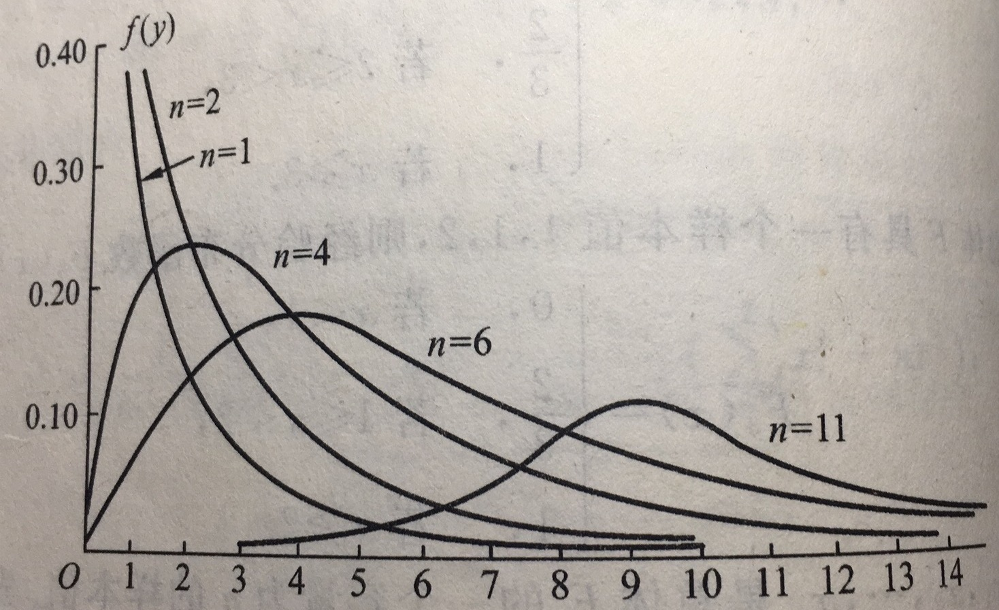</img>
        - `$ t $`, `$ X \sim N(0, 1), Y \sim \chi ^{2} (n) $` 且 `$ X , Y$` 相互独立，统计量`$ t = \frac{X}{\sqrt{Y/n}}, t \sim t(n) $`，又称 Student 分布。  
        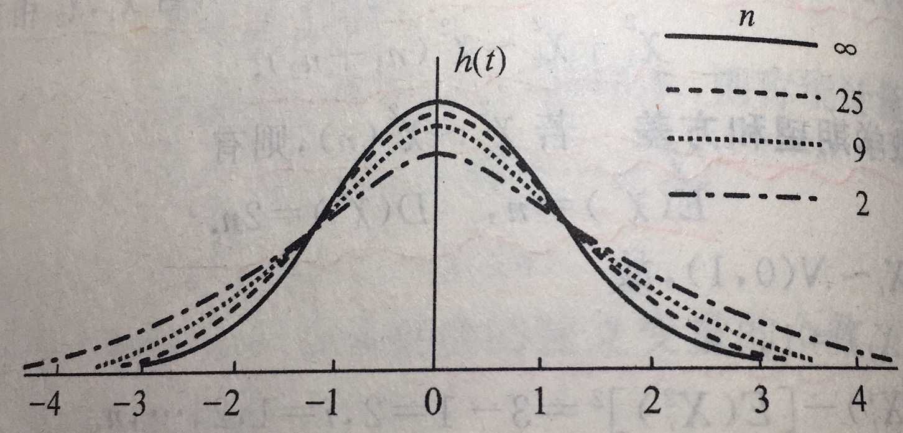</img>
        - `$ F $`, `$ U \sim \chi^{2}(n_{1}), V \sim \chi^{2}(n_{2}) $`，且 `$ U, V $` 相互独立，统计量 `$ F = \frac{U/n_{1}}{V/n_{2}}, F \sim F(n_{1}, n_{2}) $`。  
        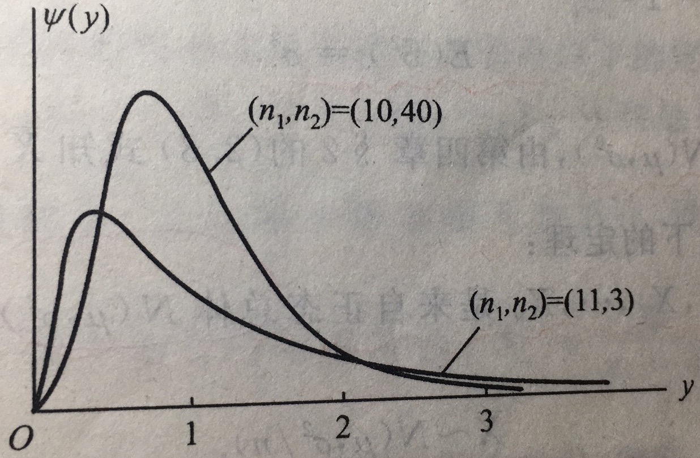</img>
    - 关于样本均值`$ \overline{X} $`和样本方差`$ S^{2} $`，有以下结论：
        - 设 `$ X_{1}, ..., X_{n}$` 是来自总体 `$ X $` （不管服从什么分布，只要它的均值和方差存在）的样本，且有`$ E(X) = \mu, D(X) = \sigma^{2} $`，则有 `$ E(\overline{X}) = \mu, D(\overline{X}) = \sigma^{2}/n $`。
        - 设总体`$ \overline{X} \sim N(\mu, \sigma^{2}) $`，`$ X_{1}, ..., X_{n}$` 是来自总体的样本，则有
            - `$ \overline{X} \sim N(\mu, \sigma^{2}/n) $`
            - `$ \frac{(n-1)S^{2}}{\sigma^{2}} \sim \chi^{2}(n-1) $`
            - `$ \overline{X}  $` 和 `$ S^{2} $` 相互独立
            - `$ \frac{\overline{X}-\mu}{S/\sqrt{n}} \sim t(n-1) $`

----

<h2 id="007"> 7.参数估计 </h2>

统计推断的基本问题可以分为两大类：估计问题 + 假设检验问题。

- 点估计
    - 定义：设总体X的**分布函数的形式已知**，但它的**一个或多个参数未知**，借助于总体X的一个**样本来估计总体未知参数的值**的问题称为参数的点估计问题。
    - 两种常用的构造估计量的方法：
        - 矩估计法：
            - 依据：样本矩依概率收敛于相应的总体矩，样本矩的连续函数依概率收敛于相应的总体矩的连续函数。
            - 估计方法：用样本矩作为相应的总体矩的**估计量**，而样本矩的连续函数作为相应的总体矩的连续函数的估计量。
            - 计算：将样本带入估计量得到**估计值**
        - 最大似然估计法：
            - **似然函数**：`$ L(\theta) = L(x_{1}, x_{2}, ..., x_{n}; \theta) = \prod_{i=1}^{n}p(x_{i};\theta), \theta \in \Theta  $` (即，联合概率)
            - 依据：小概率事件在一次实验中几乎不可能发生，现在已经取到样本值`$ x_{1}, x_{2}, ..., x_{n} $` 了，这就表明取到这一样本值的概率`$ L(\theta) $` 比较大，那我们自然不会选择使发生概率`$ L(\theta) $` 小的 `$ \theta $` 值。
            - 费希尔(R.A.Fisher)引进最大似然估计法：
            - `$ L(x_{1}, x_{2}, ..., x_{n}; \hat{\theta}) = max_{\theta \in \Theta}\prod_{i=1}^{n}p(x_{i};\theta) $`，由此得最大似然估计量`$ \hat{\theta}(X_{1}, X_{2}, ..., X_{n}) $`。由可将问题转到微分学中的求最大值问题。
            - **取对数不改变函数单调性，因此通常通过对数似然方程进行求解**。这样可以简化计算，同时也有效防止乘法溢出。
- 基于截尾样本的最大似然估计
    - 定时截尾样本和定数截尾样本。
- 估计量的评选标准
    - **无偏性**：估计量的数学期望存在，并且期望等于真实值。
    - **有效性**：无偏估计以方差小者为好。
    - **相合性**：估计量依概率收敛于真实值，**基本要求**
- 区间估计
    - 除了求出点估计以外，还希望估计出一个范围和这个范围的可信程度。
    - `$ P\{\underline{\theta}(X_{1}, X_{2}, ..., X_{n}) < \theta < \overline{\theta}(X_{1}, X_{2}, ..., X_{n})\} \geqslant 1 - \alpha $`，`$ (\underline{\theta}, \overline{\theta}) $` 是 `$ \theta $` 的置信水平为`$ 1 - \alpha $` 的**置信区间**。置信下限`$ \underline{\theta} $`、置信上限`$ \overline{\theta} $`、置信水平`$ \alpha $`。
    - 注意：
        - 对于连续型随机变量，给定置信水平下，总是可以按要求解出置信区间
        - 对于离散型随机变量，给定置信水平下，往往无法找到恰好的置信区间，一般去找区间至少为`$ 1 - \alpha $`，且尽可能接近`$ 1 - \alpha $`
    - 置信水平：反复抽样多次，每个样本确定一个区间`$ (\underline{\theta}, \overline{\theta}) $`，每个这样的区间要么包含`$ \theta $`的真值，要么不包含`$ \theta $`的真值。按伯努利大数定理，在这么多的区间中，包含`$ \theta $`真值的约占`$ 100(1-\alpha)\% $`。
    - 尽量取对称分未点的原因：这样的区间比较短，表明估计的精度高。
    - 置信区间求法：
        1. 应用矩估计法或似然法对未知参数做点估计；
        2. 构造一个`$ t, \chi^{2}, F$`**枢轴量**
            - 基本分布已知
            - 只包含估计参数，一个未知量，其余变量已知
        3. 由上`$ \alpha $` 分为点的到置信区间。
- 正态总体均值与方差的区间估计
    - 单个总体`$ N(\mu, \sigma^{2})$`的情况
        - 均值 `$ \mu $` 的置信区间
            - `$ \sigma^{2} $` 已知，枢轴量`$ \frac{\overline{X}-\mu}{\sigma / \sqrt{n}}$`
            - `$ \sigma^{2} $` 未知，枢轴量`$ \frac{\overline{X}-\mu}{S / \sqrt{n}} \sim t(n-1)$`。**在实际问题中，总体方差未知的情况居多，因此基于 t 分布的估计更具有实用价值。**
        - 方差 `$ \sigma^{2} $`的置信区间
            - 枢轴量`$ \frac{(n-1)S^{2}}{\sigma^{2}} \sim \chi^{2}(n-1) $`
            - 注意：在密度函数不对称时，如`$ \chi^{2}, F $` 分布，习惯上仍是取对称的分位点。
    - 两个总体`$ N(\mu_{1}, \sigma_{1}^{2}), N(\mu_{2}, \sigma_{2}^{2}) $`
        - 两个总体均值差`$ \mu_{1} - \mu_{2} $`的置信区间
            - `$ \sigma_{1}^{2}, \sigma_{2}^{2} $`均为已知，转为正太分布
            - `$ \sigma_{1}^{2} = \sigma_{2}^{2} = \sigma^{2} $`，但`$ \sigma^{2} $` 未知，转为 t 分布。
        - 两个总体方差比`$ \sigma_{1}^{2} / \sigma_{2}^{2}  $`的置信区间
            - 枢轴量`$ \frac{S_{1}^{2}/S_{1}^{2}}{\sigma_{1}^{2}/\sigma_{2}^{2}} \sim F(n_{1}-1, n_{2} - 1)$`
- （0-1）分布参数的区间估计
    - 根据中心极限定理，当样本容量较大时，可将二项分布近似到正太分布。
- 单侧置信区间
    - `$ P\{\theta > \underline{\theta}\} \geqslant 1 - \alpha $` 或 `$ P\{\theta < \overline{\theta}\} \geqslant 1 - \alpha              $`

----

<h2 id="008"> 8.假设检验 </h2>

统计推断的另一类重要问题是假设检验问题。即在总体的分布函数完全未知或只知道其形式，但不知其参数的情况，为了**推断总体的某些未知特性，提出某些关于总体的假设**。而假设检验是作出判断决策的过程。

- 假设检验
    - 基本术语：显著水平、检验统计量、原假设、零假设、备择假设、拒绝域、临界点、显著性检验、双边备择假设、双边检验、右边检验、左边检验、单边检验
    - 基本步骤：
        1. 根据实际问题的要求，提出原假设`$ H_{0} $` 及备择假设 `$ H_{1} $`；
        2. 给定显著水平`$ \alpha $` 以及样本容量 `$ n $`；
        3. 给定检验统计量以及拒绝域的形式；
        4. 按 `$ P\{H_{0} is-real-but-was-rejected\} \leqslant \alpha$`；
        5. 取样，根据样本观察值作出决策，是接受`$ H_{0} $` 还是拒绝 `$ H_{0} $`。
    - 错误的控制  
        - “接受”或“拒绝”假设并不意味着百分之百的确信，这仅仅是基于样本所作的一次决策，不论哪种情况，都存在做出错误选择的可能性。
        - 两类错误：
            - 第I类错误（弃真）：在 `$ H_{0} $` 实际为真时，我们可能犯拒绝 `$ H_{0} $` 的错。
            - 第II类错误（存伪）：在 `$ H_{0} $` 实际为假时，我们可能犯接受 `$H_{0}$` 的错误。  
        - 错误的控制
            - 一般情况下，当样本容量`$ n $` 固定时，减小犯第I类错误的概率，就会增大犯第II类错误的概率，反之亦然。
            - 假设检验只对第I类错误加一控制，假设检验中的显著水平`$ \alpha $` 是控制这一错误的参数。尽可能减小`$ \alpha $`来实现降低犯第一类错误的概率，也就是说假设检验中的`$ H_{0} $` 是受到保护的，即`$ H_{0}, H_{1} $`是不对等的。**因此，选择H_{0}时要小心**。
            - `$ H_{0} $` 的选择
                - 如果在两类错误中，没有一类错误的后果严重更需要避免时，常常取`$H_{0}$`为维持现状，即取`$H_{0}$`为“无效益”、“无改进”、“无价值”等。
                - 否则将后果严重的作为`$ H_{0} $`
            - Note:
                - `$ H_{0} $` 的选择往往根据经验来定，不完全遵循以上简单的结论。
                - 拒绝域的形式由`$ H_{1} $` 决定。
- 正态总体均值的假设检验

检验描述 | 前提条件 | 原假设 | 统计量依据
--- | --- | --- | ---
单个总体`$ N(\mu, \sigma^{2}) $`均值`$ \mu $` 的检验 | `$\sigma ^{2}$` 已知，关于`$ \mu $` 的检验 | `$H_{0}: \mu = \mu_{0}$` |Z 检验, t 检验法：`$ t = \frac{\overline{X} - \mu_{0}}{S/\sqrt{n}} $`
两个正太总体均值差的检验| `$ \sigma_{1}^{2} = \sigma_{2}^{2} = \sigma^{2}$`|`$ H_{0} : \mu_{1} - \mu_{2} = \delta $` | t 检验
基于成对数据的检验|相同条件下做对比实验，得到一批成对的观察值|`$D_{i} = X_{1} - Y_{1}, i=1,...,n$`， 相互独立。`$ H_{0} = \mu_{D} = 0 $`| t 检验
单个正太总体方差的假设检验 | `$ \mu, \sigma $`均未知， | `$ H_{0}: \sigma^{2} = \sigma_{0}^{2}$` | `$ S^{2} $`是`$ \sigma^{2} $`的无偏估计，当`$ H_{0} $` 为真时`$ \frac{s^{2}}{\sigma_{0}^{2}} $` 一般来说应在 1 的范围内摆动，`$ \chi^{2} = \frac{(n-1)S^{2}}{\sigma_{0}^{2}}$` 
两个正太总体方差的假设检验 | `$ \mu_{1}, \mu_{2}, \sigma_{1}^{2}, \sigma_{2}^{2} $`均未知 | `$ H_{0} : \sigma_{1}^{2} \leqslant \sigma_{2}^{2} $` | `$ \frac{S_{1}^{2}/S_{2}^{2}}{\sigma_{1}^{2}/\sigma_{2}^{2}} \sim F(n_{1}-1, n_{2}-1)$` 

- 置信区间与假设检验之间的关系
- 样本容量的选取
    - 可以通过增大样本容量来降低犯第II类错误的概率。施行特征函数`$ OC $`曲线的讨论。
- 分布拟合检验
    - 前面介绍的各种检验法都是在总体分布形式已知的前提下进行的，然而在实际问题中，有时不能知道总体服从什么类型的分布。这时就需要根据样本来检验关于分布的假设。
    - `$ \chi^{2} $` 拟合检验法：检验总体是否具有某一个指定分布或属于某一个分布族
        - 单个分布的`$ \chi^{2} $`拟合检验法
            - `$ H_{0}: $` 总体X的分布函数是`$ F(x) $`
            - 核心思想：将X可能取值的全体进行区间离散化，通过区间内的频率`$ f_{i}/n $` 来近似被检验分布的概率`$ p_{i} $`。如果`$ H_{0} $` 成立，则统计量`$ \sum_{i=1}^{k}C_{i}(\frac{f_{i}}{n} - p_{i})^{2} $`不应该太大。当`$ C_{i} = n/p_{i} $`时有，`$ \chi^{2} = \sum_{i=1}^{k}\frac{n}{p_{i}}(\frac{f_{i}}{n} - p_{i})^{2}$`
       - 分布族的`$ \chi^{2} $`拟合检验
           - `$ H_{0} :$` 总体 X 的分布函数是`$ F(x; \theta_{1}, \theta_{2}, ..., \theta_{x}) $`
           - 形式已知道，但参数未知。
           - 核心思想：（1）先利用样本求出未知参数的最大似然估计（在`$ H_{0} $`下）；（2）使用单个分布的`$ \chi^{2} $` 拟合检验法。
    - 偏度、峰度检验
        - 正态随机变量是较广泛地存在的，当研究一连续型总体时，人们往往先考察它是否服从正太分布。
        - `$ \chi^{2}$`拟合检验法虽然是检验总体分布的一般方法，但用它来检验总体的正态性时，犯第II类错误的概率往往较大。
        - 奥野忠一等人在20世纪70年代进行大量模拟计算的结果，认为正太性检验方法中，总的来说，以“偏度、峰度检验法”及“厦皮罗—威尔克法”较为有效。
        - 偏度、峰度检验法
            - 核心依据：偏度、峰度分别是标准化变量的三阶(v1)和四阶矩(v2)；当随机变量服从正太分布时v1=0 且 v2 = 3。
            - 使用这一检验法时样本容量以大于100为宜。
- 秩和检验
    - 非参数化检验
- 假设检验问题的 p 值法
    - 又称为**临界值**法。
    - 定义：假设检验问题的p值（probability value）是由检验统计量的样本观察值得出的原假设可被拒绝的最小显著水平。
    - p 值越小越显著，p<=0.01 检验是高显著的；0.01<p<=0.05，检验是显著的；0.05<p<=0.1 检验是不显著的；p>0.1一般来说没有理由拒绝原假设。

----

<h2 id="009"> 9.方差分析及回归分析 </h2>

介绍了两种用途广泛的统计模型：方差分析模型和回归分析模型

- 方差分析
    - **因素**分为可控因素和不可控因素，此处只针对**可控因素**进行讨论。
    - 在实际中**指标**往往要受到一种或多种**因素**的影响。**方差分析**就是通过试验数据进行分析，检验方差相同的多个（>2）正太总体的均值是否相等，用于**判断各因素对试验指标的影响是否显著**。
    - 按因素个数分为单因素方差分析、双因素方差分析和多因素方差分析，本文关注前两者。
        - 单因素分析（其他类似）
            - 度量数据间的变异（即离散程度）：总偏差平方和`$ S_{T} = \sum_{j=1}^{s}\sum_{i=1}^{n_{j}} (X_{ij} - \overline{X}) $`, `$ A_{j}, j=1,...,s $`水平下有`$ n_{j} $` 组观察值。
            - 将总偏差平方和`$ S_{T}$`分解可追溯到来源的部分变异：
                - 误差平方和：`$ S_{E} = \sum_{j=1}^{s}\sum_{i=1}^{n_{j}}(X_{ij}-\overline{X}_{.j})^{2} $`；这是由随机误差引起的
                - 因素A的效应平方和：`$ S_{A} = \sum_{j=1}^{s}\sum_{i=1}^{n_{j}}(\overline{X}_{.j}-\overline{X})^{2} $`；这是由各水平效应的差异及随机误差引起的。
                - 若`$ S_{A} >> S_{E}$`，则有理由认为因素的各个水平对应的试验结果有显著差异，从而拒绝原假设——因素各个水平对应的正太总体均值相等。
        - 双因素试验的方差分析
            - 双因素分析分考虑交互作用和不考虑交互作用两种情况，视情况而定。
    - “方差分析”事实上不是真正分析方差，而是分析用偏差平方和度量的数据的变异，Snedecor说过：“它是从可比组数据中分解出可追溯到某些指定来源的变异的一种技巧”。
- 回归分析
    - 客观世界中普遍存在变量之间的关系：
        - 确定关系：变量之间的关系可以用函数关系来表达。
        - 非确定性关系：变量之间的相关关系。（比如体重和身高有关系，但没有确切的函数表达）
    - 回归分析是研究相关关系的一种数学工具。它能帮助我们从一个变量取得的值去估计另一个变量所取的值。
    - 回归分析是研究**自变量**为一般变量（非随机变量），**因变量**为随机变量时两者之间的相关关系的统计分析方法。
    - 设随机变量`$ Y $`（因变量）与自变量`$ x $`（一般变量）存在着相关关系，为了研究这种关系，作为一种近似转而去研究`$ Y $` 的数学期望`$ E(Y) = \mu(x) $`与`$x$`的确定性，及函数关系，这里`$ \mu(x) $`叫做`$ Y $`关于`$x$`的回归函数。  
    <image src="images/09-01.jpeg" width="50%"> </image>    
    解题的第一步是需要确定`$ \mu(x) $`的形式，一般可通过散点图或其他先验知识确定。
    - 一元线性回归   
      一元线性回归是研究`$ \mu(x) $` 为 `$x$`的线性函数`$\mu(x) = a + bx$`的情况。一元线性回归模型为`$ Y = a + bx + \varepsilon, \varepsilon \sim N(0, \sigma^{2}) $`，其中`$ a,b,\sigma $`都不依赖于`$x$`，且`$ a, b, \sigma^{2}$`均未知。  
        1. 利用样本`$(x_{1}, y_{1}), (x_{2}, y_{2}), ..., (x_{n}, y_{n})$`来估计`$a, b$`，从而得到`$ \hat{\mu}(x)$` 的最大似然估计`$ \hat{\mu}(x) = \hat{a} + \hat{b}x $`，记`$ \hat{y} = \hat{a} + \hat{b}x$`
        2. 求误差`$ \varepsilon $` 的方差`$ D(\varepsilon) = \sigma^{2} $`的无偏估计。
        3. 作线性假设：`$ H_{0}: b=0, H_{1}: b \neq 0 $` 的显著性假设，若原假设被拒绝则说明回归效果是显著的。
        4. 求出回归系数`$ b $`的置信区间。
        5. 求估计值`$ \hat{Y} $` 的置信区间。
    - 多元线性回归l

----

<h2 id="010"> 10.bootstrap 方法 </h2>

- Abstract: 
    - 设总体分布`$ F $` 未知，但已经有一个容量为`$ n $` 的来自分布`$ F $`的数据样本，自这一样本按放回抽样的方法抽取一个容量为`$ n $`的样本，这种样本称为**bootstrap 样本**或称为**自助样本**。相继地、独立地自原始样本中取很多个bootstrap样本，利用这些样本对总体`$ F $`进行统计推断。这种方法称为**非参数化 bootstrap 方法**，又称为**自助法**。
    - 这一方法可以用于当人们对总体知之甚少的情况，它是近代统计中的一种用于数据处理的重要实用方法。这种方法需要在计算机上作大量的计算，随着计算机威力的增长，它已成为一种流行的方法。
    - bootstrap 方法是 Efron 在 20 世纪 70 年代后期建立的。
- 非参数 bootstrap 方法
    1. bootstrap 估计
        - 估计总体未知参数`$ \theta $`时，不仅给出其估计`$ \hat{\theta} $`；还需给出对应的估计精度，通过标准差`$ \delta_{\hat{\theta}} = \sqrt{D(\hat{\theta})} = \sqrt{\frac{1}{B-1}\sum_{i=1}^{B}(\hat{\theta_{i}} - \overline{\theta})^{2}}$` 来度量，这也称为估计量的**标准误差**，`$ B $`表示 bootstrap 样本的组数。
        - 步骤：
            1. 自容量大小为`$ n $`的样本，通过独立地放回抽样得到 B（B>=1000） 组样本容量为`$ n $` 的 bootstrap 样本，并求出对应的 bootstrap 估计（如果对随机变量X 的函数感兴趣，则计算对应的函数值，比如均方误差及偏差估计）。
            2. 计算最后的估计量。
    2. bootstrap 置信区间
        1. 将 bootstrap 估计从小到大排序
        2. 用对应估计量的分布作为近似，确定枢轴量
        3. 通过**分为数法**来近似分为点，`$ k_{1} = [B * \frac{\alpha}{2}], k_{2} = [B * (1 - \frac{\alpha}{2})] $`，得到近似的等式`$ P\{\hat{\theta}_{(k_{1})} < \theta < \hat{\theta}_{(k_{2})}\}  = 1 - \alpha$`
    3. bootstrap-t 法求均值的 bootstrap 的置信区间
        - 枢轴量 `$ W = \frac{\overline{X} - \overline{x}}{S / \sqrt{n}} $`
        - 通过实例来说明求解方法
    4. 非参数 bootstrap 的优势：
        - 不需要对总体分布的类型作任何的假设
        - 可以适用于小样本
        - 能用于各种统计量（不限于样本均值）
- 参数 bootstrap 方法
    - 如果分布函数的形式已知，但包含未知参数，可以先用最大似然估计来近似未知参数，然后在用以上描述的 bootstrap 对感兴趣的统计量进行估计。

----

<h2 id="011"> 11.在数理统计中应用 Excel 软件 </h2>

- 箱线图
- 假设检验
- 方差分析
- 一元线性回归
- bootstrap 方法、宏、VBA

----

<h2 id="012"> 12.随机过程及其统计描述 </h2>

- 随机过程的概念
    - 随机过程被认为是概率论的“动力学”部分。意识是说，它研究对象是随时间演变的随机现象。对于这种现象，一般来说，人们已经不能用随机变量或多维随机变量来合理地表达，而需要用一族（无限多个）随机变量来描述。
    - 一个具体的例子，**热噪声电压**。由于热骚动的随机性，在相同条件下每次测量都将产生不同的电压——时间函数。这样，不断地独立重复地一次次测量就可以得到一族不同的电压——时间函数，这族函数从另一个角度刻画了热噪声电压。
    <image src="images/12-01.jpeg" width="30%"></image>
    - 随机过程的概念：设`$ T $` 是一无限实数集，我们把依赖于参数`$ t \in T $` 的一族（无限多个）随机变量称为**随机过程**，记为`$ \{ X(t), t \in T \} $`，这里对每一个`$ t \in T, X(t)$` 是一随机变量。`$ T $` 叫做**参数集**。我们常把`$ t $` 看作为时间，称`$ X(t) $` 为时刻`$ t $` 时过程的**状态**，而`$ X(t_{1}) = x (real-number)$`说成是`$ t = t_{1} $`时过程处于状态`$ x $`。对于一切`$ t \in T, X(t) $`所有可能取的一切值的全体称为随机过程的**状态空间**。
    - 对随机过程`$ \{ X(t), t \in T \} $`进行一次试验（即在`$ T $`上进行一次全程观测），其结果是`$ t $`的函数，记为`$ x(t), t \in T $`，称它为随机过程的一个**样本函数**或**样本曲线**。
    - **相关术语：伯努利过程（伯努利随机序列）、连续型随机过程、离散型随机过程、连续参数随机过程、离散参数随机过程（随机序列）**。
    - 工程技术中有很多随机现象，例如，地震波幅、结构物承受的风荷载，时间间隔`$ (0, t] $`内船舶甲板“上浪”的次数、**通讯系统和自控系统中的各种噪声和干扰，以及生物群体的生长**等等变化过程都可以用随机过程这一数学模型来描绘。不过，**由于自然界和社会产生随机因素的机理极为复杂，甚不可能被观察**。因而，对于这样的随机过程（实际中大多是这样的随机过程），**一般来说，我们只有通过分析由观察所得到的样本函数才能掌握它们随时间变化的统计规律**。
    - 随机过程的不同描述方式在本质上是一致的。在理论分析时往往以随机变量族的描述方式作为出发点，而在实际测量和数据处理中往往采用样本函数族的描述方式。这两种描述方式在理论和实践方面是互补的。
- 随机过程的统计描述
    1. 随机过程的分布函数族
        - `$ F_{X}(x,t) = P\{X(t) \leqslant x\}, x \in R $` 称为随机过程`$ \{ X(t), t \in T\} $` 的**一分布函数**。而`$ \{F_{X}(x, t), t \in T\} $`称为**一维分布函数族**，刻画了随机过程在各个个别时刻的统计特性。
        - 对任意`$ n $`个不同的时刻，引入`$n$`维随机变量`$(X(t_{1}), X(t_{2}), ..., X(t_{n}))$`，它的分布函数记为：`$ F_{X}(x_{1}, x_{2}, ..., x_{n}; t_{1}, t_{2}, ..., t_{n}) = P(X(t_{1}) \leqslant x_{1}, X(t_{2}) \leqslant x_{2}, ..., X(t_{n}) \leqslant x_{n}), x_{i} \in R, i=1,2,3,...,n $`，称为随机过程的**n维分布函数族**。
    2. 随机过程的数字特征
        - 随机过程`$ \{ X(t), t \in T\} $` 的均值与`$t$`有关，记为`$ \mu_{X}(t) = E[X(t)] $`，称为随机过程的**均值函数**。**注意：**`$\mu_{X}(t)$`是随机过程的所有样本函数在时刻`$t$`的函数值的平均值，通常称这种平均为**集平均**或**统计平均**。`$\mu_{X}(t)$` 表示了随机过程在各个时刻的摆动中心。由此导出的统计量还有，**均方值函数**、**方差函数**、**标准差函数**。  
        <image src="images/12-4.jpeg" width="50%"></image>
        - 二阶原点混合矩，记为`$ R_{XX}(t_{1}, t_{2}) = E[X(t_{1})X(t_{2})]$`，为随机过程的**自相关函数**，简称**相关函数**。由此导出的统计量还有，**自协方差函数（协方差函数）**。
        - 特殊性质的随机过程：
            - **二阶随机过程**：对每一个`$ t \in T$`，随机过程`$\{X(t), t \in T\}$`的二阶矩`$ E[X^{2}(t)] $`都存在。
            - **正太过程**是一种特殊的二阶矩过程：每一个有限维分布都是正太分布，即对于任意整数`$ n \geqslant 1$`即任意`$t_{1}, t_{2}, ..., t_{n} \in T, (X(t_{1}), X(t_{2}), ..., X(t_{n}))$`服从`$n$`维正太分布。
    3. 二维随机过程的分布函数和数字特征
        - 相关术语：**二维随机过程，`$ n + m $` 维分布函数（`$ n+m $`维联合分布函数），相互独立，互相关函数，互协方差函数，不相关**
- 泊松过程及维纳过程
    - 有二阶矩过程`$ \{ X(t), t \geqslant 0 \} $`，随机变量`$ X(t) - X(s), 0 \leqslant s < t $` 为随机过程在区间`$ (s, t] $`上的增量。如果对于任意的正整数 `$n$` 和任意选定的`$ 0 \leqslant t_{0} \leqslant t_{1} \leqslant ... \leqslant t_{n} $`，`$ n $` 个增量 `$ X(t_{1}) - X(t_{0}), X(t_{2}) - X(t_{1}), ..., X(t_{n}) - X(t_{n-1}) $`相互独立，则称`$ \{ X(t), t \geqslant 0 \} $`为**独立增量过程**。直观的说，它具有特征——“在互不重叠的区间上，状态的增量是相互独立的”。
    - 对于独立增量过程，可以证明：在 `$X(0) = 0$`的条件下，它的有限维分布函数族可以由增量`$ X(t) - X(s), 0 \leqslant s < t $` 的分布所确定。
    - 特别，若对于任意实数 `$h$` 和 `$0 \leqslant s+h < t+h, X(t+h) - X(s+h)$` 与 `$ X(t) - X(s) $`具有相同的分布，则称**增量具有平稳性**。
    - 两个独立增量过程：
        - 柏松过程：
            - 对于任意 `$t > t_{0} \geqslant 0$`，增量`$ N(t) - N(t_{0}) \sim \pi(\lambda(t - t_{0})) , N(0) = 0$`
            - 柏松过程是研究排队理论的工具，在技术领域它又是构造（模拟）一类重要噪声（散粒噪声）的基础。
        - 维纳(Wiener)过程：
            - 对任意`$ t > s \geqslant 0$`，增量`$ W(t) - W(s) \sim N(0, \sigma^{2}(t-s)), \sigma >0, W(0)=0 $`
            - Wiener 过程不只是布朗运动的数学模型，前面讲到的电子元件或器件在恒温下的热噪声也可归结为Wiener过程。
    - 注意学习和研究，在`$X(0)=0$`的条件下，怎样利用增量的独立性，从独立增量过程`$ \{ X(t), t \geqslant 0 \} $`的已知方差函数`$D_{X}(t)$`，推演出它的自协方差函数`$ C_{X}(s,t) = D_{X}(min\{s,t\}), s, t \geqslant 0 $`，并由此获得柏松过程和维纳过程的自协方差函数（自相关函数）。

----

<h2 id="013"> 13.马尔可夫链 </h2>

平稳随机过程是一类应用相当广泛的随机过程。

- 马尔可夫过程及其概率分布
    - **马尔可夫性**或**无后效性**：过程（或系统）在时刻 `$t_{0}$` 所处的状态为已知条件下，过程在时刻 `$t > t_{0}$` 所处的状态无关。通俗地说，就是在已经知道过程“现在”的条件下，其“将来”不依赖于“过去”。
    - 柏松过程是时间连续状态离散的马尔可夫过程；维纳过程是时间状态都连续的马尔可夫过程。
    - 时间和状态都是离散的马尔可夫过程称为**马尔可夫链**，简称马氏链，记为 `$ \{ X_{n} = X(n), n=1,2,... \} $`，它可以看作在时间集`$ T_{1} = \{0, 1, 2, ...\} $`上对离散状态的马氏过程相继观察的结果。约定记链的状态空间为 `$ I = \{ a_{1}, a_{2}, ... \}, a_{i} \in R$`。
    - **转移概率**：`$ P_{ij}(m, m+n) = P\{X_{m+n}=a_{j} | X_{m}=a_{i}\}, \sum_{j=1}^{+\infty}P_{ij}(m, m+n) = 1, i = 1,2,... $`
    - **转移概率矩阵**：由转移概率组成的矩阵`$\mathbf{P}(m, m+n) = (P_{ij}(m, m+n))$`，此矩阵的每一行元素之和为1。
    - 当转移概率 `$ P_{ij}(m, m+n) $` 只与 `$ i, j $` 及时间间距 `$ n $` 有关时，把它记为`$ P_{ij}(n) $`，并称此转移概率具有**平稳性**。同时也称此链是**齐次的**或**时齐的**。
    - **以下限于讨论齐次马氏链**
    - **n 步转移概率**：`$ P_{ij}(n) = P\{X_{m+n}=a_{j} | X_{m}=a_{i}\} $`，转移概率决定了马氏链运动的统计规律。
- 多步转移概率的确定
    - 著名的切普曼戈罗夫（Chapman-Kolmogorov）方程，简称 C-K 方程：设 `$ \{X(n), n=0,1,2,...\} $`是一齐次马氏链，则对任意的 `$ u,v \in T_{1} $`，有 `$ P_{ij}(u + v) = \sum_{k=1}^{+\infty}P_{ik}(u)P_{kj}(v), i,j=1,2,... $`。（事件的可分解性）
    - 由此得 n 步转移概率，`$ \mathbf{P}(u+v) = \mathbf{P}(u)\mathbf{P}(v) $`，令 `$u = 1$`得到递推关系 `$ \mathbf{P}(n) = \mathbf{P}(1)\mathbf{P}(n-1), \mathbf{P}(n) = \mathbf{P}^{n} $`。就是说，对齐次链而言，n 步转移概率矩阵是一步转移概率矩阵的 n 次方。**进而可知，齐次马氏链的有限维分布可由初始分布与一步转移概率完全确定。**
- 遍历性
    - 讨论 `$ P_{ij}(n) $` 当 `$ n \rightarrow +\infty $` 时的极限问题。只限于讨论有限链的情形。
    - 如任意 `$ a_{i}, a_{j} \in I $`，都有 `$ \lim_{n \rightarrow +\infty} P_{ij}(n) = \pi_{j} $` （与 `$ i $` 无关），就称此链具有**遍历性**。因为是有限链，因此又有 `$ \sum_{j=1}^{N}P_{ij}(n) = 1 $`，取极限 `$ n \rightarrow +\infty $`，总有`$ \sum_{j=1}^{N}\pi_{j} = 1 $`，于是 `$ (\pi_{1}, \pi_{2}, ..., \pi_{N}) $`构成一分布律，称为链的极限分布或平稳分布。
    - 马氏链的便利性表示一个系统经过长时间转移后达到平衡状态，即当 `$ n >> 1 $` 时，`$ P_{ij}(n) \approx \pi_{j} $` 与起步状态 `$ a_{i} $` 无关。
    - 有限链具有便利性的充分条件是：存在正整数 `$ m $`，使对一切 `$ a_{i}, a_{j} \in I $`，都有 `$ p_{ij}(m) > 0 $`，或即存在 `$ m $` 步转移概率矩阵 `$ \mathbf{P}(m) = \mathbf{P}^{m} $` 无零元，而极限分布 `$ \mathbf{\pi} = (\pi_{1}, \pi_{2}, ..., \pi_{N}) $` 是方程组 `$ \left\{\begin{matrix}
\mathbf{\pi} = \mathbf{\pi}\mathbf{P}, & \\ 
 \pi_{j} > 0, \sum_{j=1}^{N}\pi_{j}=1& 
\end{matrix}\right. $` 的唯一解。

----

<h2 id="014"> 14.平稳随机过程 </h2>

- 平稳随机过程的概念
   - 平稳随机过程：过程的统计特性不随时间的推移而变化。严格地说，如果对于任意的`$n (n=1,2,...), t_{1}, t_{2}, ..., t_{n} \in T$`和任意实数`$ h $`，当`$ t_{1}+h, t_{2} + h, ..., t_{n} + h \in T $`，`$n$`维随机变量`$(X(t_{1}), X(t_{2}), ..., X(t_{n}))$` 和 `$ X(t_{1}+h), X(t_{2}+h), ..., X(t_{n}+h) $` 具有相同的分布函数，则称随机过程`$ \{ X(t), t \in T \} $`具有平稳性，并同时称此过程为**平稳随机过程**，或简称**平稳过程**
    - 平稳过程的参数集`$ T $`，一般为`$ (-\infty, \infty), [0, +\infty], \{0, \pm 1, \pm 2, ...\} $` 或`$ \{0, 1, 2, ...\} $`。当定义在离散参数集上时，也称过程为**平稳随机序列**或**平稳时间序列**。
    - 在实际问题中，确定过程的分布函数，并用它来判定其平稳性，一般是很难办到的。但是，**对于一个被研究的随机过程，如果前后的环境和主要条件都不随时间的推移而变化，则一般认为是平稳的。**
    - 恒温条件下的热噪声电压过程，强震阶段的地震波幅、船舶的颠簸过程、照明电网中电压的波动过程**以及各种噪声和干扰等等在工程上都被认为是平稳的。**
    - **与平稳过程相反的是非平稳过程。一般，随机过程处于过渡阶段时总是非平稳的**。
    - 定义：给定二阶矩过程`$\{X(t), t \in T\}$`，如果对于任意`$t, t+\tau  \in T$`，`$ E[X(t)] = \mu_{X}$`（常数），`$ E[X(t)X(t+\tau)] = R_{X}(\tau)$`，则称`$\{X(t), t \in T\}$`为**宽平稳过程**或**广义平稳过程**。相对地，前述按分布函数定义的平稳过程称为**严平稳过程**或**狭义平稳过程**。
    - 由于宽平稳过程的定义只涉及与一维、二维分布有关的数字特征，所以一个严过程只要二阶矩存在，则它必定也是宽平稳的。但反过来，一般是不成立的。不过正太分布是例外情形，因为正太分布由均值函数和自相关函数完全确定。
    - 除特别指明外，总是指宽平稳过程。
- 各态历经性
    - 按照数学期望的定义来计算平稳过程的数字特征，需要预先确定其样本函数或分布函数，在实际中很难做到。即使通过统计实验进行估计，也需要对一个平稳过程重复进行大量观察。
    - 值得注意的是，平稳过程的统计特征不随时间的推移而变化，于是我们自然期待在一个很长时间内观察得到的一个样本曲线，可以作为得到这个过程的数字特征的充分依据。
    - 本章的**各态历经定理**证实：对平稳过程而言，只要满足一些较宽的条件，那么集平均（均值和自相关函数等）实际上可以用一个样本函数在整个时间轴上的平均值来代替。这就解决了大量的工作量。
    - 分别定义了**均值各态历经性**，**自相关函数各态历经性**，**均方值各态历经性**。
    - 历经性有时也称作**遍历性**或**埃尔古德性（ergodicity）**。并给出了几个判定的定理。
    - 实际中通常通过模拟法和数字法来测量或计算估计式
        1. 模拟自相关分析仪；
        2. 数字法
            - 均值的无偏估计：`$ \hat{\mu}_{X} = \frac{1}{T}\sum_{k=1}^{N}x_{k} \Delta t = \frac{1}{N} \sum_{k=1}^{N}x_{k} $`
            - 自相关函数的无偏估计：`$ \hat{R}_{X}(\tau_{r}) = \frac{1}{T-\tau}\sum_{k=1}^{N-r}x_{k}x_{k+r}\Delta t = \frac{1}{N-r}\sum_{k=1}^{N-r}x_{k}x_{k+r}, r=0,1,2,...,m, m<N$`
    - 最后指出，各态历经定理的条件是比较宽的，工程中碰到的大多数平稳过程都能够满足。不过，要去验证它们是否成立却是十分困难的。因此在实践中，通常事先假定所研究的平稳过程具有各态历经性，并从这个假定出发，对由此而产生的各种资料进行分析、处理，看所得的结论是否与实际相符。如果不符，则要修改假设，另作处理。
- 相关函数的性质
    - 前文论述了，利用均值和相关函数去研究随机过程更方便。本节着重研究相关函数的性质。假设`$X(t), Y(t)$`是平稳过程，`$R_{X}(\tau), R_{Y}(\tau), R_{XY}(\tau)$`分别是它们的自相关函数和互相关函数。
    1. `$ R(0) = E(X^{2}(t))=\Psi_{X}^{2} $`.`$ R(0) $`有时候称为平稳过程的“平均功率”。
    2. `$ R_{X}(-\tau) = R_{X}(\tau) $`，即`$R_{X}(\tau)$`是`$\tau$`的偶函数。互相关函数非奇非偶，`$ R_{XY}(-\tau)=R_{YX}(\tau)$`
    3. 关于自相关函数和自协方差函数有不等式：`$ |R_{X}(\tau)| \leqslant R_{X}(0), |C_{X}(\tau)| \leqslant C_{X}(0) = \sigma_{X}^{2} $`. 此不等式说明自相关（自协方差）在`$\tau=0$`处取最大值。
    4. `$R_{X}(\tau)$`是非负定的，即对任意数组`$t_{1}, t_{2}, ..., t_{n} \in T$`和任意实值函数`$g(t)$`都有`$\sum_{i,j=1}^{n}R_{X}(t_{i}-t_{j})g(t_{i})g(t_{j}) \geqslant 0$`
    5. 如果平稳过程满足条件`$P\{X(t+T_{0}) = X(t)\} = 1$`，则称它为周期是`$T_{0}$`的平稳过程。周期平稳过程的自相关函数必是周期函数，且其周期也是`$T_{0}$`。
- 平稳随机过程的功率谱密度
    - 在很多理论和应用问题中，常常利用傅立叶(Fourier)变换这一有效工具来确立时间函数的频率结构。本节的目的是讨论如何运用这一工具以确立平稳过程的频率结构——功率谱密度。**（个人感觉本章内容是为了完整而添加，大多是公式的堆积，将很多内容浓缩起来，很难理解。此部分内容一时无法消化，可以参考其他文献。）**
    1. 平稳过程的功率谱密度
    2. 谱密度的性质
    3. 互谱密度及其性质。
    
    